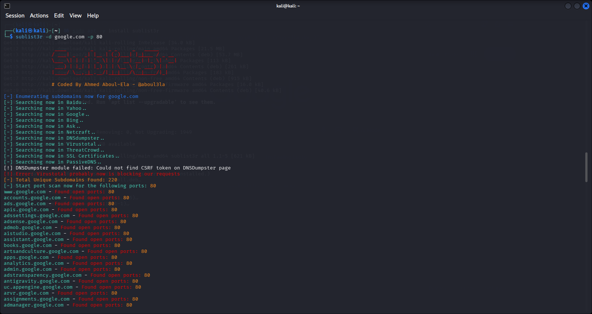

# Lab 2: Finding Subdomains using Sublist3r (Kali Linux)

## 1. Laboratory Overview & Objectives

The objective of this lab is to perform subdomain enumeration using Sublist3r within a Kali Linux environment. Sublist3r is an open-source Python tool designed to enumerate subdomains using OSINT techniques. It targets search engines (such as Bing) and integrates PortScanner to discover active subdomains and evaluate open ports.

- **Host System:** Windows 11
- **Attacker OS:** Kali Linux
- **Target Domain:** `google.com`
- **Target Ports:** `80` (HTTP)

---

## 2. Step-by-Step Task Execution & Evidence

### Part 1: Package Installation & Environment Setup

1. Opened the terminal shell inside Kali Linux.
2. Updated local package indexes and installed the Sublist3r reconnaissance package:

   ```bash
   sudo apt update && sudo apt -y install sublist3r
   ```

### Part 2: Subdomain Enumeration via Bing Search Engine

1. Executed Sublist3r targeting `google.com` using 3 threads and querying the Bing search engine:

   ```bash
   sublist3r -d google.com 
   ```

**Observation:** By removing engine-specific constraints (such as -e bing), Sublist3r queried multiple engines (Baidu, Yahoo, Google, SSL Certificates, etc.), discovering 180 unique subdomains despite individual module warnings from DNSDumpster and VirusTotal

### Part 3: Port Filtering and Active Reconnaissance

1. Executed Sublist3r with port filtering enabled to isolate subdomains running active web services on TCP port 80:

   ```bash
   sublist3r -d google.com -p 80 
   ```

**Observation:** Sublist3r identified 220 unique subdomains across its intelligence feeds and initiated an integrated socket scan, confirming active HTTP listeners on Port 80 for endpoints such as accounts.google.com, admin.google.com, and cloud.google.com

> **📸 Verification Screenshot 4: Sublist3r Execution Output Listing Discovered Subdomains with Port 80 Open**
> 
---

## 3. Lab Questions & Technical Analysis

**Question 1:** What are the advantages of using passive subdomain enumeration tools (like Sublist3r) over active brute-forcing tools?

**Answer:** Passive subdomain enumeration gathers domain intelligence through third-party search engines (like Bing) and public repositories without directly sending requests to the target domain's primary servers. This minimizes the likelihood of triggering the target's Intrusion Detection Systems (IDS), Web Application Firewalls (WAF), or Security Operations Center (SOC) alerts during the early reconnaissance phase.

**Question 2:** Why is identifying subdomains with open port 80 crucial during an organization's security posture assessment?

**Answer:** Subdomains often host legacy, development, or staging applications that might not follow the same strict security controls as the primary domain. Identifying subdomains running HTTP on port 80 highlights web applications transmitting unencrypted data, providing potential entry points for Man-in-the-Middle (MitM) attacks or unpatched web vulnerability exploitation.

---

## 4. Laboratory Reflection

All procedures for Lab 2 were executed successfully. While querying single engine parameters (-e bing) resulted in zero records due to search engine rate limits and broken web parsers, switching to global search parameters allowed Sublist3r to successfully map 220 unique target subdomains. Port scanning verified that these targets actively maintain open HTTP listeners on TCP port 80