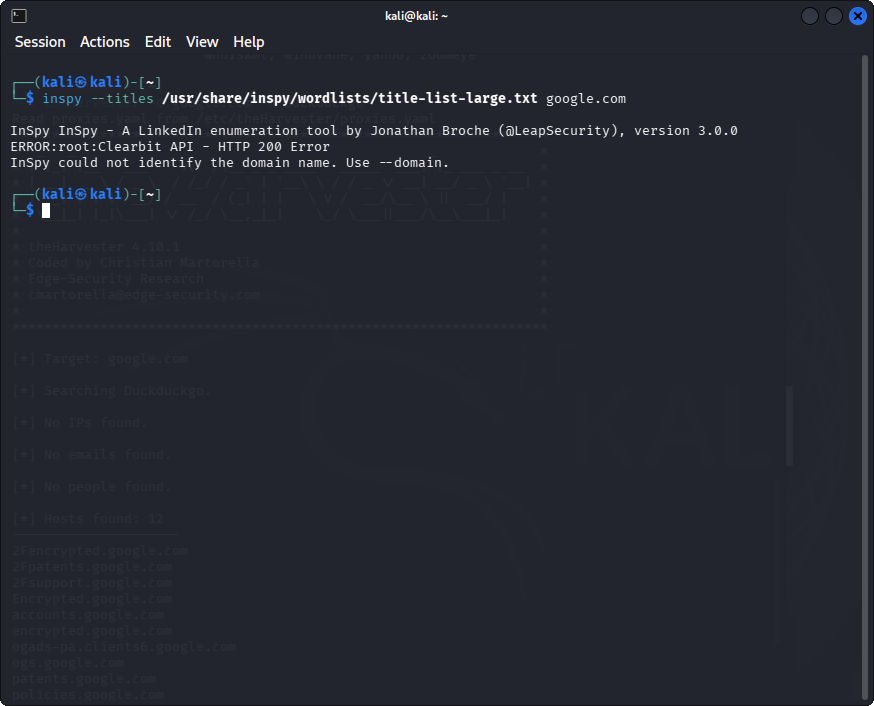
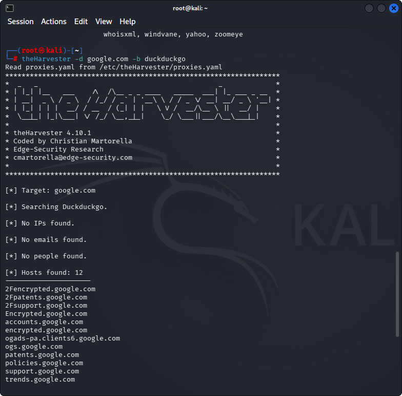

# Lab 4: Gathering Information from LinkedIn using InSpy & theHarvester (Kali Linux)

## 1. Laboratory Overview & Objectives

The objective of this lab is to conduct open-source intelligence (OSINT) gathering and employee enumeration against a target organization within a Kali Linux environment. While the legacy tool `InSpy` was originally designed to enumerate employee names, job titles, and email address formats from LinkedIn via search engines, modern API changes and aggressive anti-scraping mechanisms cause it to fail on current operating systems. To complete the lab scenario, `theHarvester` is used as a functional alternative to passively gather domain intelligence, public hostnames, and email addresses.

- **Host System:** Windows 11
- **Attacker OS:** Kali Linux
- **Target Domain:** `google.com`
- **Reconnaissance Engine:** DuckDuckGo / Passive OSINT Search Engines

---

## 2. Step-by-Step Task Execution & Evidence

### Part 1: Deprecated Tool Execution & Scraper Error Analysis

1. Updated local package indexes and attempted to execute `InSpy` targeting `google.com` using the default job titles wordlist:

   ```bash
   inspy --titles /usr/share/inspy/wordlists/title-list-large.txt google.com
   ```

   **Observation:** InSpy failed during execution. It threw HTTP 401 Error messages due to missing/invalid API integrations (HunterIO/Clearbit) and repeatedly returned HTTP 404 Error Crawling errors because its Google search scraper components are obsolete and blocked by search engine anti-bot controls.

   📸 *Verification Screenshot 1: InSpy Execution Error Output*

   

### Part 2: Transitioning to Modern OSINT with theHarvester

2. Installed theHarvester package on Kali Linux:

   ```bash
   sudo apt update && sudo apt -y install theharvester
   ```

3. Executed passive domain enumeration targeting `google.com` using the DuckDuckGo search engine source module:

   ```bash
   theHarvester -d google.com -b duckduckgo
   ```

   **Observation:** theHarvester bypassed scraper restrictions and successfully queried public search indexes, returning 12 active public target host subdomains (such as `accounts.google.com`, `support.google.com`, and `patents.google.com`) without directly interacting with or alerting the target infrastructure.

   📸 *Verification Screenshot 2: theHarvester Execution Output Listing Discovered Target Hosts*

   

---

## 3. Lab Questions & Technical Analysis

**Question 1:** Why do legacy OSINT web scrapers like InSpy frequently fail or break on modern operating systems?

**Answer:** Tools like InSpy rely on static HTML parsing and unauthenticated queries sent directly to commercial search engine endpoints or social networks (like Google and LinkedIn). Modern platforms continuously update their anti-bot measures, rate-limiting rules, API authentication structures, and web page schemas, causing hardcoded legacy scrapers to receive HTTP 401 (Unauthorized), 404 (Not Found), or 429 (Too Many Requests) errors.

**Question 2:** How does using theHarvester support passive corporate reconnaissance without triggering target security defenses?

**Answer:** theHarvester queries third-party search engine indexes, public certificate transparency logs, and DNS records rather than probing the target organization's primary servers directly. Because traffic flows strictly between the attacker and public third-party indexers, the target's Intrusion Detection Systems (IDS), Web Application Firewalls (WAF), and SOC monitoring teams receive no direct traffic or alert indicators.

---

## 4. Laboratory Reflection

All primary objectives for Lab 4 were addressed successfully. Although the legacy InSpy tool proved unusable due to outdated scraping endpoints and strict API authentication failures, substituting theHarvester allowed for successful passive OSINT gathering. The updated approach successfully mapped public subdomains and validated host infrastructure for `google.com` through DuckDuckGo search indexing.