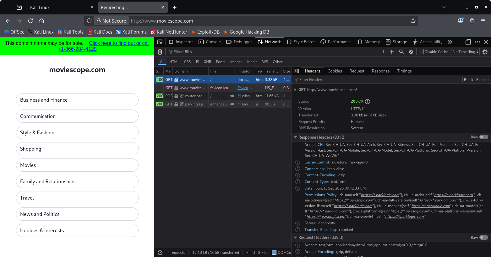

# Lab 5: Web Reconnaissance via Developer Tools (Firefox / Kali Linux)

## 1. Laboratory Overview & Objectives

The objective of this lab is to perform client-side web reconnaissance using built-in browser Developer Tools within Kali Linux. By inspecting response headers, network traffic, and security warnings on a target web application (`http://www.moviescope.com`), analysts can passively identify underlying web server technologies, framework versions, and insecure data transmission mechanisms (such as unencrypted password forms over HTTP).

* **Host System:** Windows 11 / Kali Linux
* **Browser:** Mozilla Firefox / Developer Tools (F12)
* **Target Domain:** `http://www.moviescope.com`

---

## 2. Step-by-Step Task Execution & Evidence

### Part 1: Accessing Target and Launching Developer Tools

1. Opened Mozilla Firefox inside Kali Linux and navigated to `http://www.moviescope.com`.
2. Launched Firefox Developer Tools by pressing `F12` (or `Ctrl + Shift + I`).

### Part 2: Security & Console Inspection (Insecure Transmission)

1. Navigated to the **Console** and **Security** tabs within Developer Tools.
2. Inspected active transport security alerts, noting warnings regarding insecure password input fields served over plain HTTP (`http://`).

### Part 3: Inspecting Network Traffic & Server Response Headers

1. Switched to the **Network** tab in Developer Tools.
2. Refreshed the page (`F5`) to capture active HTTP GET requests.
3. Selected the primary GET request for `www.moviescope.com` and expanded the **Headers** pane on the right.
4. Analyzed the **Response Headers** section to enumerate web server and framework metadata:
   * **Server Header:** `Microsoft-IIS/8.5` (or equivalent target IIS version)
   * **Framework Header:** `X-Powered-By: ASP.NET`

> **📸 Verification Screenshot 7: Developer Tools Showing Response Headers with Web Server and Framework Information**
> 

---

## 3. Lab Questions & Technical Analysis

**Question 1: What security risk is introduced when web servers disclose detailed `Server` and `X-Powered-By` HTTP response headers?**

* **Answer:** Disclosing headers like `Server: Microsoft-IIS/8.5` and `X-Powered-By: ASP.NET` reveals the exact operating environment, web server software, and framework version to passive observers. Attackers can cross-reference these precise version numbers against public vulnerability databases (such as CVE lists) to locate known exploits without needing to perform aggressive active scanning.

**Question 2: Why does transmitting login credentials over plain HTTP pose a significant vulnerability, and how do modern browsers flag this?**

* **Answer:** Plain HTTP transmits data across the network in cleartext without SSL/TLS encryption. Any attacker positioning themselves on the local network path (e.g., via ARP spoofing or unencrypted Wi-Fi) can capture transmitted credentials using packet sniffers. Modern browsers detect password inputs on non-HTTPS pages and flag them in the Developer Tools Console and address bar as insecure authentication risks.

---

## 4. Laboratory Reflection

The lab successfully demonstrated client-side web reconnaissance using browser Developer Tools. By analyzing HTTP response headers captured during regular page navigation, critical web stack details—including the IIS web server version and ASP.NET framework backend—were successfully extracted without generating suspicious log footprints or running external scanner tools.