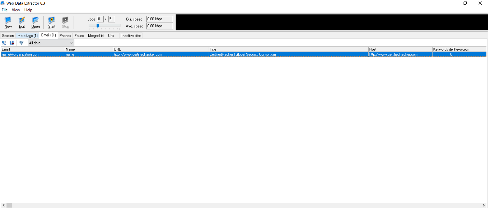

# Lab 6: Extracting Data using Web Data Extractor

## 1. Laboratory Overview & Objectives
The objective of this lab is to perform automated reconnaissance and data harvesting against a target website using Web Data Extractor (`wde.exe`). Security analysts use automated scraping tools to passively or semi-passively extract sensitive structured data from web pages—such as email addresses, telephone numbers, meta tags, and full site body content—to map a target's communication channels and potential social engineering attack vectors.

* Host System: Windows 11 / Kali Linux (Wine or Windows VM)
* Reconnaissance Tool: Web Data Extractor (`wde.exe`)
* Target URL: `http://www.certifiedhacker.com`

## 2. Step-by-Step Task Execution & Evidence

### Part 1: Configuring the Extraction Project

1. Download this from website : `https://softpedia-secure-download.com/dl/e534824783f368089a9a8a39a15bc656/6aa5f2a3/100003771/software/internet/wde.exe` 
Installed and Launched the Web Data Extractor application (`wde.exe`).
2. Clicked New Project to create a fresh harvesting session.
3. Entered the target starting URL: `http://www.certifiedhacker.com`.
4. Configured extraction parameters by enabling checkboxes for Meta tags, Emails, Phones, and Site body.

### Part 2: Executing and Reviewing Harvested Data

1. Clicked Start to initiate the multi-threaded web crawling and data extraction process.
2. Waited for the processing queue to complete across the target domain structure.
3. Navigated through the resulting application tabs (Meta tags, Emails, and Phones) to analyze harvested intelligence.

> **📸 Verification Screenshot 8: Web Data Extractor Window Showing Extracted Email Addresses and Phone Numbers**
>
> 

## 3. Lab Questions & Technical Analysis

**Question 1: What security risks are associated with exposing raw email addresses and phone numbers in public web page markup?**

* Answer: Publicly exposed contact information allows automated spambots and threat actors to harvest corporate email lists and direct telephone numbers instantly. Attackers leverage these lists to launch targeted phishing campaigns, business email compromise (BEC) attacks, and voice phishing (vishing) against specific organizational personnel.

**Question 2: How can organizations mitigate automated data harvesting by web scrapers?**

* Answer: Organizations can mitigate automated scrapers by implementing Web Application Firewalls (WAFs) with rate-limiting rules, utilizing CAPTCHAs on sensitive forms or contact pages, obfuscating email text using JavaScript or image rendering, and monitoring user-agent strings for known scraper signatures.

## 4. Laboratory Reflection
The lab successfully demonstrated automated data extraction against `www.certifiedhacker.com` using Web Data Extractor. By harvesting meta tags, contact emails, and phone numbers in a single automated session, the tool highlighted how easily structured organizational intelligence can be gathered to fuel subsequent social engineering phases.