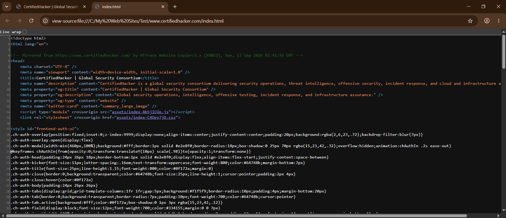

# Lab 7: Mirroring Website using HTTrack Web Site Copier

## 1. Laboratory Overview & Objectives
The objective of this lab is to create a local offline copy of a target website using WinHTTrack Website Copier. Website mirroring allows penetration testers and security analysts to download HTML, images, stylesheets, and entire site structures to a local directory for offline analysis, vulnerability scanning, and structural mapping without generating live traffic during active assessments.

* Host System: Windows 11 / Kali Linux
* Reconnaissance Tool: WinHTTrack Website Copier
* Project Name: Test Project
* Target Domain: `www.certifiedhacker.com`

## 2. Step-by-Step Task Execution & Evidence

### Part 1: Initializing a New Mirroring Project

1. Launched WinHTTrack Website Copier.
2. Entered the project name as Test Project and configured the base storage path.
3. Selected the action category (e.g., Download web site(s)).

### Part 2: Configuring Web Addresses & Scan Rules

1. Entered the target web address: `www.certifiedhacker.com`.
2. Configured scan rules, link depth, and file type filters to control the scope of the mirrored data.
3. Executed the project and monitored the transfer engine as files were downloaded recursively to the local storage path.

### Part 3: Accessing the Mirrored Directory

1. Once the mirroring operation completed, clicked Browse Mirrored Website or located the local directory.
2. Verified the local `index.html` file path (`C:\...`) loaded correctly in the web browser.

> **📸 Verification Screenshot 9: Browser Displaying the Mirrored Site with a Local Directory File Path in the Address Bar**
>
> 

## 3. Lab Questions & Technical Analysis

**Question 1: What are the operational advantages of mirroring a target website offline prior to a security assessment?**

* Answer: Mirroring a website offline allows security analysts to inspect front-end source code, hidden form fields, JavaScript logic, and directory structures locally without triggering web application firewalls (WAFs), intrusion detection systems (IDS), or rate-limiting rules on the live production server.

**Question 2: How can administrators protect their web assets against unauthorized mirroring or scraping?**

* Answer: Administrators can defend against mirror tools by implementing robust `robots.txt` exclusion rules, setting rate-limiting policies, deploying WAF signatures that detect automated user-agents (such as HTTrack or custom scrapers), and requiring user authentication for deep content paths.

## 4. Laboratory Reflection
The lab successfully demonstrated offline website mirroring using HTTrack. By replicating `www.certifiedhacker.com` to a local directory path (`C:\...`), a complete offline replica of the site structure was obtained for safe, local code review and vulnerability analysis.