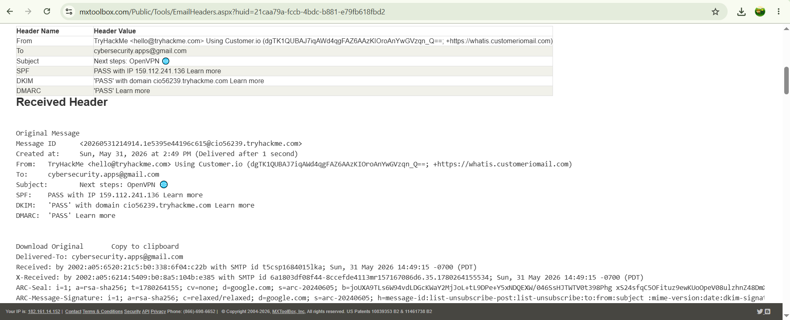

# Lab 8: Tracing Emails using eMailTrackerPro & Online Header Analyzers

## 1. Laboratory Overview & Objectives

The objective of this lab is to perform email header analysis and sender tracing to identify the origin, routing path, and infrastructure of an incoming email. By analyzing raw MIME internet headers (`Received:`, `X-Originating-IP`, `DKIM`), security analysts can uncover the sender's true IP address, trace server hop sequences, map geographical origins, and detect email spoofing or phishing attempts.

* **Host System:** Windows 11 / Kali Linux
* **Analysis Tool:** eMailTrackerPro / MXToolbox & Infobyip Header Analyzer (Free Web OSINT)
* **Target Data:** Raw MIME Internet Email Headers

---

## 2. Step-by-Step Task Execution & Evidence

### Part 1: Extracting Raw Internet Headers

1. Logged into the email client interface.
2. Selected an incoming target email and accessed the raw source metadata (via **Show Original**, **View Raw Message**, or **View Details**).
3. Copied the complete unedited block of MIME internet headers, including all `Received: from` directives and DKIM signature blocks.

### Part 2: Header Parsing & Route Tracing

1. Opened the email header analysis tool (**eMailTrackerPro** / online header analyzer at `mxtoolbox.com/EmailHeaders.aspx`).
2. Navigated to **Trace Headers** (or the header submission text area).
3. Pasted the copied raw email headers into the input field and clicked **Trace** / **Analyze Header**.
4. Analyzed the extracted intelligence:
   * **Sender IP & ISP Details:** Identified the originating mail transfer agent (MTA) IP address and registered Autonomous System (ASN).
   * **Hop Sequence:** Traced the chronological path of mail servers handling the message from source to destination.
   * **Geolocation Data:** Mapped the originating country, region, and server physical location.

> **📸 Verification Screenshot 10: Email Analysis Interface Displaying IP Hop List, Geolocation Map, and Sender ISP Details**
> 

---

## 3. Lab Questions & Technical Analysis

**Question 1: Why is the bottom-most `Received:` line in an email header considered the most critical entry for identifying the true sender?**

* **Answer:** Email headers are appended sequentially as a message travels across mail transfer agents (MTAs). The bottom-most `Received:` header represents the initial hop where the originating client or server first injected the email into the mail system, making it the most reliable record of the sender's original IP before intermediate relays handled the transmission.

**Question 2: How do security teams use email header tracing to analyze spear-phishing and business email compromise (BEC) attacks?**

* **Answer:** Security analysts compare the declared sender domain in the `From:` line against the actual originating IP and return path discovered in the header trace. Discrepancies between the sender identity and the physical routing path indicate email spoofing, open relay abuse, or phishing infrastructure.

---

## 4. Laboratory Reflection

The email header analysis successfully demonstrated how to extract raw header metadata and reconstruct an email's path across the internet. By parsing the hop sequence and mapping the originating IP address, critical attribution data—such as the sender's ISP, server geographical location, and transmission delays—was successfully documented without interacting directly with the threat actor's infrastructure.