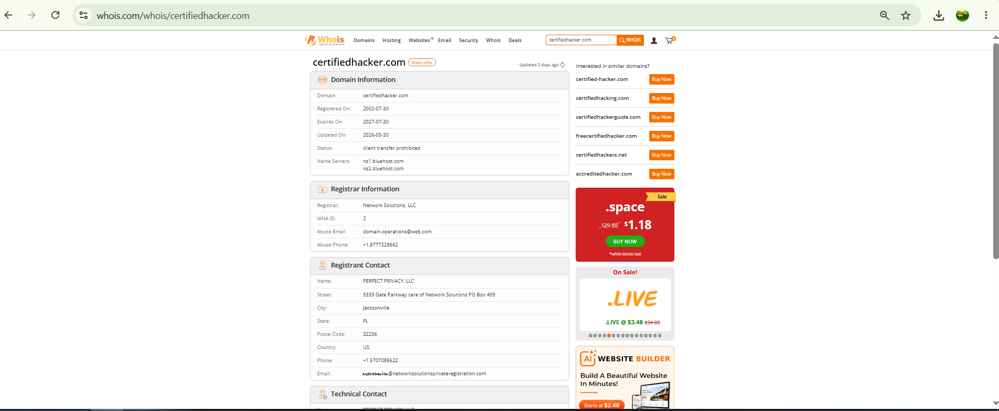

# Lab 09: Domain Information Lookup via SmartWhois

## 1. Laboratory Overview & Objectives

The objective of this lab is to perform domain footprinting using WHOIS query tools to extract administrative, technical, and structural intelligence regarding a target domain. Gathering WHOIS metadata allows security professionals and ethical hackers to identify domain ownership, registrar infrastructure, primary name servers (DNS), contact details, and physical location data without direct active scanning against target hosts.

* **Host System:** Windows 11 / Kali Linux
* **Analysis Tool:** SmartWhois / Online WHOIS Lookup (DomainTools / CentralOps)
* **Target Domain:** `certifiedhacker.com`

---

## 2. Step-by-Step Task Execution & Evidence

### Part 1: SmartWhois Query Execution

1. Launched **SmartWhois** (or navigated to the web-based WHOIS lookup interface).
2. Configured query parameters to query domain registration records and IP address ranges recursively.
3. Entered the target domain name (`certifiedhacker.com`) into the search address field and initiated the query.

### Part 2: Extracting Domain Metadata

1. Analyzed the returned WHOIS record parameters:
   * **Domain Name & Registrar:** Identified the accredited registrar managing the target domain registration.
   * **Registration Timestamps:** Documented creation date, last updated timestamp, and expiration date.
   * **Name Servers (NS):** Recorded primary and secondary authoritative DNS servers responsible for resolving domain queries.
   * **Administrative & Technical Contacts:** Gathered registrant organizational details, contact emails, and physical geographic locations (or identified privacy protection services).
   * **Network Blocks & ASNs:** Mapped associated IP blocks and Autonomous System Numbers (ASNs) hosting the target domain.

> **📸 Verification Screenshot 11: SmartWhois Output Displaying Domain Registration Details, Name Servers, and Administrative Contacts**
> 

---

## 3. Lab Questions & Technical Analysis

**Question 1: What security risks are associated with publicly exposed WHOIS administrative and technical contact information?**

* **Answer:** Exposing real names, phone numbers, email addresses, and physical locations in WHOIS records provides attackers with tailored intelligence for social engineering and spear-phishing attacks. Attackers can leverage administrative contact emails to construct targeted BEC scams or attempt domain hijacking by targeting domain management accounts.

**Question 2: How do authoritative Name Server (NS) entries obtained from a WHOIS lookup assist in further reconnaissance phases?**

* **Answer:** Identifying authoritative name servers gives analysts the targets needed for DNS footprinting. Knowing the specific name servers allows security teams to attempt zone transfers (`AXFR`), perform sub-domain enumeration, and identify third-party cloud DNS hosting providers or misconfigured infrastructure.

---

## 4. Laboratory Reflection

Domain footprinting via WHOIS querying successfully demonstrated how passive OSINT collection exposes critical organizational infrastructure. By retrieving registrar data, authoritative name servers, and IP block allocations, essential information was gathered to map the target's external attack surface—all conducted passively without triggering intrusive network alerts on the target domain.