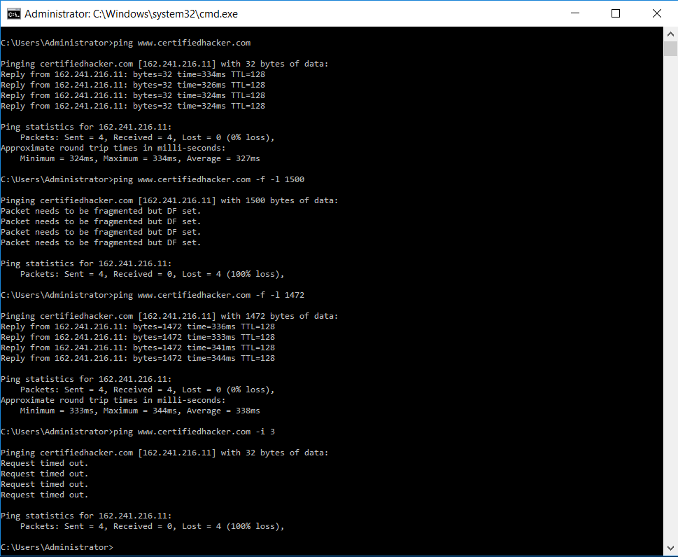
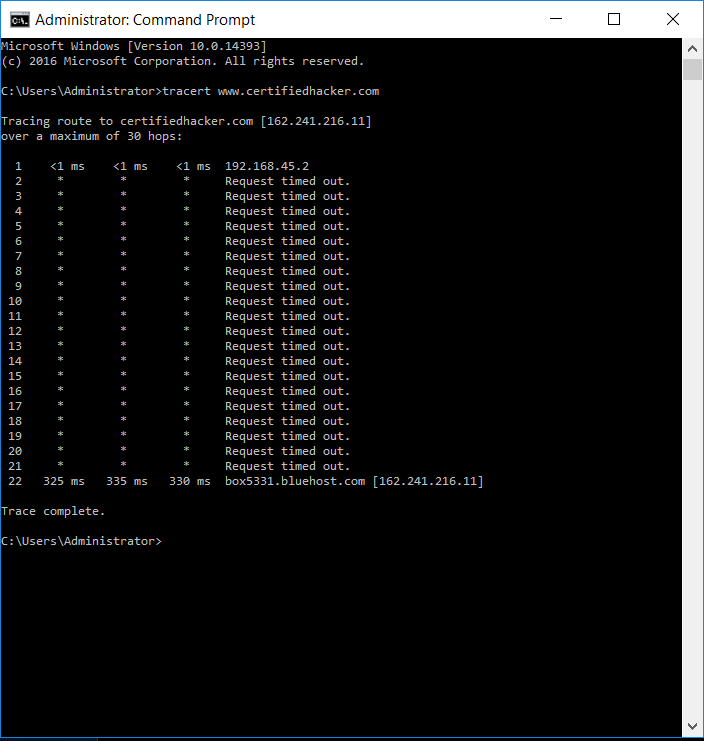
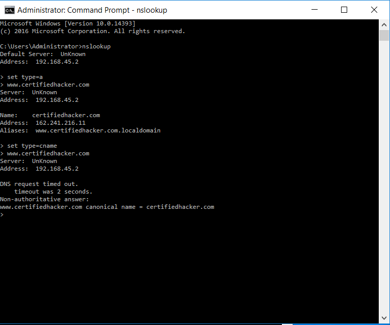

# Lab 1: Open Source Information Gathering (Windows Command Line)

## 1. Laboratory Overview & Objectives

The objective of this lab is to utilize native Windows command-line utilities to perform initial active reconnaissance against a target organization. This involves resolving domain names to IP addresses, discovering route hops, identifying network maximum transmission unit (MTU) thresholds before packet fragmentation occurs, and querying Domain Name System (DNS) records.

- **Host System:** Windows 11
- **Target Domain:** `www.certifiedhacker.com`
- **Target IP:** `162.241.216.11`

---

## 2. Step-by-Step Task Execution & Evidence

### Part 1: Ping & Maximum Frame Size Identification

1. Opened the Windows Command Prompt (`cmd.exe`) with Administrator privileges.

2. Executed an ICMP Echo Request to discover the target IP address and verify host reachability:

   ```cmd
   ping www.certifiedhacker.com
   ```

   - **Observation:** The domain resolved to IP `162.241.216.11`, with responses averaging approximately `327ms` and `TTL=128`.

3. Evaluated path Maximum Transmission Unit (MTU) limits by enforcing the Don't Fragment flag (`-f`) while adjusting payload sizes (`-l`):

   ```cmd
   ping www.certifiedhacker.com -f -l 1500
   ```

   - **Observation:** Returned `Packet needs to be fragmented but DF set` with 100% packet loss, confirming that a 1500-byte ICMP payload exceeds the path MTU.

4. Reduced the buffer size to `1472` bytes to determine the maximum non-fragmented ICMP payload:

   ```cmd
   ping www.certifiedhacker.com -f -l 1472
   ```

   - **Observation:** Successful responses were received with 0% packet loss.

5. Tested TTL expiration by forcing a 3-hop ceiling:

   ```cmd
   ping www.certifiedhacker.com -i 3
   ```

   - **Observation:** The command returned `Request timed out` across all four packets, indicating that the TTL expired before the packets reached the destination.

> **📸 Verification Screenshot 1: Ping, MTU Determination, and TTL Expiration**
> 

---

### Part 2: TTL Expiration and Route Tracing

1. Executed `tracert` to map the Layer 3 path from the local system to the remote target:

   ```cmd
   tracert www.certifiedhacker.com
   ```

   - **Observation:** The local gateway was identified at `192.168.45.2`. Several intermediate hops did not return ICMP responses and displayed `Request timed out`. The trace eventually terminated at hop 22:

     `box5331.bluehost.com [162.241.216.11]`

> **📸 Verification Screenshot 2: Route Hop Trace to Target Host**
>
---

### Part 3: DNS Record Enumeration via nslookup

1. Launched the interactive DNS lookup shell:

   ```cmd
   nslookup
   ```

2. Queried standard IPv4 Address (`A`) records:

   ```cmd
   set type=a
   www.certifiedhacker.com
   ```

   - **Observation:** The hostname resolved to `162.241.216.11` under the `certifiedhacker.com` domain.

3. Queried Canonical Name (`CNAME`) records:

   ```cmd
   set type=cname
   www.certifiedhacker.com
   ```

   - **Observation:** The lookup identified the canonical relationship:

     `www.certifiedhacker.com = certifiedhacker.com`

> **📸 Verification Screenshot 3: Interactive NSLookup DNS Query Output**
>
---

## 3. Lab Questions & Technical Analysis

### Question 1: Why does a payload size of 1472 bytes result in an effective MTU of 1500 bytes on standard Ethernet networks?

**Answer:** Standard Ethernet networks commonly use an IP MTU of 1500 bytes. An ICMP Echo Request consists of an IP header of 20 bytes and an ICMP header of 8 bytes in addition to the ICMP data payload.

Therefore:

```text
1472 bytes (ICMP payload)
+ 8 bytes (ICMP header)
+ 20 bytes (IPv4 header)
--------------------------------
1500 bytes (total IP packet size)
```

Thus, a 1472-byte payload results in an effective IP packet size of 1500 bytes. A larger payload would exceed a 1500-byte path MTU when the Don't Fragment (`DF`) flag is set.

### Question 2: What security risks are associated with leaving ICMP Echo Responses and detailed DNS records exposed to the public internet?

**Answer:** Publicly accessible ICMP responses can confirm that a host or network address is active and may provide information useful for reconnaissance. The observed TTL value may also provide clues about the operating system or network configuration, although TTL alone is not sufficient to reliably identify an operating system.

Public DNS records such as `A` and `CNAME` records can reveal hostnames, IP addresses, aliases, and relationships between internet-facing systems. This information can help an attacker map an organization's external attack surface and identify infrastructure that may require further security assessment.

However, exposing these records is not automatically a vulnerability. Public DNS records are often necessary for legitimate internet services, and ICMP may be intentionally permitted for diagnostics and network operations.

---

## 4. Laboratory Reflection

All tasks for initial network reconnaissance using Windows command-line utilities were completed successfully.

The exercises demonstrated how common tools such as `ping`, `tracert`, and `nslookup` can be used to collect basic information about an internet-facing host. The testing established a maximum successful ICMP payload of 1472 bytes for the tested path, corresponding to a 1500-byte IPv4 packet when the 20-byte IP header and 8-byte ICMP header are included.

The route trace provided visibility into the network path toward the target, while DNS queries revealed the target's IPv4 address and canonical hostname relationship. These techniques demonstrate the importance of understanding publicly observable network information when performing defensive security assessments and reconnaissance.
