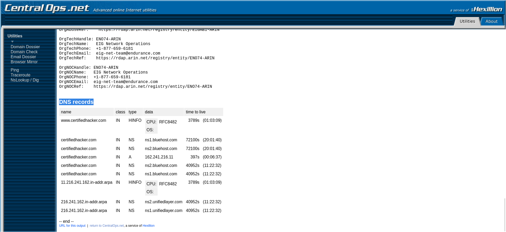

# Lab 4: Website Footprinting (Central Ops & OSINT Tools)

## 1. Laboratory Overview & Objectives

The objective of this lab is to perform website footprinting to gather administrative, network, and technological details of a target domain without launching disruptive attacks. This lab utilizes public web services like Central Ops (`https://centralops.net`) to inspect domain registration data, IP routing structures, network ownership details, and DNS record mapping.

* **Host System:** Windows 11 / Kali Linux
* **Target Domain:** `www.certifiedhacker.com`
* **Target IP:** `162.241.216.11`
* **Target OSINT Engine:** Central Ops (`https://centralops.net`)

---

## 2. Step-by-Step Task Execution & Evidence

### Part 1: Initial Query Setup & Address Lookup

1. Opened the web browser inside Kali Linux and navigated to `https://centralops.net/co/`.
2. Entered the target domain `www.certifiedhacker.com` into the **Domain Dossier** search utility.
3. Enabled checkmarks for **domain whois record**, **network whois record**, and **DNS records**.
4. Executed the query to initiate passive reconnaissance.
5. Analyzed the returned **Address lookup** results:
   * **Canonical Name:** `certifiedhacker.com`
   * **Aliases:** `www.certifiedhacker.com`
   * **Addresses:** `162.241.216.11`

> **📸 Verification Screenshot 6: Central Ops Interface and Address Lookup**
> 

---

### Part 2: Domain WHOIS Record Inspection

1. Inspected the aggregated **Domain Whois record** output queried from `whois.internic.net` and `whois.networksolutions.com`.
2. Documented core registrar details:
   * **Registrar:** Network Solutions, LLC
   * **Creation Date:** `2002-07-30` | **Expiration Date:** `2027-07-30`
   * **Name Servers:** `NS1.BLUEHOST.COM`, `NS2.BLUEHOST.COM`
   * **Registrant Privacy:** PERFECT PRIVACY, LLC (Jacksonville, FL)

> **📸 Verification Screenshot 7: Domain WHOIS Record Analysis**
> 

---

### Part 3: Network WHOIS & IP Ownership Enumeration

1. Reviewed the **Network Whois record** queried from `rwhois.unifiedlayer.com` and `whois.arin.net` for target IP `162.241.216.11`.
2. Verified infrastructure and netblock metrics:
   * **NetRange:** `162.240.0.0` – `162.241.255.255` (`162.240.0.0/15`)
   * **Organization:** Unified Layer / Bluehost (`BLUEH-2`)
   * **Abuse / Tech Contacts:** `abuse@unifiedlayer.com`, `netops@unifiedlayer.com`

> **📸 Verification Screenshot 8: Network WHOIS and IP Assignment Details**
> 

---

### Part 4: DNS Records & Reverse Lookup Mapping

1. Analyzed the returned **DNS records** table for `certifiedhacker.com` and reverse DNS (`in-addr.arpa`) entries.
2. Verified record mappings:
   * **A Record:** `certifiedhacker.com` $\rightarrow$ `162.241.216.11`
   * **NS Records:** `ns1.bluehost.com`, `ns2.bluehost.com`
   * **Reverse DNS (PTR):** `216.241.162.in-addr.arpa` pointing to `ns1.unifiedlayer.com` / `ns2.unifiedlayer.com`
   * **HINFO Record:** CPU `RFC8482`

> **📸 Verification Screenshot 9: DNS Records and PTR Reverse Lookups**
> 

---

## 3. Lab Questions & Technical Analysis

**Question 1: What critical technical information can be extracted from a Domain Dossier report during the website footprinting phase?**

* **Answer:** A Domain Dossier report reveals canonical hostnames, active IP assignments (`162.241.216.11`), domain registrar details, registration/expiration windows, administrative abuse contacts, parent network blocks (`162.240.0.0/15`), authoritative name servers (`ns1.bluehost.com`), and reverse pointer configurations.

**Question 2: How do attackers use network WHOIS netblock ranges and hosting provider details gathered during passive website footprinting?**

* **Answer:** Identifying netblock ranges (`162.240.0.0/15`) and upstream infrastructure providers (Unified Layer / Bluehost) allows security analysts and attackers to define the physical hosting environment, map adjacent target infrastructure within the same subnet, and evaluate network-level defenses without issuing noisy direct probes against the primary domain.

---

## 4. Laboratory Reflection

Website footprinting via Central Ops successfully demonstrated passive intelligence gathering against `www.certifiedhacker.com`. By systematically analyzing domain registration, network netblocks, and DNS records across the 4 captured stages, a complete profile of the target's public-facing footprint was constructed with zero direct penetration traffic logged against the target host.