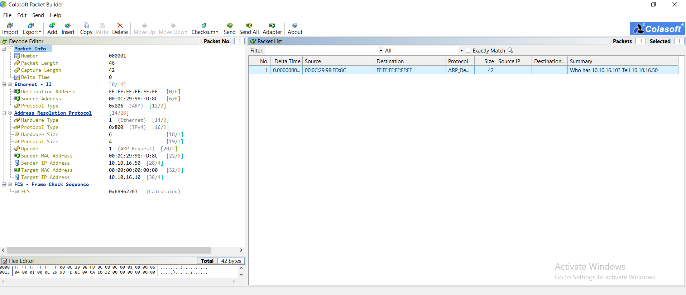
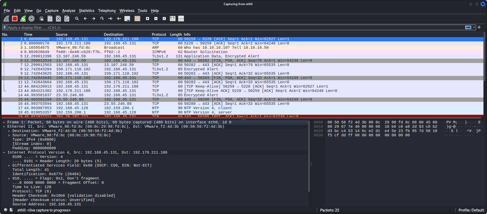

# Lab 1: Scanning the Network using Colasoft Packet Builder

## 1. Laboratory Overview & Objectives

The objective of this lab is to perform Layer 2 network scanning and packet construction techniques on a local area network segment. By utilizing **Colasoft Packet Builder**, security analysts can manually craft custom Address Resolution Protocol (ARP) Request frames from scratch and transmit them across a subnet. This enables analysts to perform passive and active host discovery, inspect low-level network frame structures, evaluate target ARP handling behaviors, and map active IP-to-MAC address pairings on the network without relying exclusively on automated scanning utilities.

* **Host System:** Windows 11 / Windows 10 Pro / Kali Linux
* **Primary Tool:** Colasoft Packet Builder
* **Monitoring Tool:** Wireshark
* **Target Environment:** Local Subnet (`10.10.16.0/24`)

---

## 2. Step-by-Step Task Execution & Evidence

### Part 1: Initializing Colasoft Packet Builder & Adapter Selection

1. Launched **Colasoft Packet Builder** with administrative privileges on the host machine.
2. Navigated to the Adapter menu and selected the active Network Adapter (`Intel(R) 82574L Gigabit Network Connection`).
3. Cleared any existing packet configurations to establish a fresh workspace for packet construction.

### Part 2: Crafting Custom ARP Request Frames & Field Configuration

1. Created a new packet entry and selected the **ARP Packet** template.
2. In the **Decode Editor** and **Hex Editor** panes, configured the specific Layer 2 and Layer 3 parameters:
   * **Source MAC Address:** `00:0C:29:98:FD:8C`
   * **Destination MAC Address:** `FF:FF:FF:FF:FF:FF` (Layer 2 Broadcast)
   * **Hardware Type:** Ethernet (`1`)
   * **Protocol Type:** IPv4 (`0x0800`)
   * **Operation Code:** ARP Request (`1`)
   * **Sender MAC Address:** `00:0C:29:98:FD:8C`
   * **Sender IP Address:** `10.10.16.50`
   * **Target MAC Address:** `00:00:00:00:00:00` (Unknown/Padding)
   * **Target IP Address:** `10.10.16.10`
3. Verified that the overall packet length reached 42 bytes (including FCS calculation) and that the summary output properly read `Who has 10.10.16.10? Tell 10.10.16.50`.

> **📸 Verification Screenshot 1: Fully Configured ARP Request Frame in Colasoft Packet Builder**
> 

### Part 3: Packet Transmission & Wireshark Capture Analysis

1. Initialized **Wireshark** on interface `eth0` to monitor incoming and outgoing network traffic.
2. Returned to Colasoft Packet Builder, highlighted the crafted 42-byte ARP Request frame, and executed packet transmission across the segment.
3. Observed the live traffic stream in Wireshark to confirm packet arrival on the network line:
   * **Captured Frame Line 3:** `VMware_98:fd:8c -> Broadcast | ARP | 60 | Who has 10.10.16.10? Tell 10.10.10.50`
4. Confirmed successful Layer 2 packet egress and monitored for response traffic from the target host.

> **📸 Verification Screenshot 2: Wireshark Traffic Capture Confirming Transmitted ARP Broadcast Frame**
> 

---

## 3. Lab Questions & Technical Analysis

**Question 1: Why are custom crafted ARP Request probes effective for host discovery on local Ethernet subnets, and what limits their utility across routed networks?**

* **Answer:** ARP Request probes operate directly at Layer 2 (Data Link Layer) of the OSI model. Because hosts on an Ethernet segment are required to resolve IP addresses to physical MAC addresses in order to communicate, active network nodes respond to ARP Requests regardless of local Layer 4 firewall rules (such as Windows Firewall blocking ICMP/ping traffic). However, because ARP frames utilize Layer 2 broadcast destination addresses (`FF:FF:FF:FF:FF:FF`), routers and default gateways immediately drop them at Layer 3 boundaries, making ARP scanning strictly non-routable beyond the local subnet segment.

**Question 2: How can packet manipulation utilities like Colasoft Packet Builder be leveraged in adversarial scenarios, and what defensive mechanisms mitigate these threats?**

* **Answer:** Attackers can utilize custom packet generators to execute ARP cache poisoning attacks, forge source MAC/IP parameters to bypass network access controls, perform denial-of-service (DoS) via packet flooding, or evade detection signatures using non-standard header fields. Network administrators defend against these threats by implementing **Dynamic ARP Inspection (DAI)** on switch ports, enforcing **DHCP Snooping**, binding static ARP tables for critical infrastructure, and deploying Network Intrusion Detection Systems (NIDS) to detect abnormal broadcast volumes.

---

## 4. Laboratory Reflection

This lab provided practical experience in constructing custom network frames at Layer 2 using Colasoft Packet Builder. By populating specific hardware addresses, operation codes, and target IP values manually, the exercise demonstrated how network discovery functions at the lowest protocol layers. Verifying the egress of the custom ARP frame inside Wireshark underscored the relationship between packet crafting tools and network capture utilities, highlighting both the diagnostic utility of raw frame generation and the critical need for Layer 2 security controls like Dynamic ARP Inspection.