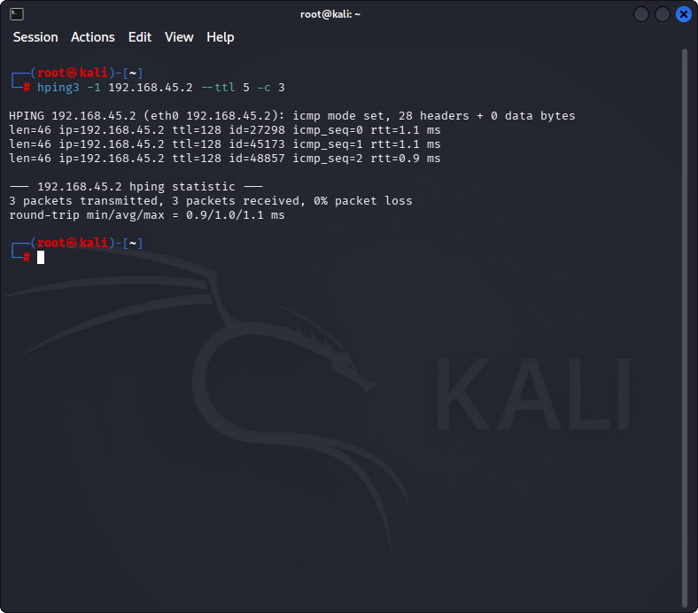
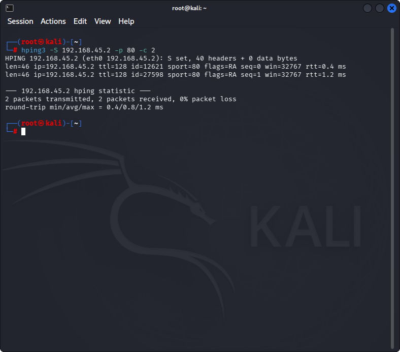
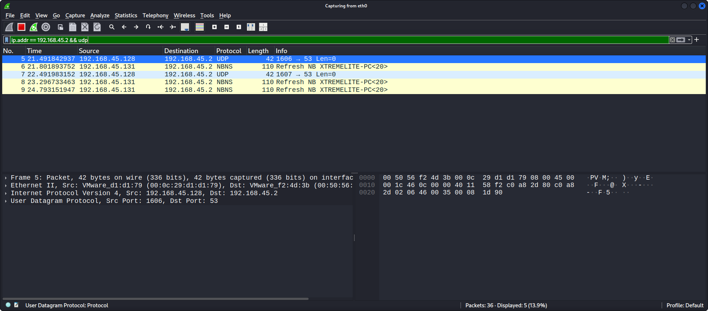

# Lab 02: UDP and TCP Packet Crafting Techniques using HPING3

## 1. Laboratory Overview & Objectives

The objective of this lab is to explore low-level network probing, host discovery, and firewall/NIDS evasion using **HPING3**, a powerful command-line packet crafting tool. Security analysts utilize HPING3 to manually assemble raw TCP, UDP, and ICMP headers to test network reachability, analyze open/closed port behavior, evaluate stateless vs. stateful firewall rules, and measure network performance under custom flag combinations.

* **Host System:** Kali Linux (Attacker System)
* **Primary Tool:** HPING3
* **Monitoring Tool:** Wireshark
* **Target Environment:** Local Subnet (`192.168.45.0/24`) / Target IP (`192.168.45.2`)

---

## 2. Step-by-Step Task Execution & Evidence

### Part 1: ICMP Ping Probe & Custom TTL Configuration

1. Executed a basic ICMP echo request using HPING3 targeted at the lab host to test Layer 3 connectivity.
2. Modified the Time-to-Live (TTL) value to observe network hop behavior and traceroute capabilities:

   ```bash
   hping3 -1 192.168.45.2 --ttl 5 -c 3
   ```

3. All 3 ICMP echo requests received replies with 0% packet loss (`ttl=128`, round-trip min/avg/max = 0.9/1.0/1.1 ms), confirming Layer 3 reachability to the target.

> **📸 Verification Screenshot 1: ICMP Echo Probe Execution via HPING3**
> 

### Part 2: TCP SYN Scanning & Custom Flag Manipulation

1. Initiated a stealthy TCP SYN probe against the target's HTTP port (80) to determine port state without completing a full 3-way handshake:

   ```bash
   hping3 -S 192.168.45.2 -p 80 -c 2
   ```

2. Analyzed the returning packet flags:
   * **SYN/ACK (flags=SA):** would indicate the port is OPEN and listening.
   * **RST/ACK (flags=RA):** indicates the port is CLOSED.

   Both probes returned `flags=RA`, confirming **port 80 was closed** on the target at the time of the scan.

3. Crafted a custom TCP flag combination (Xmas Scan: FIN, URG, PSH) to further test firewall filtering and target OS stack behavior:

   ```bash
   hping3 -F -U -P 192.168.45.2 -p 80 -c 2
   ```

> **📸 Verification Screenshot 2: TCP SYN Scan Output Displaying Target Port Status**
> 

### Part 3: UDP Scanning & Wireshark Capture Verification

1. Transmitted custom UDP packets to the target's DNS port (53) to perform UDP service discovery:

   ```bash
   hping3 --udp 192.168.45.2 -p 53 -c 2
   ```

2. Monitored traffic in Wireshark using display filter `ip.addr == 192.168.45.2 && udp`:
   * Verified transmission of custom UDP frames (source ports 1606 and 1607 → destination port 53, length 0).
   * The capture also surfaced unrelated NBNS (NetBIOS Name Service) refresh broadcasts from a second host (`192.168.45.131`) on the same segment, confirming the filter was correctly isolating traffic to/from the target.

> **📸 Verification Screenshot 3: Wireshark Traffic Capture Confirming HPING3 Probe Transmission**
> 

---

## 3. Lab Questions & Technical Analysis

**Question 1:** What is the main structural difference between a TCP SYN probe and a full TCP connection scan, and why is SYN scanning preferred during initial reconnaissance?

**Answer:** A TCP SYN probe (half-open scan) sends only the initial SYN packet to initiate communication. If the target responds with SYN/ACK, the attacker immediately responds with a RST (Reset) packet to tear down the connection before it completes. A full TCP connection scan uses the operating system's `connect()` API to complete the entire 3-way handshake (SYN → SYN/ACK → ACK). SYN scanning is preferred because it is faster, generates significantly less network overhead, and historically bypassed standard application-level logging mechanisms.

**Question 2:** How does a target host respond to a UDP probe sent to a closed port, and how do firewalls complicate UDP scanning accuracy?

**Answer:** When a UDP packet hits a closed port on an accessible host, the target operating system generates an ICMP Type 3, Code 3 (Destination Unreachable: Port Unreachable) message back to the sender. If the port is open, the application may respond with UDP data or remain completely silent. Firewalls complicate this process by silently dropping incoming UDP probes or ICMP response messages, causing the scanner to mark ports ambiguously as Open|Filtered.

---

## 4. Laboratory Reflection

This lab demonstrated packet assembly and transmission at the transport layer using HPING3. Manually setting TCP flags (SYN, ACK, RST, FIN, URG, PSH) provided direct visibility into how operating system TCP/IP stacks negotiate state and respond to non-standard requests — in this case, the `flags=RA` response to the SYN probe confirmed port 80 was closed on the target. Additionally, cross-referencing probe execution with Wireshark confirmed how packet crafting tools interact with live network interfaces, reinforcing the importance of stateful inspection engines and Intrusion Detection Systems in identifying crafted flag anomalies.