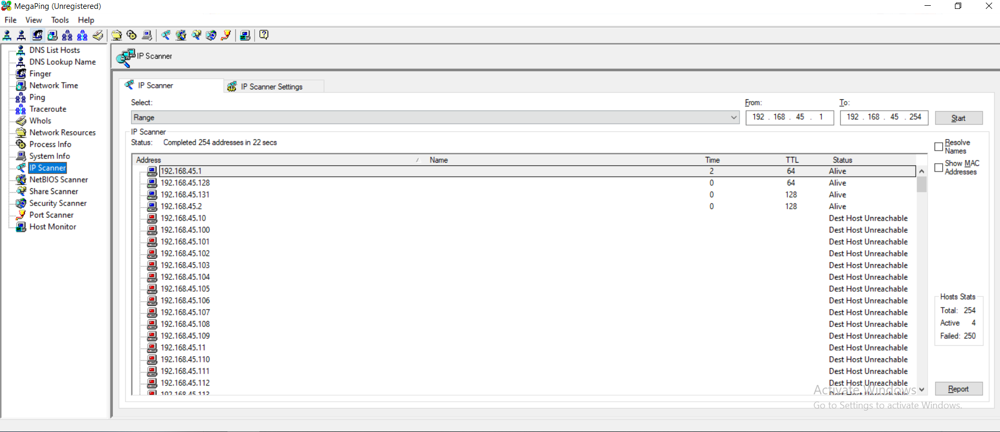
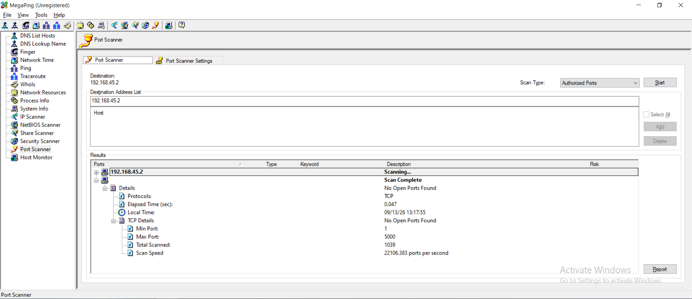
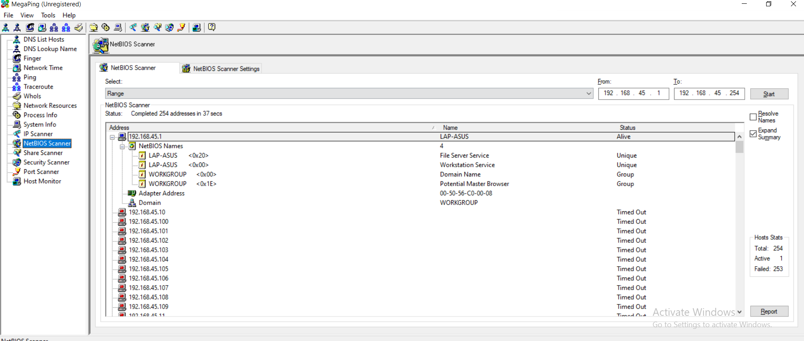

# Lab 03: Basic Network Troubleshooting using MegaPing

## 1. Laboratory Overview & Objectives

The objective of this lab is to perform comprehensive network reconnaissance, host discovery, and service enumeration using **MegaPing**. Security analysts utilize MegaPing to systematically scan IP address ranges, identify active hosts, enumerate open TCP/UDP ports, perform netbios auditing, and map network infrastructure. This exercise provides foundational experience in host discovery and basic network troubleshooting from a Windows management perspective.

* **Attacker System:** Windows Host (`192.168.45.131` / local workstation)
* **Primary Tool:** MegaPing
* **Monitoring Tool:** Wireshark
* **Target Environment:** Subnet `192.168.45.0/24` / Target Host (`192.168.45.2`)

---

## 2. Step-by-Step Task Execution & Evidence

### Part 1: IP Scanner & Active Host Discovery

1. Launched **MegaPing** with administrative privileges.
2. Selected **IP Scanner** from the left-hand navigation pane.
3. Configured the target IP address range to scan the local network segment:
   * **Start IP:** `192.168.45.1`
   * **End IP:** `192.168.45.254`
4. Executed the scan to discover live hosts, recording active IP addresses, MAC addresses, and response ping times across the subnet.

> **📸 Verification Screenshot 1: MegaPing IP Scanner Host Discovery Results**
> 

### Part 2: Port Scanner & Service Enumeration

1. Navigated to the **Port Scanner** module within MegaPing.
2. Input target host IP `192.168.45.2` and selected a standard port range (Ports `1–1024`).
3. Initiated the scan to identify listening services, open TCP ports, and associated application banners (e.g., HTTP, SMB, RPC).

> **📸 Verification Screenshot 2: MegaPing Port Scanner Output Displaying Listening Services**
> 

### Part 3: NetBIOS & Network System Auditor

1. Selected **NetBIOS Scanner** / **System Auditor** in MegaPing.
2. Scanned target `192.168.45.2` to enumerate NetBIOS name tables, workgroup/domain metadata, logged-in user details, and shared network folders.
3. Verified egress of enumeration probes and cross-checked live network responses.

> **📸 Verification Screenshot 3: MegaPing NetBIOS Enumeration & System Audit Summary**
> 

---

## 3. Lab Questions & Technical Analysis

**Question 1: How do graphical network scanners like MegaPing differ from command-line packet tools like HPING3 during network reconnaissance?**

* **Answer:** GUI tools like MegaPing automate higher-level scanning workflows by combining multiple protocol requests (ICMP ping sweeps, TCP port connects, NetBIOS queries) into a unified interface. While highly efficient for rapid administrative audits, they lack the granular, low-level header crafting (such as arbitrary TCP flag setting or custom IP option injection) provided by command-line tools like HPING3.

**Question 2: What security risks are associated with unauthenticated NetBIOS enumeration on a local network?**

* **Answer:** NetBIOS enumeration allows unauthenticated network observers to gather critical host details, including computer names, domain membership, user accounts, and active network shares. Attackers can leverage this intelligence to craft targeted SMB brute-force attacks, identify sensitive file repositories, or execute lateral movement across the internal domain.

---

## 4. Laboratory Reflection

This lab demonstrated host discovery and service auditing using MegaPing. By executing IP sweeps, port scans, and NetBIOS queries, the exercise highlighted how automated multi-function scanners construct a comprehensive profile of local network targets. Cross-referencing these findings reinforced the importance of restricting legacy protocols like NetBIOS and disabling unneeded services to minimize an organization's internal attack surface.