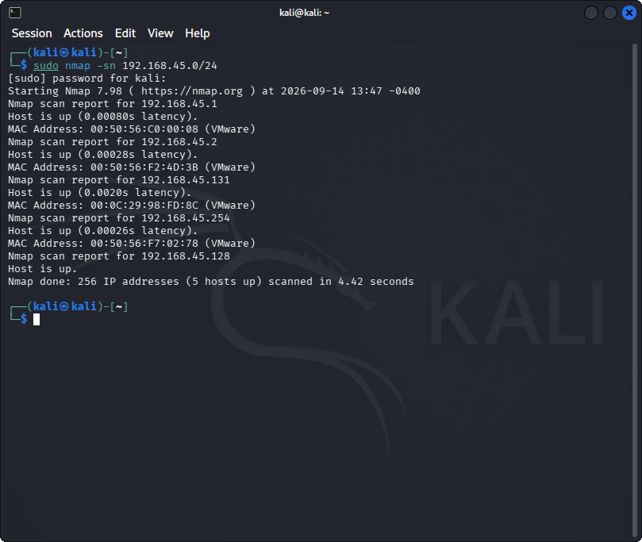
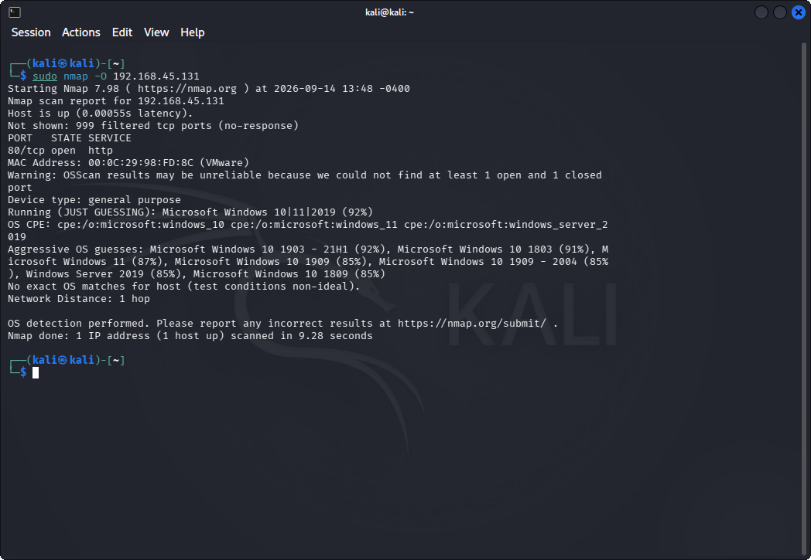
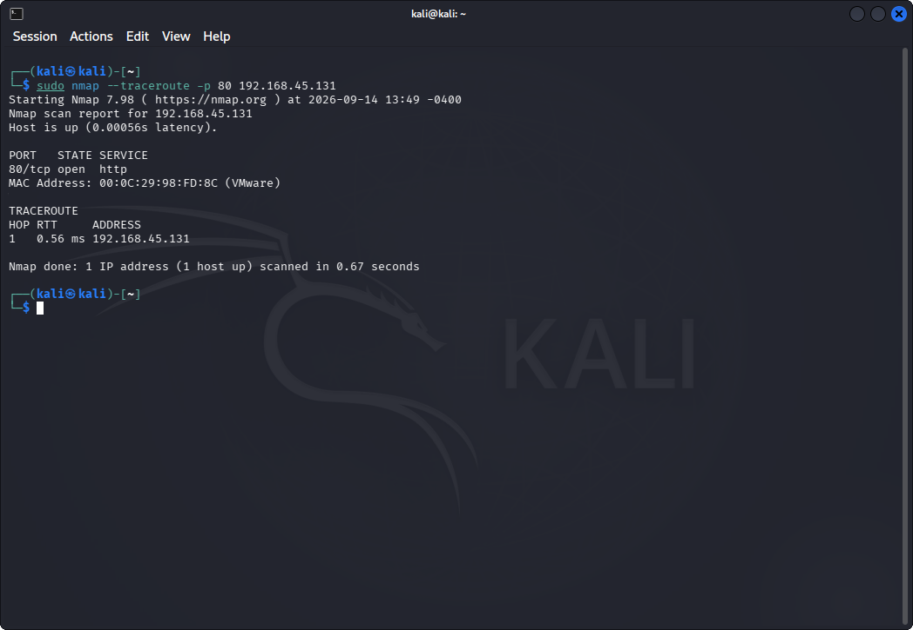

# Lab 04: Understanding Network Scanning using Nmap

## 1. Laboratory Overview & Objectives

The objective of this lab is to conduct comprehensive network reconnaissance, host discovery, operating system fingerprinting, and packet path tracing using **Nmap** (Network Mapper). Security analysts utilize Nmap to map local subnets, determine active target OS stacks through TCP/IP fingerprinting, measure network latency, and inspect transit hops to identify security boundaries and open service vectors.

* **Attacker System:** Kali Linux (`192.168.45.128`)
* **Primary Tool:** Nmap
* **Monitoring Tool:** Wireshark
* **Target Environment:** Subnet `192.168.45.0/24` / Target IP (`192.168.45.131`)

---

## 2. Step-by-Step Task Execution & Evidence

### Part 1: Subnet Exploration & Ping Sweep Host Discovery

1. Executed a stealthy ICMP and TCP ACK ping sweep across the target subnet to discover live hosts without performing full port scans:
   ```bash
   nmap -sn 192.168.45.0/24
   ```

2. Extracted active IP addresses, MAC addresses, and response latencies across the local network segment.

> **📸 Verification Screenshot 1: Nmap Subnet Ping Sweep Output Displaying Active Network Hosts**
> 

```
$ sudo nmap -sn 192.168.45.0/24
[sudo] password for kali:
Starting Nmap 7.98 ( https://nmap.org ) at 2026-09-14 13:47 -0400
Nmap scan report for 192.168.45.1
Host is up (0.00080s latency).
MAC Address: 00:50:56:C0:00:08 (VMware)
Nmap scan report for 192.168.45.2
Host is up (0.00028s latency).
MAC Address: 00:50:56:F2:4D:3B (VMware)
Nmap scan report for 192.168.45.131
Host is up (0.0020s latency).
MAC Address: 00:0C:29:98:FD:8C (VMware)
Nmap scan report for 192.168.45.254
Host is up (0.00026s latency).
MAC Address: 00:50:56:F7:02:78 (VMware)
Nmap scan report for 192.168.45.128
Host is up.
Nmap done: 256 IP addresses (5 hosts up) scanned in 4.42 seconds
```

The sweep identified **5 live hosts** on the `/24` subnet, including the gateway (`.1`), the eventual target (`.131`), and the local attacker interface (`.128`).

### Part 2: Remote Operating System Detection & TCP/IP Fingerprinting

1. Initiated OS detection against target host `192.168.45.131` using raw socket responses and TCP windowing behaviors:

   ```bash
   nmap -O 192.168.45.131
   ```

2. Analyzed TCP/IP stack fingerprints (TCP options, IP ID sequences, ICMP error handling) to identify target OS details and kernel versions.

> **📸 Verification Screenshot 2: Nmap OS Detection Output Identifying Target Host Operating System**
> 

```
$ sudo nmap -O 192.168.45.131
Starting Nmap 7.98 ( https://nmap.org ) at 2026-09-14 13:48 -0400
Nmap scan report for 192.168.45.131
Host is up (0.00055s latency).
Not shown: 999 filtered tcp ports (no-response)
PORT   STATE SERVICE
80/tcp open  http
MAC Address: 00:0C:29:98:FD:8C (VMware)
Warning: OSScan results may be unreliable because we could not find at least 1 open and 1 closed port
Device type: general purpose
Running (JUST GUESSING): Microsoft Windows 10|11|2019 (92%)
OS CPE: cpe:/o:microsoft:windows_10 cpe:/o:microsoft:windows_11 cpe:/o:microsoft:windows_server_2019
Aggressive OS guesses: Microsoft Windows 10 1903 - 21H1 (92%), Microsoft Windows 10 1803 (91%), Microsoft Windows 11 (87%), Microsoft Windows 10 1909 (85%), Microsoft Windows 10 1909 - 2004 (85%), Windows Server 2019 (85%), Microsoft Windows 10 1809 (85%)
No exact OS matches for host (test conditions non-ideal).
Network Distance: 1 hop

OS detection performed. Please report any incorrect results at https://nmap.org/submit/ .
Nmap done: 1 IP address (1 host up) scanned in 9.28 seconds
```

Nmap only found a single open port (`80/tcp`, HTTP) and no closed port to compare against, so it flagged the OS match as unreliable. Based on the TCP/IP stack signature, it produced a best guess of **Microsoft Windows 10/11/Server 2019 (92% confidence)** rather than an exact match.

### Part 3: Packet Tracing & Hop Analysis via Nmap Traceroute

1. Conducted path tracing to map intermediate hops, network latency, and round-trip times between the attacker system and the target host:

   ```bash
   nmap --traceroute -p 80 192.168.45.131
   ```

2. Verified probe packet traversal and logged hop count details for target network infrastructure mapping.

> **📸 Verification Screenshot 3: Nmap Traceroute Output Mapping Network Hops to Target Host**
> 

```
$ sudo nmap --traceroute -p 80 192.168.45.131
Starting Nmap 7.98 ( https://nmap.org ) at 2026-09-14 13:49 -0400
Nmap scan report for 192.168.45.131
Host is up (0.00056s latency).

PORT   STATE SERVICE
80/tcp open  http
MAC Address: 00:0C:29:98:FD:8C (VMware)

TRACEROUTE
HOP RTT     ADDRESS
1   0.56 ms 192.168.45.131

Nmap done: 1 IP address (1 host up) scanned in 0.67 seconds
```

Since the target is on the same local subnet as the attacker, the trace resolved in a **single hop** with sub-millisecond latency — there is no intermediate routing infrastructure between the two hosts.

---

## 3. Lab Questions & Technical Analysis

**Question 1: How does Nmap perform remote OS detection (`-O`) without running an authenticated local agent on the target system?**

* **Answer:** Nmap transmits a series of crafted TCP, UDP, and ICMP probes with specific TCP flags, window sizes, options, and sequence patterns to open and closed ports on the target. It measures how the target's TCP/IP stack responds to these variations (e.g., initial sequence numbers, window sizing, FIN probe handling) and compares the resulting signature against its internal database of thousands of known operating system signatures (`nmap-os-db`).

**Question 2: What is the main structural difference between a standard ICMP traceroute and Nmap's port-guided traceroute capability?**

* **Answer:** Standard traceroute tools rely primarily on sending ICMP Echo Requests or UDP packets with incrementing Time-to-Live (TTL) values. Nmap's port-guided traceroute (`--traceroute`) attaches trace probes to specific open or closed transport-layer ports (such as TCP Port 80 or 445). This allows path discovery to succeed even when intermediate firewalls or routers block traditional ICMP/UDP traceroute traffic.

---

## 4. Laboratory Reflection

This lab demonstrated Nmap's versatility in host discovery, OS fingerprinting, and packet path analysis. Combining subnet sweeps (`-sn`), OS identification (`-O`), and hop tracing (`--traceroute`) provided a complete top-level profile of target network architecture. The ping sweep of `192.168.45.0/24` revealed 5 live hosts, OS detection against `192.168.45.131` returned only a probabilistic match (92% confidence Windows 10/11/Server 2019) due to the lack of a closed comparison port, and the traceroute confirmed the target sits a single hop away on the same local segment. Cross-referencing Nmap responses with wire-level traffic highlighted how TCP/IP stack nuances reveal operating system details, emphasizing the necessity of network-level firewall filtering to prevent unauthorized reconnaissance.