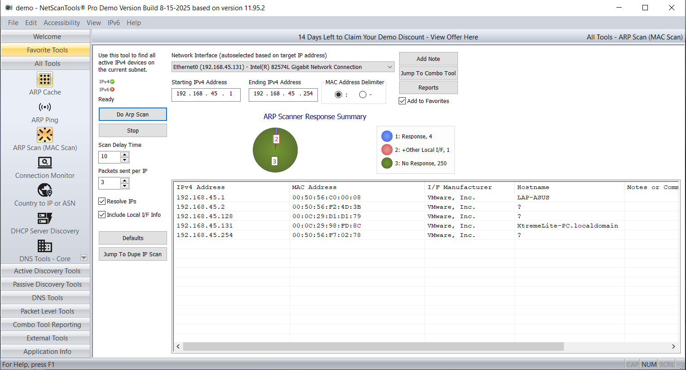
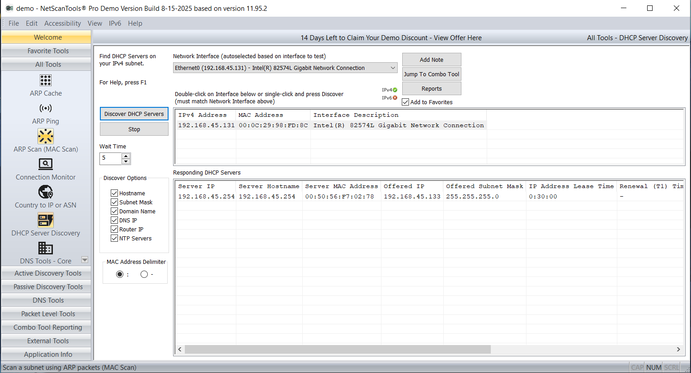
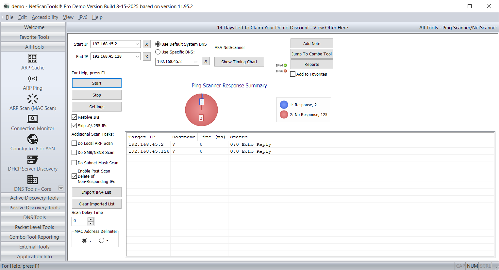
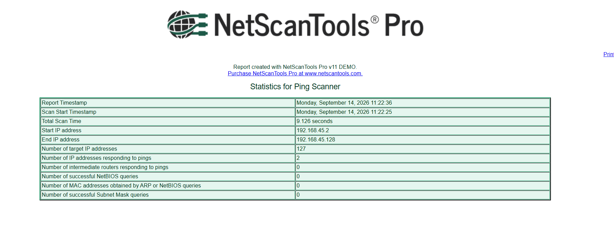

# Lab 05: Scanning a Network using NetScanTools Pro

## 1. Laboratory Overview & Objectives

The objective of this lab is to execute advanced network discovery, subnet sweeping, host identification, and DHCP server detection using **NetScanTools Pro**. Security analysts utilize NetScanTools Pro to rapidly map local IP-to-MAC address bindings using ARP sweeps, detect rogue DHCP servers, evaluate network responsiveness, and audit active host protocols across target internal subnets.

* **Attacker System:** Windows Workstation /Windows 10 -  (`192.168.45.131`)
* **Primary Tool:** NetScanTools Pro
* **Target Environment:** Subnet `192.168.45.0/24` / Gateway (`192.168.45.2`)

---

## 2. Step-by-Step Task Execution & Evidence

### Part 1: Subnet ARP / MAC Address Sweep

1. Launched NetScanTools Pro with administrative privileges and navigated to the **ARP Scanner / Ping Scanner** tool module.
2. Configured the scan target range to `192.168.45.1` through `192.168.45.254` and executed the subnet sweep.
3. Extracted resolved MAC addresses, NIC manufacturer details (e.g., VMware, ASUS), round-trip response latencies, and active host status across the IP range.

> **📸 Verification Screenshot 1: NetScanTools Pro ARP Scanner Subnet Sweep Results**
> 

### Part 2: DHCP Server Discovery & Network Audit

1. Selected the **DHCP Server Discovery** tool module within NetScanTools Pro.
2. Transmitted DHCP Discover broadcast packets across the local Ethernet interface (`192.168.45.131`) to query responding network services.
3. Audited active DHCP server responses, assigned IP lease ranges, gateway addresses, subnet masks, and DNS server options to verify authorized network infrastructure.

> **📸 Verification Screenshot 2: NetScanTools Pro DHCP Server Discovery Output**
> 

### Part 3: Ping Scanner & Target Responsiveness Mapping

1. Loaded the **Ping Scanner** module and performed multi-threaded ICMP echo requests against discovered live target hosts (`192.168.45.2`, `192.168.45.128`).
2. Cataloged packet loss metrics, minimum/maximum TTL responses, and round-trip times (RTT) to map target network stability and response behavior.

> **📸 Verification Screenshot 3: NetScanTools Pro Ping Scanner Responsiveness Matrix**
> 

> **📸 Verification Screenshot 3: NetScanTools Pro Ping Scanner Responsiveness Matrix**
> 

---

## 3. Lab Questions & Technical Analysis

**Question 1: Why is an ARP-based subnet sweep more reliable than an ICMP ping sweep on a local Ethernet network segment?**

* **Answer:** ARP (Address Resolution Protocol) operates at Layer 2 (Data Link layer) and is required for IP-to-MAC address resolution on local network segments. Hosts cannot block ARP requests while remaining functional on an Ethernet network, whereas ICMP packets (Layer 3) are frequently blocked or dropped by host firewalls (such as Windows Defender Firewall). Therefore, ARP sweeps discover all active local hosts regardless of OS-level firewall rules.

**Question 2: What security risks are associated with unauthorized or rogue DHCP servers operating on a local subnet?**

* **Answer:** Rogue DHCP servers can issue illegitimate IP configurations to client devices on the network. By advertising their own IP address as the default gateway or primary DNS server, attackers can execute Man-in-the-Middle (MitM) attacks, intercept unencrypted traffic, reroute DNS queries to malicious destinations, or deny network connectivity to legitimate endpoints (Denial of Service).

---

## 4. Laboratory Reflection

This lab demonstrated the effectiveness of NetScanTools Pro for automated Layer 2 and Layer 3 reconnaissance. Conducting ARP sweeps provided accurate host discovery across local subnets without triggering typical host firewall blocks. Furthermore, performing DHCP discovery enabled rapid verification of authorized DHCP servers, illustrating how network administrators and auditors detect rogue network appliances and unauthorized service configurations.