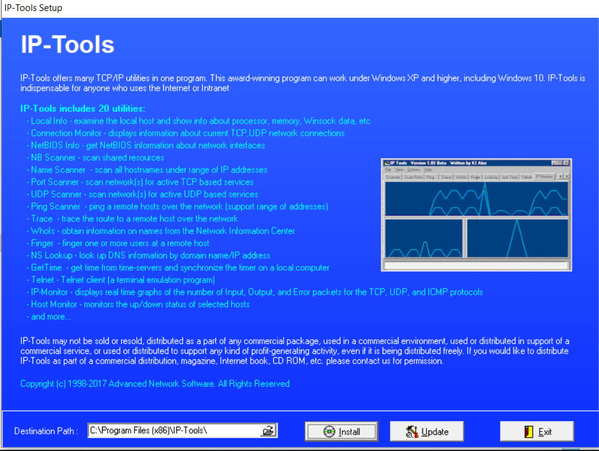
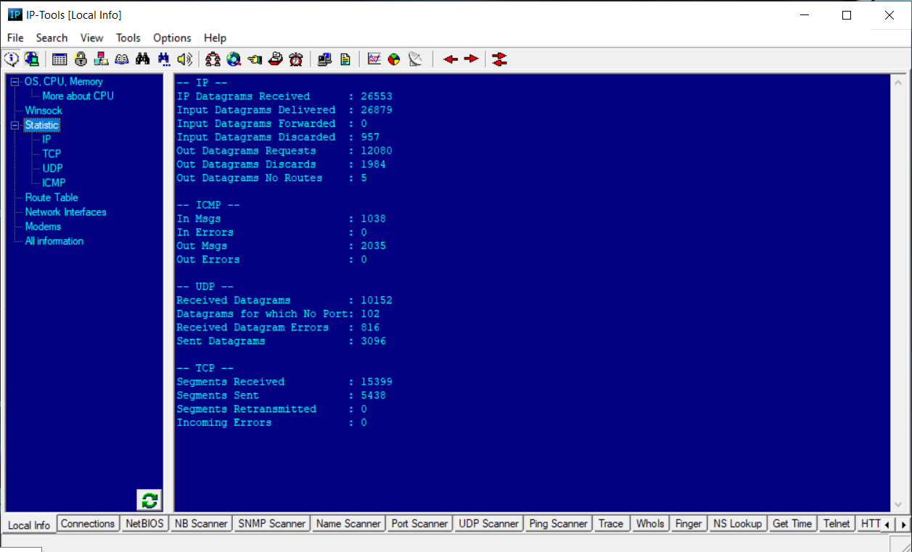
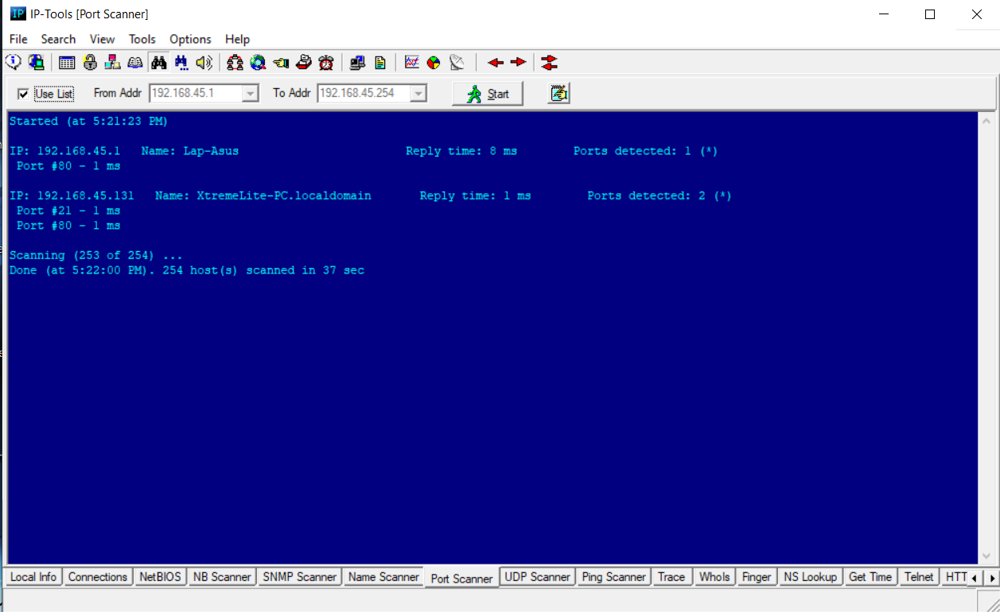

# Lab 06: Scanning for Network Traffic Going through a Computer's Adapter using IP-Tools

## 1. Laboratory Overview & Objectives

The objective of this lab is to monitor network traffic, perform target discovery, and audit active network adapters using **IP-Tools**. Security analysts use IP-Tools to inspect computer network interfaces, observe real-time packet flow and adapter statistics, perform port scanning, and detect live hosts across local subnets to assess exposed network entry points.

* **Attacker System:** Windows Workstation (`192.168.45.131`)
* **Primary Tool:** IP-Tools
* **Target Host / Subnet:** `192.168.45.131` / `192.168.45.0/24`

---

## 2. Step-by-Step Task Execution & Evidence

### Part 1: Installation & Initial Setup

1. Navigated to the tool installer directory:  
   `C:\Users\Administrator\DownloadsIP-Tools`
2. Executed `iptools.exe` and confirmed the setup popup prompt by clicking **Yes**.
3. Followed the installation wizard prompts and completed setup by clicking **Install**.

> **📸 Verification Screenshot 1: IP-Tools Setup & Installation Prompt**  
> 

### Part 2: Adapter Statistics & Live Traffic Monitoring

1. Launched **IP-Tools** with administrative privileges.
2. Selected the **Adapter Statistics** utility tab from the left side panel.
3. Monitored active network interface metrics, real-time packet throughput, and bandwidth consumption graphs.

> **📸 Verification Screenshot 2: IP-Tools Adapter Statistics Dashboard**  
> 

### Part 3: Host Discovery & Port Scanning

1. Selected the **Port Scanner** / **Ping Scanner** utility tab inside IP-Tools.
2. Entered the target IP range (`192.168.45.1`-`192.168.45.254`) and executed the scan.
3. Analyzed the results to identify active IP addresses, open listening ports, and active network services.

> **📸 Verification Screenshot 3: IP-Tools Network & Port Scan Results**  
> 

---

## 3. Lab Questions & Technical Analysis

**Question 1: Why is adapter traffic monitoring important during network scanning and security assessments?**

* **Answer:** Monitoring adapter traffic allows security analysts to observe raw packet transmission rates, verify active network connections, and confirm that scanning tools are sending and receiving traffic properly across the designated network interface without unintended drop-offs or bottlenecking.

**Question 2: How do utilities like IP-Tools assist in identifying live hosts on a network segment?**

* **Answer:** IP-Tools sends ICMP echo requests (pings) and TCP/UDP connection requests across a defined range of IP addresses. Devices that return valid responses (such as ICMP Echo Replies or TCP SYN/ACK flags) reveal themselves as active hosts operating within the subnet.

---

## 4. Laboratory Reflection

This lab demonstrated how IP-Tools consolidates essential TCP/IP utilities—such as adapter traffic monitoring, ping scanning, and port checking—into a single graphical interface. Using adapter statistics and scanning features provided clear visibility into active network interfaces and enabled swift discovery of live target endpoints.