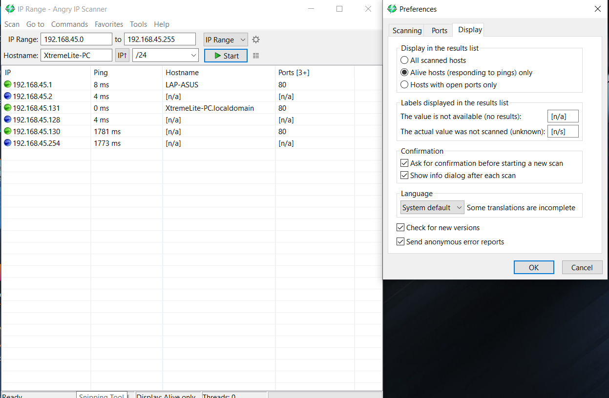
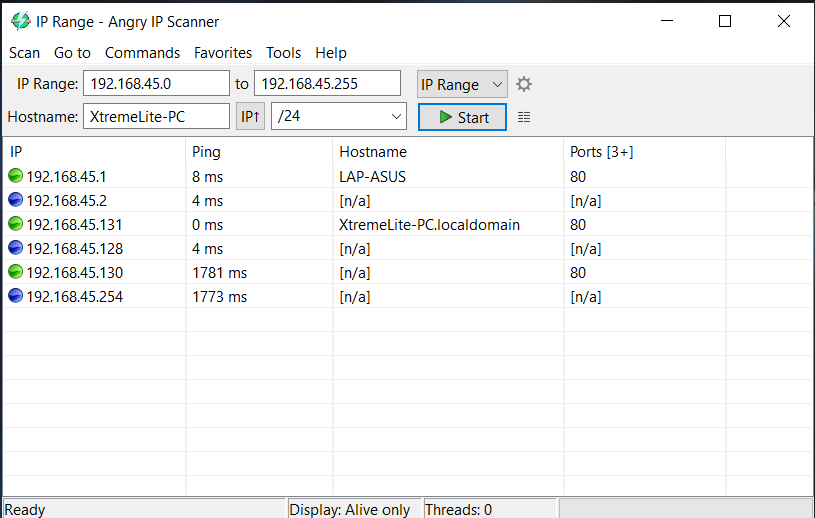
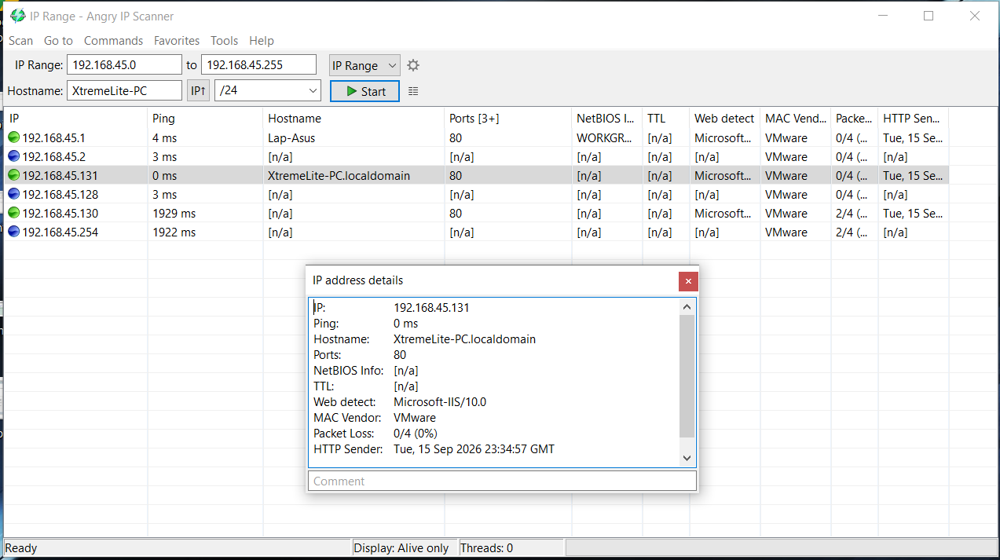

# Lab 07: Checking for Live Systems using Angry IP Scanner

## 1. Laboratory Overview & Objectives

The objective of this lab is to perform rapid, multi-threaded host discovery and IP reachability sweeps across a local target subnet using **Angry IP Scanner**. Security analysts use Angry IP Scanner to quickly map live hosts, resolve hostnames via NetBIOS/DNS, measure round-trip latency, and identify open target ports across large network ranges.

* **Attacker System:** Windows Workstation (`192.168.45.131`)
* **Primary Tool:** Angry IP Scanner
* **Target Subnet:** `192.168.45.0` to `192.168.45.255` (`/24`)

---

## 2. Step-by-Step Task Execution & Evidence

### Part 1: Subnet Range Configuration & Display Preferences

1. Launched **Angry IP Scanner** on the Windows workstation.
2. Configured the scan parameters: **IP Range:** `192.168.45.0` **to** `192.168.45.255` (Netmask: `/24`).
3. Navigated to **Tools -> Preferences -> Display** and selected **"Alive hosts (responding to pings) only"** under *Display in the results list* to filter out non-responding IP addresses.

> **📸 Verification Screenshot 1: Angry IP Scanner Interface Configuration**
> 

### Part 2: Subnet Ping Sweep & Host Discovery Execution

1. Clicked **Start** to initiate the multi-threaded host discovery sweep across the target subnet.
2. Monitored real-time scanning statistics, resolving hostnames and open port status for active network targets.
3. Verified the alive hosts responding across the subnet: `192.168.45.1`, `192.168.45.2`, `192.168.45.128`, `192.168.45.130`, `192.168.45.131`, and `192.168.45.254`. Active web services (Port 80) were confirmed on hosts `192.168.45.1`, `192.168.45.130`, and `192.168.45.131`.

> **📸 Verification Screenshot 2: Angry IP Scanner Active Host Sweep Results**
> 

### Part 3: Host Details & Fetcher Inspection

1. Right-clicked target host `192.168.45.131` (`XtremeLite-PC.localdomain`) from the results list and selected **Host Details**.
2. Inspected extended fetcher fields, confirming a `0 ms` ping response, VMware MAC vendor identification, web service detection (`Microsoft-IIS/10.0`), 0% packet loss, and HTTP sender metadata timestamp details.

> **📸 Verification Screenshot 3: Angry IP Scanner Host Details & Fetcher Inspection**
> 

---

## 3. Lab Questions & Technical Analysis

**Question 1: How does Angry IP Scanner achieve high-speed host discovery across large subnet ranges compared to standard single-threaded ping tools?**

* **Answer:** Angry IP Scanner utilizes multi-threading by creating a separate scanning thread for each IP address (or batch of addresses). This allows it to send asynchronous ping probes and process network responses concurrently rather than sequentially waiting for each host response to time out.

**Question 2: What is the purpose of "Fetchers" in Angry IP Scanner?**

* **Answer:** Fetchers are modular plugins within Angry IP Scanner that gather specific details about discovered hosts beyond basic ICMP pings. Examples include resolving DNS/NetBIOS hostnames, detecting MAC address vendor details, fetching HTTP server banners (e.g., `Microsoft-IIS/10.0`), and checking specific open ports.

---

## 4. Laboratory Reflection

This lab demonstrated the speed and efficiency of Angry IP Scanner for network reconnaissance. Multi-threaded ping sweeps quickly identified 6 active hosts on the `192.168.45.0/24` subnet without manual IP probing. Filtering results by alive status and inspecting host fetchers provided exact MAC vendor details, web server banners, and network latency profiles across internal targets.