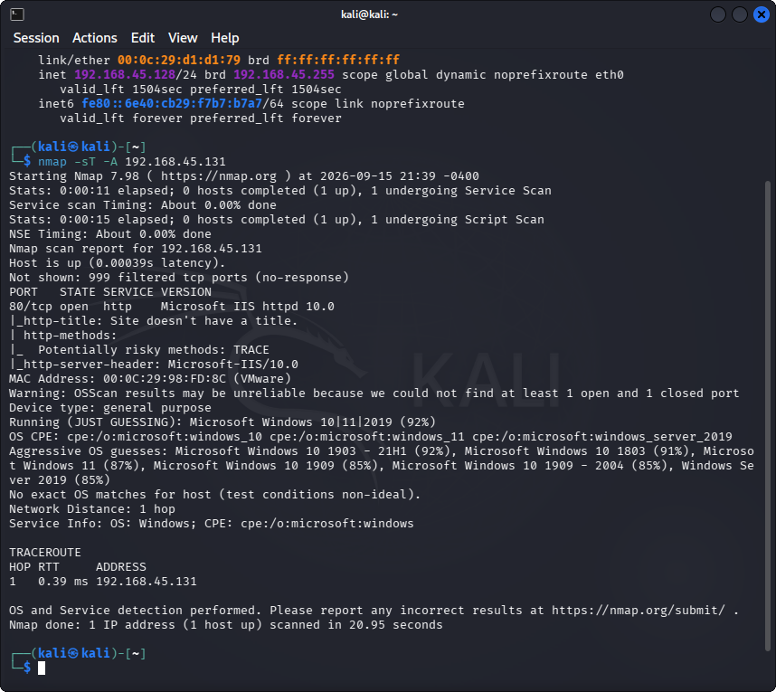
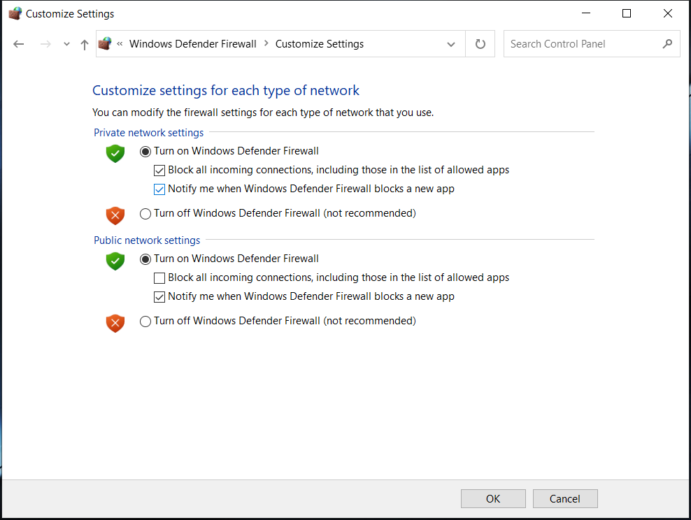
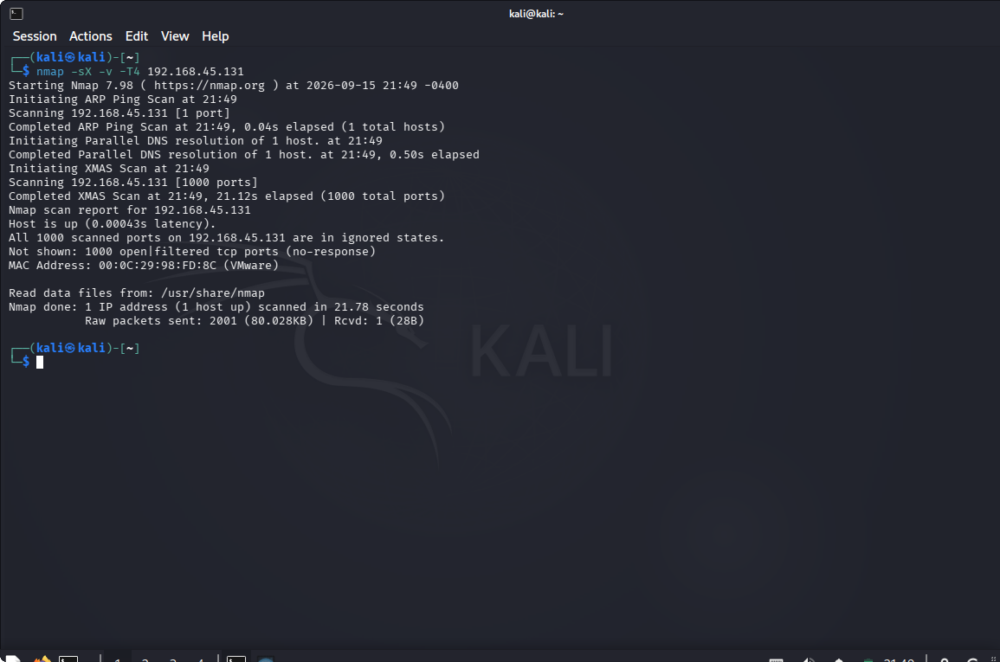
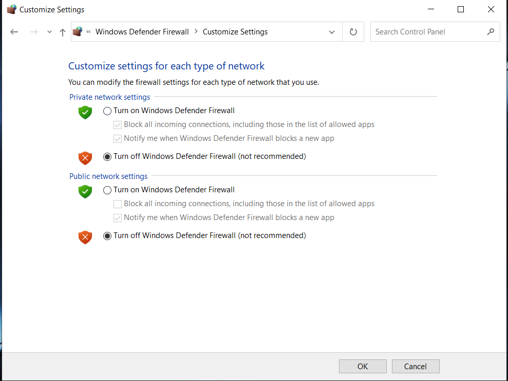
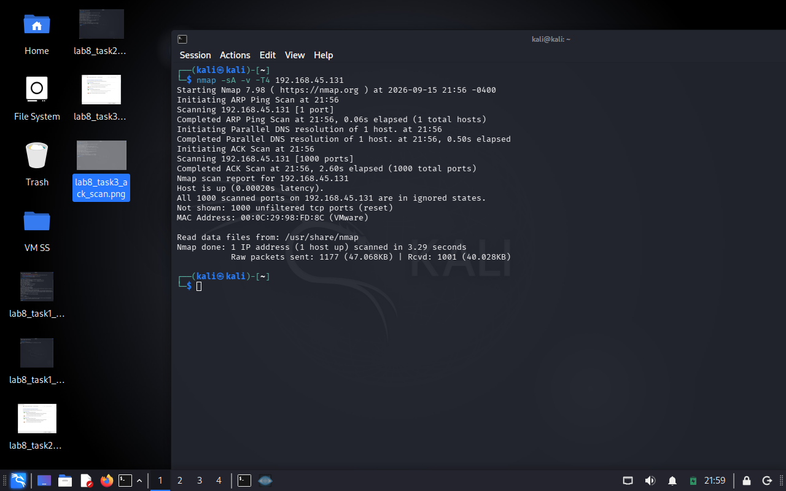

# Lab 08: Exploring Various Network Scanning Techniques

## 1. Laboratory Overview & Objectives

The objective of this lab is to explore advanced network scanning techniques using **Nmap** on Kali Linux against a target windows 10 machine. Security analysts and penetration testers use specialized Nmap scan types (such as TCP Connect, Xmas, ACK flag, UDP, and IDLE scans) to map open ports, analyze service behavior, and evaluate target firewall responses under different configurations.

* **Attacker System:** Kali Linux (`192.168.45.128`)
* **Target System:** Windows 10 (`192.168.45.131`)
* **Primary Tool:** Nmap

---

## 2. Step-by-Step Task Execution & Evidence

### Task 1: Perform TCP Connect Scan

1. Launched the command-line terminal in Kali Linux (`192.168.45.128`).
2. Verified local IP address using `ip a` and target Windows 10 IP (`192.168.45.131`) using `ipconfig`.
3. Executed `nmap -sT -A 192.168.45.131` to run a full TCP Connect scan with aggressive OS, version detection, and script scanning.
4. Inspected the scan results displaying open ports, OS fingerprinting, NetBIOS details, and SMB service metadata.

> **📸 Verification Screenshot 2: TCP Connect Scan Output Details**
> 

### Task 2: Perform Xmas Scan

1. Switched to the Windows 10 virtual machine (`192.168.45.131`) and enabled **Windows Firewall** for all network profiles.
2. Switched back to the Kali Linux (`192.168.45.128`) terminal.
3. Executed `nmap -sX -v -T4 192.168.45.131` to send a TCP frame with PSH, URG, and FIN flags set.
4. Observed the Nmap response confirming that all scanned ports returned as `open|filtered` due to the active Windows Firewall rules dropping probes.

> **📸 Verification Screenshot 3: Turning ON Windows Firewall**
> 

> **📸 Verification Screenshot 4: Performing Xmas Scan**
> 

### Task 3: Perform ACK Flag Scan

1. Switched to the windows 10 virtual machine (`192.168.45.131`) and turned **OFF** the Windows Firewall.
2. Returned to the Kali Linux (`192.168.45.128`) terminal.
3. Executed `nmap -sA -v -T4 192.168.45.131` to send ACK probes to test firewall filtering rules.
4. Analyzed the results showing that all scanned ports returned as `unfiltered`, confirming the target firewall was inactive and stateful filtering was disabled.

> **📸 Verification Screenshot 5: Turning OFF Windows Firewall**
> 

> **📸 Verification Screenshot 6: Performing ACK Flag Scan**
> 

---

## 3. Lab Questions & Technical Analysis

**Question 1: What is the primary difference between a full TCP Connect scan (`-sT`) and a SYN scan (`-sS`)?**

* **Answer:** A TCP Connect scan (`-sT`) completes the full three-way handshake (SYN, SYN-ACK, ACK) using the operating system's network stack, making it easier to log on the target. A SYN scan (`-sS`) performs a half-open scan by sending a RST packet immediately after receiving a SYN-ACK, tearing down the connection before completion to reduce detection logging.

**Question 2: Why did the Xmas scan (`-sX`) report ports as `open|filtered` when the Windows Firewall was turned ON?**

* **Answer:** An Xmas scan relies on RFC 793 standards where non-standard flag combinations (FIN, URG, PSH) sent to closed ports should prompt a RST response, while open ports drop the packet. When Windows Firewall is active on target host `192.168.45.131`, it drops these illegal packets across both open and closed ports without sending RST responses, causing Nmap to categorize all ports as `open|filtered`.

---

## 4. Laboratory Reflection

This lab highlighted the practical mechanics of packet manipulation and firewall responses using Nmap executed from Kali Linux (`192.168.45.128`) targeting windows 10 (`192.168.45.131`). Executing TCP Connect, Xmas, and ACK flag scans illustrated how host security settings like Windows Firewall alter port state output. Understanding how different TCP flag combinations behave against stateful firewalls is essential for accurate network enumeration and security assessment.