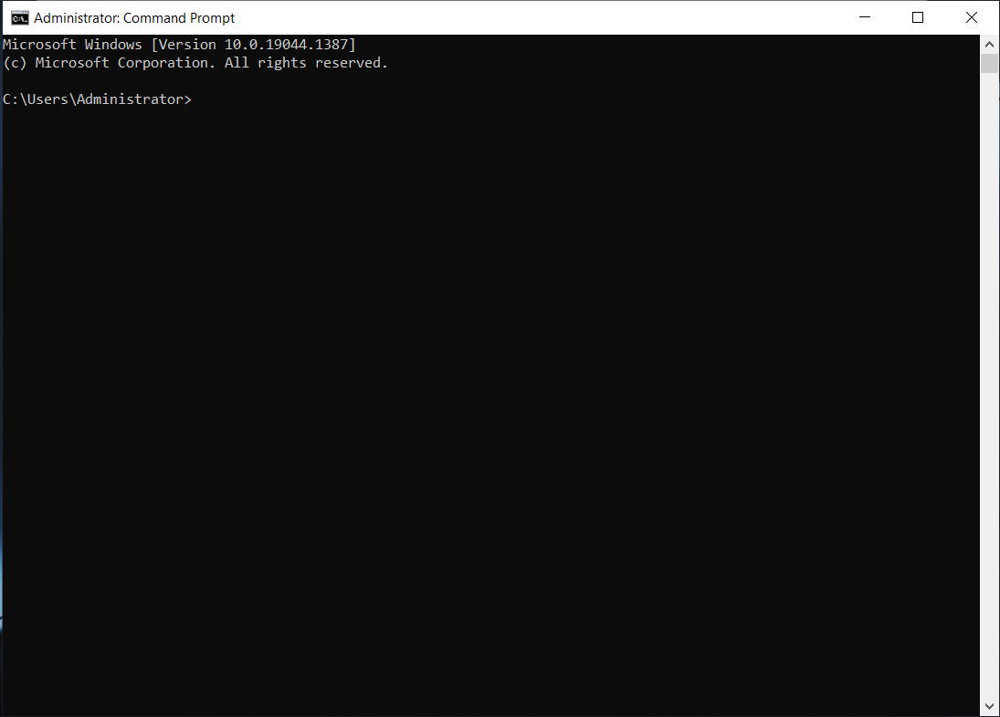
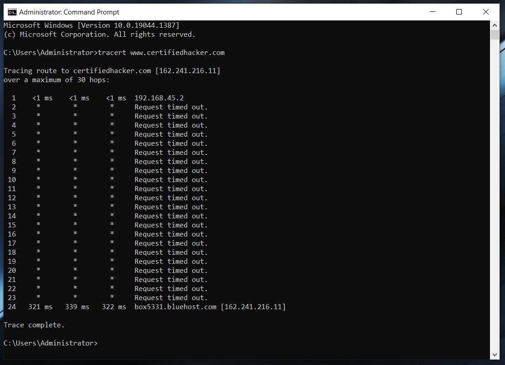
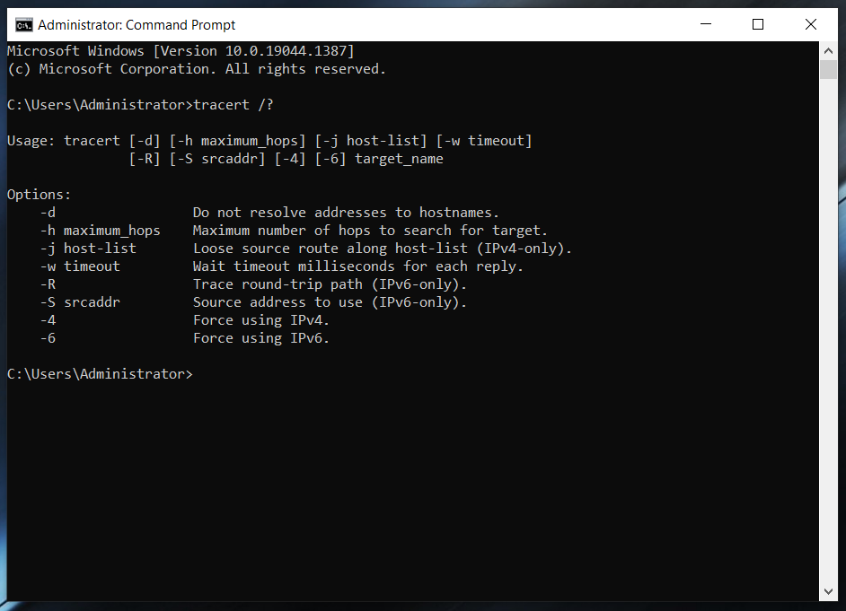
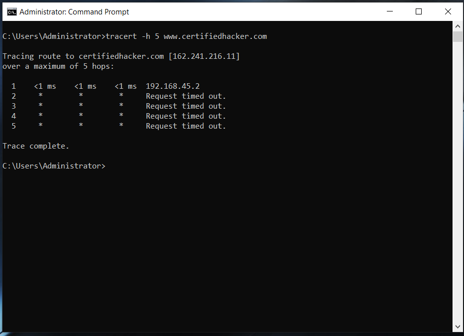

# Lab 09: Perform ICMP Probing using Ping/Traceroute for Network Troubleshooting

## 1. Laboratory Overview & Objectives

The objective of this lab is to learn and perform ICMP probing techniques using diagnostic command-line tools such as **Ping** and **Traceroute (`tracert`)** to troubleshoot network connectivity, diagnose packet paths, and trace intermediate hop counts across a network.

* **Attacker System / Host System:** Windows Server 2016 / Windows 10
* **Secondary System:** Kali Linux
* **Primary Tools:** `tracert` (Traceroute)

---

## 2. Step-by-Step Task Execution & Evidence

### Task 1: Open Elevated Command Prompt

1. Right-clicked the **Start** button on the Windows taskbar.
2. Selected **Command Prompt (Admin)** from the context menu to launch an elevated command-line window.

📸 **Verification Screenshot 1: Opening Elevated Command Prompt**

### Task 2: Run Tracert Command

1. Opened the elevated Command Prompt window.
2. Typed `tracert www.certifiedhacker.com` and pressed **Enter**.
3. Observed the system resolving the domain name into its target IP address and initiating the trace to show each intermediate network hop (up to 17 hops) required to reach the destination.

📸 **Verification Screenshot 2: Running Tracert Command**

4. Typed `tracert /?` and pressed **Enter** to display the available command-line switches and options for the `tracert` utility.

📸 **Verification Screenshot 3: Tracert Command Help Options**

5. Typed `tracert -h 5 www.certifiedhacker.com` and pressed **Enter** to execute a trace constrained to a maximum of 5 hops.

📸 **Verification Screenshot 4: Running Tracert with Max Hops**

---

## 3. Lab Questions & Technical Analysis

**Question 1: What is the primary purpose of the `tracert` (Traceroute) tool in network troubleshooting?**

* **Answer:** `tracert` is a utility used to trace the path that an IP packet takes from a source host to a destination host. It works by sending ICMP Echo Request messages with incrementally increasing Time-To-Live (TTL) values, causing each router along the path to return an ICMP Time Exceeded message, thereby revealing the IP address and response time of every hop.

**Question 2: How does specifying the `-h` flag modify the behavior of the `tracert` command?**

* **Answer:** The `-h` parameter specifies the maximum number of hops to search for the target destination. For example, running `tracert -h 5 www.certifiedhacker.com` limits the route discovery process to 5 hops, causing the trace to stop after the fifth hop even if the final destination has not been reached.

---

## 4. Laboratory Reflection

This lab demonstrated the practical implementation of ICMP probing for network diagnostic and path trace analysis using `tracert`. By executing standard traces, reviewing utility help switches, and applying hop limits via `-h`, we evaluated how network traffic traverses intermediate routers to reach a remote target (`www.certifiedhacker.com`). Understanding Time-To-Live (TTL) manipulation and hop analysis is essential for identifying network bottlenecks, routing loops, and unreachable path segments during security audits and network troubleshooting.
