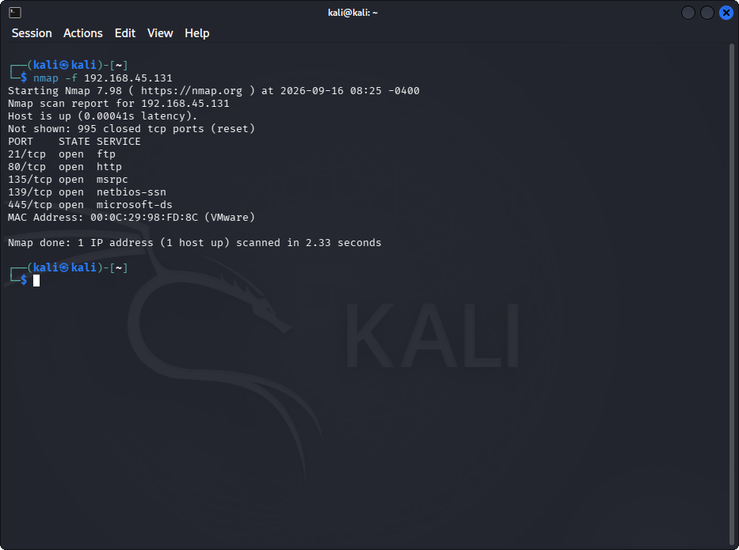
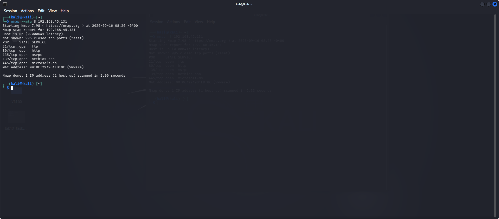
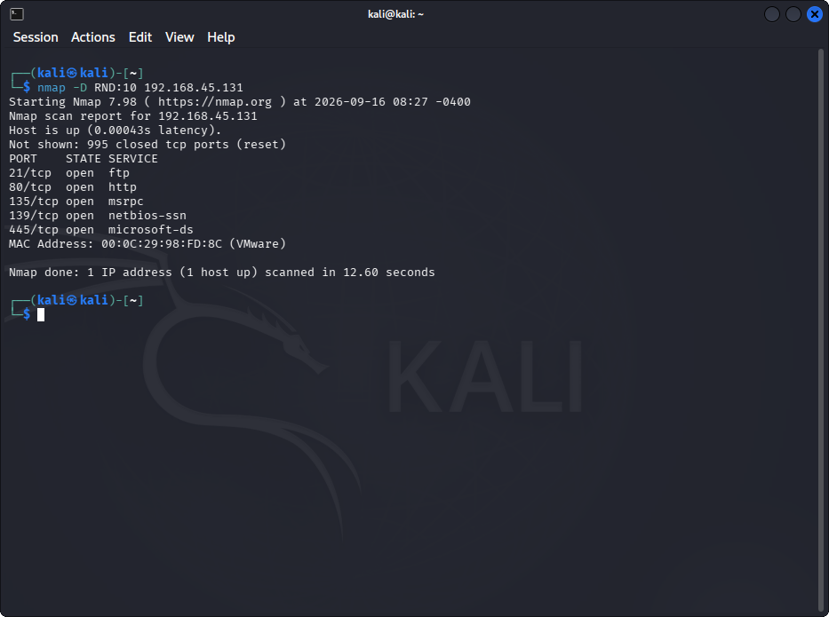
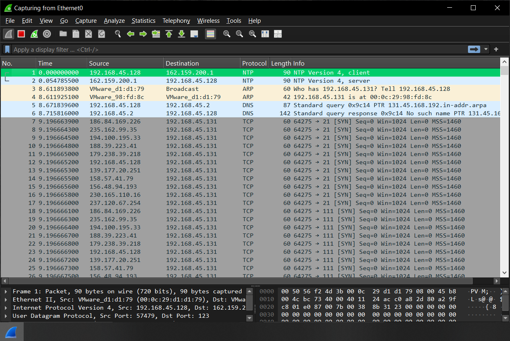

# Lab 10: Avoiding Scanning Detection using Multiple Decoy IP Addresses

## 1. Laboratory Overview & Objectives

The objective of this lab is to explore techniques for evading network security perimeter controls—such as Firewalls and Intrusion Detection Systems (IDS)—by using IP fragmentation, custom Maximum Transmission Unit (MTU) sizing, and decoy IP address spoofing with **Nmap**.

* **Attacker System:** Kali Linux (`192.168.45.128`)
* **Target System:** Windows 10 (`192.168.45.131`)
* **Primary Tools:** Nmap, Wireshark

---

## 2. Step-by-Step Task Execution & Evidence

### Task 1: Turn ON Windows Firewall

1. Switched to the target Windows 10 machine (`192.168.45.131`).
2. Opened the **Windows Defender Firewall** settings.
3. Configured and turned **ON** the Windows Firewall for Domain, Private, and Public network profiles to ensure perimeter filtering was active.

📸 **Verification Screenshot 1: Turning ON Windows Firewall**

### Task 2: Perform IP Fragmentation

1. Switched to the Kali Linux terminal (`192.168.45.128`).
2. Executed `nmap -f 192.168.45.131` to split the probe packets into smaller fragments, making packet inspection and rule matching harder for firewalls/IDS.
3. Analyzed the scan output displaying the discovered open ports on the target host despite active firewall rules.

📸 **Verification Screenshot 2: Performing IP Fragmentation Scan**

### Task 3: Perform Maximum Transmission Unit (MTU) Customization

1. Executed `nmap --mtu 8 192.168.45.131` in the Kali Linux terminal (`192.168.45.128`).
2. Verified that packet payloads were transmitted using customized 8-byte boundaries instead of default packet lengths, bypassing stateful packet inspection signatures.

📸 **Verification Screenshot 3: Performing MTU Customization Scan**

### Task 4: Decoying IP Addresses

1. Executed `nmap -D RND:10 192.168.45.131` in the Kali Linux terminal (`192.168.45.128`) to generate 10 random decoy IP addresses alongside the real attacker IP address (`192.168.45.128`).
2. Switched to the target Windows 10 machine (`192.168.45.131`) and launched **Wireshark**.
3. Captured network traffic to confirm that incoming scan packets originated from multiple spoofed decoy source IP addresses, effectively concealing the true origin of the attacker.(Wireshark: nmap -D RND:10 192.168.45.131 triggers SYN packets in Wireshark arriving at 192.168.45.131 from various spoofed IP addresses (186.84.169.226, 235.162.99.35, 194.100.195.33, 237.120.67.254 , etc...) alongside your actual Kali IP (192.168.45.128)
)

📸 **Verification Screenshot 4: Running Nmap Decoy Scan**

📸 **Verification Screenshot 5: Wireshark Traffic Capture Showing Decoy IPs**

---

## 3. Lab Questions & Technical Analysis

**Question 1: How does IP fragmentation (`-f`) help in evading Firewall and Intrusion Detection Systems (IDS)?**

* **Answer:** IP fragmentation breaks the TCP header into smaller packet fragments (typically 8 bytes or smaller). Because many simple stateful firewalls and signature-based IDS sensors evaluate complete packets without reassembling fragments in real-time, fragmented packets can bypass filtering rules undetected until they reach the destination host (`192.168.45.131`) for reassembly.

**Question 2: What is the purpose of using the decoy option (`-D RND:10`) during network enumeration?**

* **Answer:** The `-D` option mixes decoy source IP addresses with the real attacker's IP address (`192.168.45.128`) in the packet stream. To target logging mechanisms and IDS sensors, it appears as though multiple hosts are scanning the network simultaneously, making it extremely difficult for security analysts to isolate the true origin of the attack.

---

## 4. Laboratory Reflection

This lab demonstrated advanced evasion mechanisms used to perform network scanning without triggering perimeter defenses. By using `-f` for packet fragmentation, custom `--mtu` values, and `-D RND:10` for spoofing decoy IP addresses against target `192.168.45.131` from Kali Linux (`192.168.45.128`), we successfully concealed the scan profile and distributed probe signatures across fake IPs. Observing these packets in Wireshark reinforced the importance of implementing stateful packet reassembly and anomaly-based detection mechanisms within modern IDS and firewall architectures.