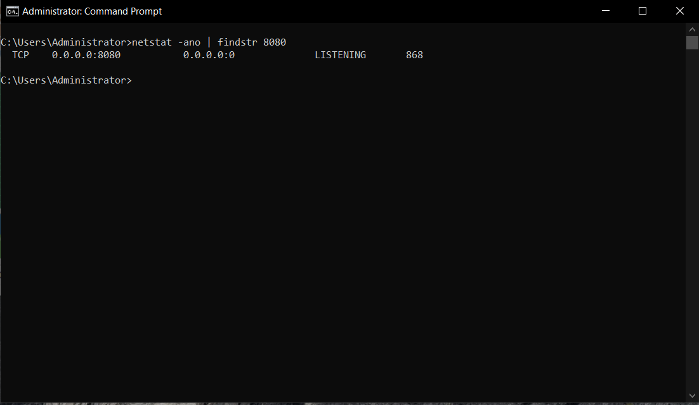
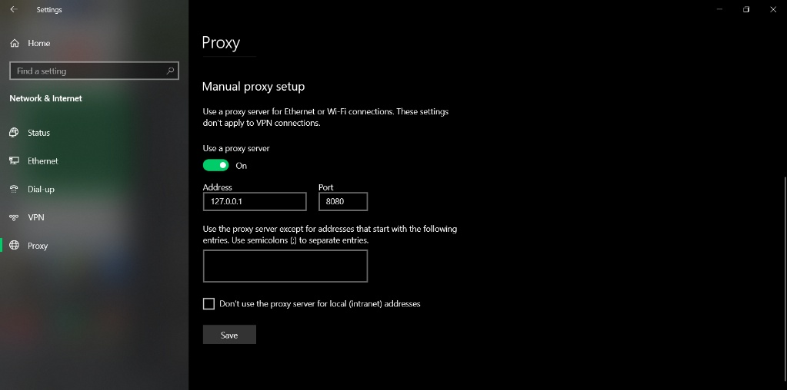
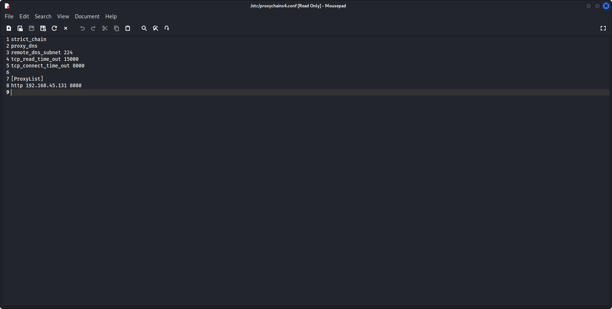
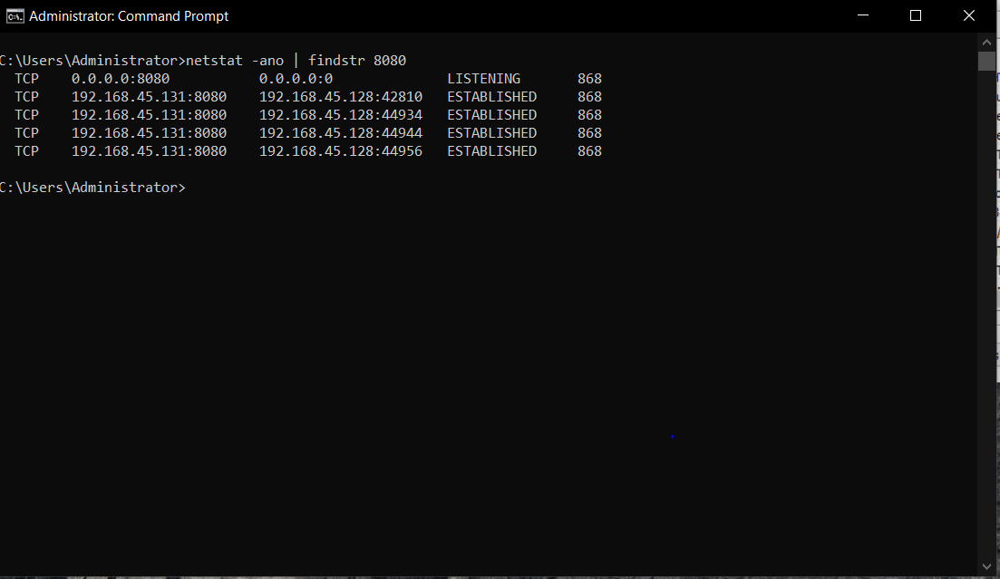

# Lab 11: Daisy Chaining using Proxy Tools

## 1. Laboratory Overview & Objectives

The objective of this lab is to configure and perform proxy daisy chaining across multiple network nodes. Proxy daisy chaining routes traffic sequentially through a series of intermediate proxy servers before reaching the destination, effectively masking the origin IP address and enhancing operational anonymity.

* **Attacker System / Host System:** Windows Machine (`192.168.45.131`)
* **Intermediate / Secondary Systems:** Kali Linux (`192.168.45.128`)
* **Gateway IP:** `192.168.45.2`
* **Primary Tools:** CCProxy, ProxyChains-ng, Google Chrome

---

## 2. Step-by-Step Task Execution & Evidence

### Task 1: Install and Configure CCProxy Server

1. Installed CCProxy on the Windows host machine (`192.168.45.131`).
2. Configured the proxy listener options to support HTTP traffic on port `8080`.
3. Started the CCProxy service and verified active socket binding using `netstat -ano | findstr 8080`.

📸 **Verification Screenshot 1: Installing Proxy Tool**

### Task 2: Configure Local Proxy Settings in Google Chrome

1. Opened **Google Chrome** on the host machine (`192.168.45.131`).
2. Navigated to **Settings > System** (`chrome://settings/system`) and selected **Open your computer's proxy settings**.
3. Enabled **Use a proxy server** under the **Manual proxy setup** section.
4. Entered `127.0.0.1` into the **Address** field and specified port `8080` in the **Port** field.
5. Clicked **Save** to apply the system-wide proxy route for Chrome traffic.

📸 **Verification Screenshot 2: Configuring Chrome System Proxy**

### Task 3: Establish Proxy Daisy Chain Nodes in ProxyChains

1. Edited the ProxyChains configuration file on Kali Linux (`/etc/proxychains4.conf`).
2. Configured `strict_chain` routing and added the CCProxy node (`http 192.168.45.131 8080`) under the `[ProxyList]` header.
3. Verified clean formatting to ensure no syntax errors or invalid item parsing occurred.

📸 **Verification Screenshot 3: Configuring Proxy Chain Nodes**

### Task 4: Execute Web Requests & Audit Traffic Chain

1. Executed HTTP requests from Kali Linux through the proxy chain using `proxychains4 curl -I http://google.com`.
2. Reviewed terminal output to verify successful proxy routing:
   * **Terminal Status:** Output confirmed `[proxychains] Strict chain ... 192.168.45.131:8080 ... google.com:80 ... OK`.
   * **HTTP Response:** Target returned `HTTP/1.1 301 Moved Permanently`, validating full round-trip communication through the proxy chain.
3. Audited active sockets using `netstat -ano | findstr 8080` on the Windows host, confirming active inbound TCP connections originating from Kali (`192.168.45.128`) in an `ESTABLISHED` state under PID `868`.

📸 **Verification Screenshot 4: Verifying Proxy Chain Traffic**

---

## 3. Lab Questions & Technical Analysis

**Question 1: What is the primary purpose of daisy chaining proxy servers during scanning or attack phases?**

* **Answer:** Proxy daisy chaining routes network traffic through multiple intermediate systems in sequence. This hides the actual IP address of the attacker/scanner system (`192.168.45.131`) from the target system, making it difficult for perimeter defenses and forensic analysts to trace the source of the connections.

**Question 2: In the configured lab environment, which IP address appears in the server logs of the target web server?**

* **Answer:** The target web server only observes connections originating from the final proxy node in the chain. The actual source host (`192.168.45.131`) and intermediate proxy nodes (e.g., `192.168.45.128`) remain hidden from the destination system's direct socket connection logs.

---

## 4. Laboratory Reflection

This lab demonstrated the practical implementation of proxy daisy chaining using CCProxy and ProxyChains-ng to achieve connection anonymity. By configuring Google Chrome system proxy settings and chaining proxy instances across `192.168.45.128` $\rightarrow$ `192.168.45.131:8080` $\rightarrow$ Target, we verified how traffic is sequentially forwarded across hop nodes. Understanding proxy chaining mechanisms is critical for both security testing (avoiding direct footprint attribution) and defensive analysis (detecting proxy chains through log aggregation across intermediate gateways).