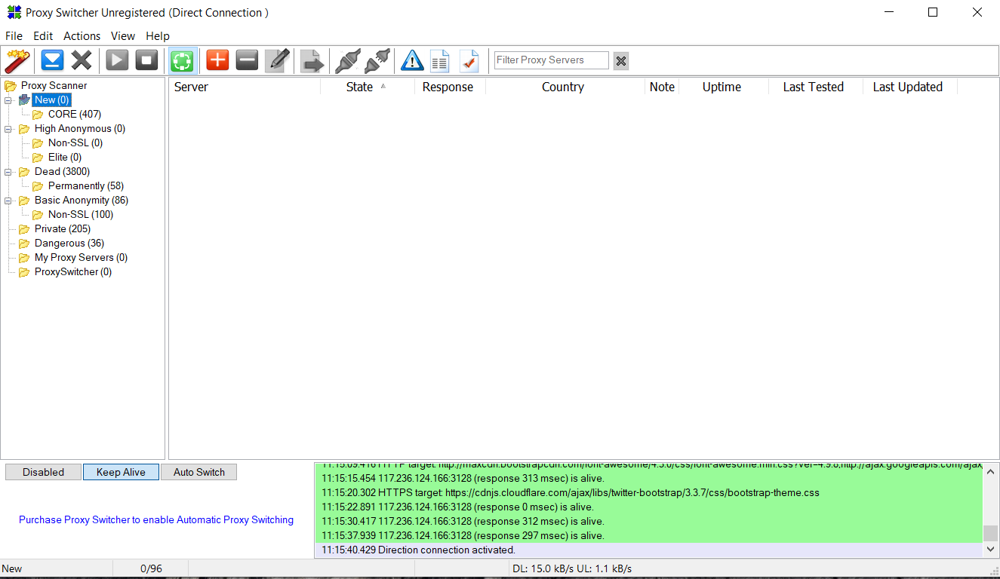
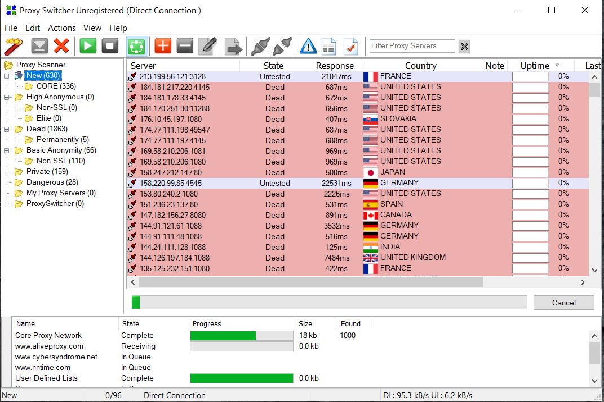
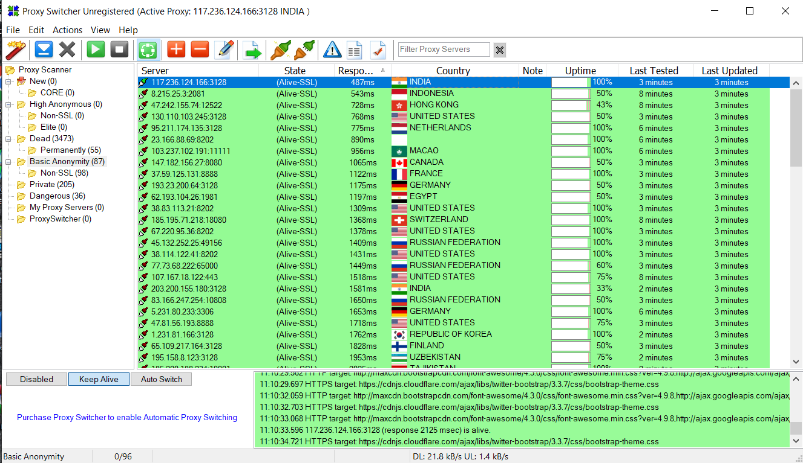
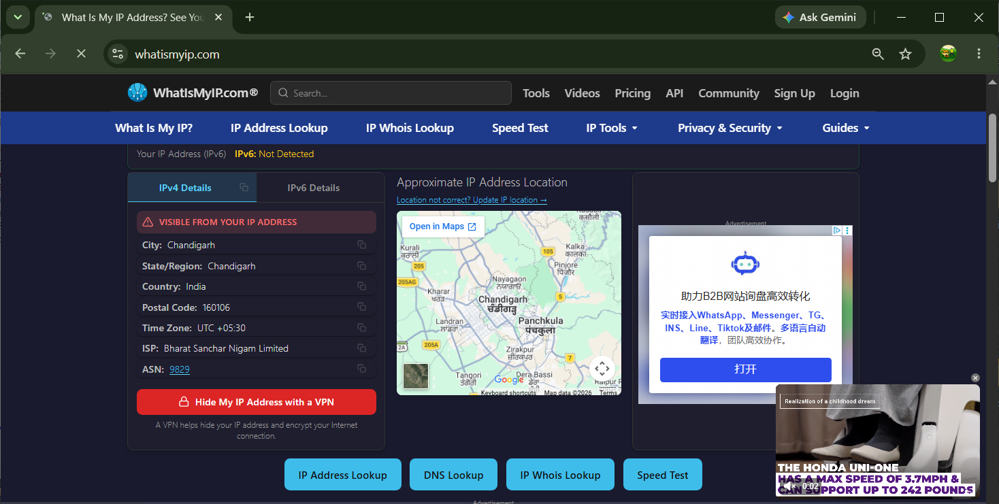

# Lab 12: Anonymous Browsing using Proxy Switcher

## 1. Laboratory Overview & Objectives

The objective of this lab is to demonstrate how to use **Proxy Switcher** to mask your real IP address and maintain Internet anonymity during ethical hacking and penetration testing operations.

* **Target System / Environment:** Windows Server 2016 / Windows 10/11
* **Primary Tools:** Proxy Switcher

---

## 2. Step-by-Step Task Execution & Evidence

### Task 1: Launch Proxy Switcher

1. Navigated to the tool directory `C:\Users\Administrator\Downloads\Proxy Switcher` or opened the application from the start menu.
2. Launched **Proxy Switcher** with administrative privileges.

📸 **Verification Screenshot 1: Launching Proxy Switcher**

### Task 2: Download and Import Proxy List

1. Configured automatic proxy downloading or imported an active proxy list into Proxy Switcher.
2. Initiated connectivity and latency testing across the retrieved proxy servers to identify live, high-anonymity nodes.

📸 **Verification Screenshot 2: Testing and Loading Proxy Servers**

### Task 3: Switch Proxy and Verify IP Address

1. Selected an active high-anonymity proxy server from the list.
2. Clicked **Switch to Selected Proxy** to route all outgoing web traffic through the proxy server.

📸 **Verification Screenshot 3: Enabling Selected Proxy**

3. Opened a web browser and navigated to an IP verification site (e.g., `https://www.whatismyip.com` or `https://ipinfo.io`).
4. Verified that the origin IP address displayed matches the proxy server's IP address rather than the host system's real IP.

📸 **Verification Screenshot 4: Verifying Anonymous IP Address**

---

## 3. Lab Questions & Technical Analysis

**Question 1: What is the primary purpose of using Proxy Switcher in penetration testing and scanning operations?**

* **Answer:** Proxy Switcher enables ethical hackers to automatically switch between different proxy servers, effectively concealing the source IP address from target network logs. This maintains anonymity, prevents target-side IP blocking, and simulates attacks originating from varied geographic regions.

**Question 2: Why is it critical to test proxy servers for anonymity level before using them?**

* **Answer:** Not all proxy servers conceal client identity equally; transparent proxies reveal the client's real IP in header fields, while elite or high-anonymity proxies completely strip identifying request headers. Testing verifies both server responsiveness and strict anonymity standards before routing live traffic.

---

## 4. Laboratory Reflection

This lab provided practical experience in implementing anonymous browsing techniques using Proxy Switcher. By configuring proxy lists, testing active nodes, and switching active system proxies, we verified that outgoing browser requests were successfully rerouted and masked. Mastering proxy management and anonymity tools is fundamental for obfuscating reconnaissance activity, bypassing geographic restrictions, and minimizing source detection during security evaluations.