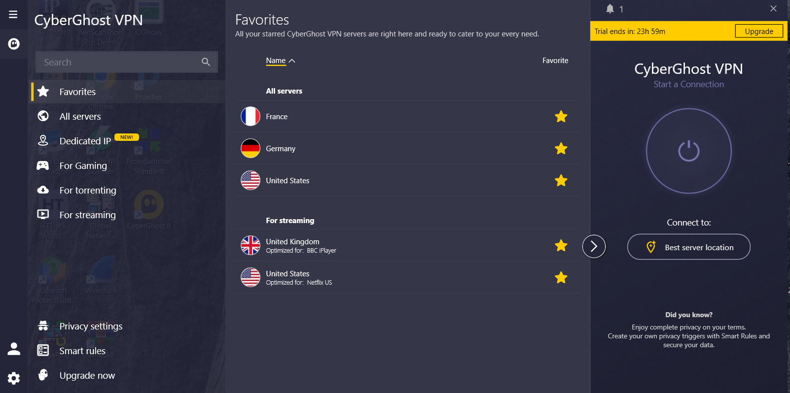
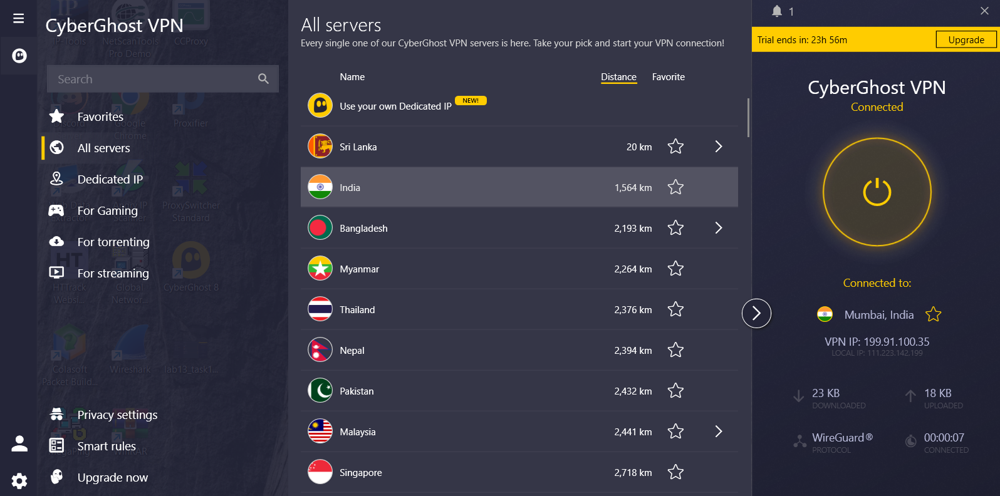
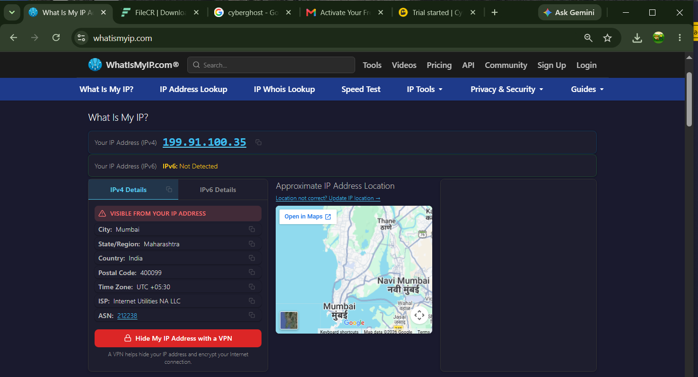

# Lab 13: Anonymous Browsing using CyberGhost

## 1. Laboratory Overview & Objectives

The objective of this lab is to demonstrate how to use **CyberGhost** to surf anonymously and access blocked or censored content during ethical hacking and penetration testing operations.

* **Target System / Environment:** Windows Server 2016 / Windows 10/11
* **Primary Tools:** CyberGhost

---

## 2. Step-by-Step Task Execution & Evidence

### Task 1: Launch CyberGhost

1. Navigated to the tool directory `C:\Users\Administrator\Downloads\CyberGhost` or downloaded/opened the application from the official site.
2. Launched **CyberGhost** with administrative privileges.

📸 **Verification Screenshot 1: Launching CyberGhost**

### Task 2: Configure Anonymity Settings and Server Selection

1. Selected the desired connection mode (e.g., Surf Anonymously, Unblock Streaming, or Unblock Basic Websites).
2. Chose a specific country or server node to establish an encrypted and masked tunnel.

3. Clicked the **Connect** button to initiate the VPN tunnel and route all system web traffic through the CyberGhost network.
4. Verified that the connection status turned active and secure.

📸 **Verification Screenshot 3: Establishing Secure Connection**

### Task 3: Verify Anonymous IP Address and Location

1. Opened a web browser and navigated to an IP verification site (e.g., `https://www.whatismyip.com` or `https://ipinfo.io`).
2. Confirmed that the origin IP address and geographic location reflect the assigned CyberGhost server rather than the host system's real details.

📸 **Verification Screenshot 4: Verifying Anonymous IP Address**

---

## 3. Lab Questions & Technical Analysis

**Question 1: What is the primary advantage of using a dedicated VPN client like CyberGhost compared to traditional browser-based proxy servers?**

* **Answer:** CyberGhost encrypts all system-wide internet traffic (using secure protocols like OpenVPN, IKEv2, or WireGuard) rather than just browser traffic. It also provides higher connection stability, automatic kill switches, DNS leak protection, and access to high-speed dedicated servers worldwide.

**Question 2: Why is DNS leak protection important when performing anonymous browsing and reconnaissance?**

* **Answer:** DNS leak protection ensures that domain name resolution requests are routed through the secure VPN tunnel rather than the Internet Service Provider (ISP). Without it, local DNS queries can expose browsing destinations, revealing the user's real network activity and identity despite an active VPN connection.

---

## 4. Laboratory Reflection

This lab provided practical experience in implementing system-wide anonymous browsing using CyberGhost. By configuring connection modes, selecting remote server nodes, establishing secure tunnels, and verifying IP masking, we confirmed that outgoing traffic was successfully encrypted and anonymized. Mastering VPN tools is crucial for maintaining operational security (OpSec), bypassing regional censorship, and protecting reconnaissance data during ethical hacking assessments.