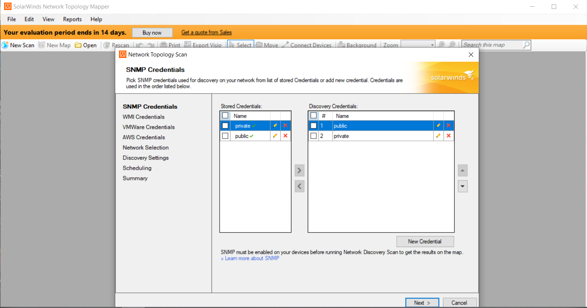
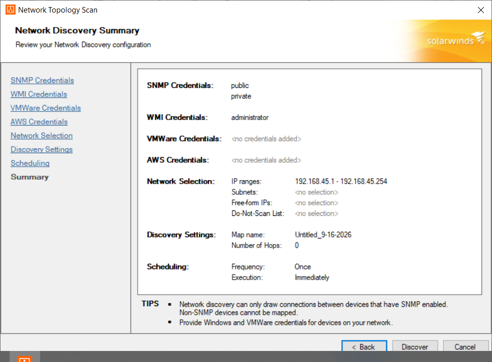
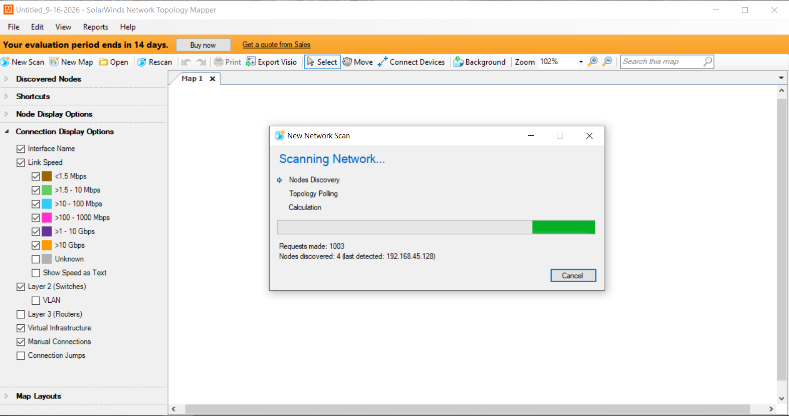
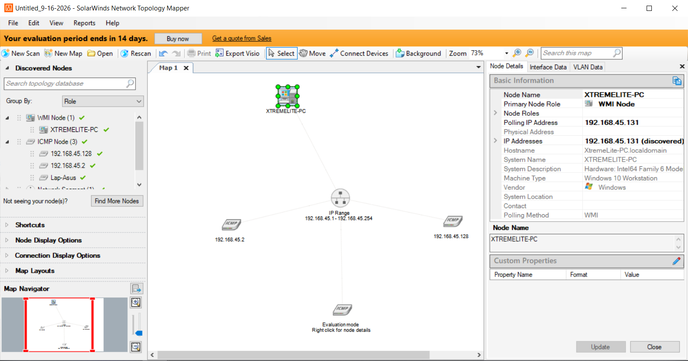

# Lab 15: Drawing Network Diagrams using Network Topology Mapper

## 1. Laboratory Overview & Objectives

The objective of this lab is to demonstrate how to use **Network Topology Mapper** to discover a network and produce a comprehensive network diagram that integrates OSI Layer 2 and Layer 3 topology data during security assessments.

* **Target System / Environment:** Windows Server 2016 / Windows 8/10/11
* **Primary Tools:** SolarWinds Network Topology Mapper (NTM)

---

## 2. Step-by-Step Task Execution & Evidence

### Task 1: Launch Network Topology Mapper

1. Navigated to the tool directory `C:\Users\Administrator\Downloads\Network Topology Mapper` or launched **Network Topology Mapper** from the desktop/start menu with administrative privileges.
2. Created a new network map project or selected discovery settings.

📸 **Verification Screenshot 1: Launching Network Topology Mapper**

### Task 2: Configure Network Discovery Scan

1. Entered target IP address ranges, subnets, or SNMP credentials (such as community strings) to scan the network infrastructure.
2. Configured discovery options incorporating Layer 2 (Switch/MAC tables) and Layer 3 (Routing tables, ARP) protocols.

📸 **Verification Screenshot 2: Configuring Discovery Range and Credentials**

### Task 3: Execute Map Generation and Process Discovery Data

1. Initiated the network scan and monitored node discovery, packet exchanges, and topology mapping progress.
2. Waited for NTM to correlate discovered devices, routers, switches, and endpoints into a unified topology structure.

📸 **Verification Screenshot 3: Executing Network Discovery**

### Task 4: Export and Review Network Topology Diagram

1. Reviewed the generated visual network map illustrating device interconnections, links, and subnet layouts.
2. Exported or saved the final network diagram report for documentation and reconnaissance analysis.

📸 **Verification Screenshot 4: Final Network Topology Diagram**

---

## 3. Lab Questions & Technical Analysis

**Question 1: Why is mapping both Layer 2 (Data Link) and Layer 3 (Network) topology important during a security assessment?**

* **Answer:** Layer 2 mapping reveals physical switch ports, MAC addresses, and VLAN assignments, whereas Layer 3 mapping shows IP routing, subnets, and gateway connections. Combining both provides a complete, accurate asset inventory and helps identify misconfigured network segments, unauthorized devices, or potential choke points.

**Question 2: What role do protocols like SNMP play in automated network mapping tools like SolarWinds NTM?**

* **Answer:** Simple Network Management Protocol (SNMP) allows discovery tools to query managed network devices (routers, switches, firewalls) for detailed system information, interface statuses, routing tables, and ARP/MAC address caches, enabling fast and precise topology mapping without requiring aggressive port scans.

---

## 4. Laboratory Reflection

This lab provided practical experience in automated network discovery and topology diagramming using Network Topology Mapper. By defining target scan ranges, utilizing SNMP credentials, correlating Layer 2 and Layer 3 data, and generating visual network maps, we successfully produced comprehensive documentation of target infrastructures. Mastering network mapping tools is crucial for reconnaissance, asset discovery, and understanding network architecture during security evaluations.