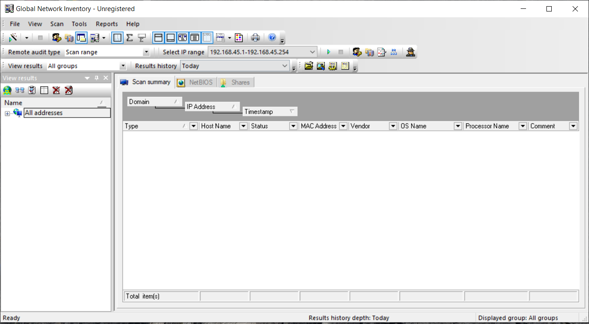
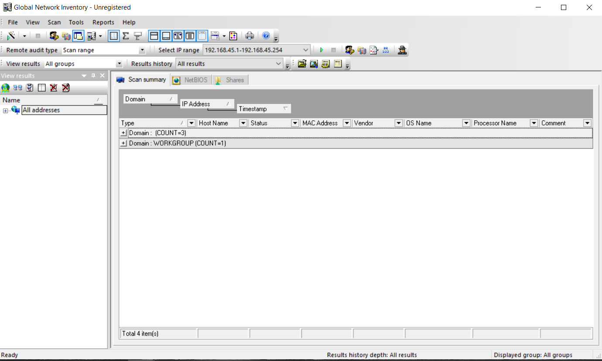
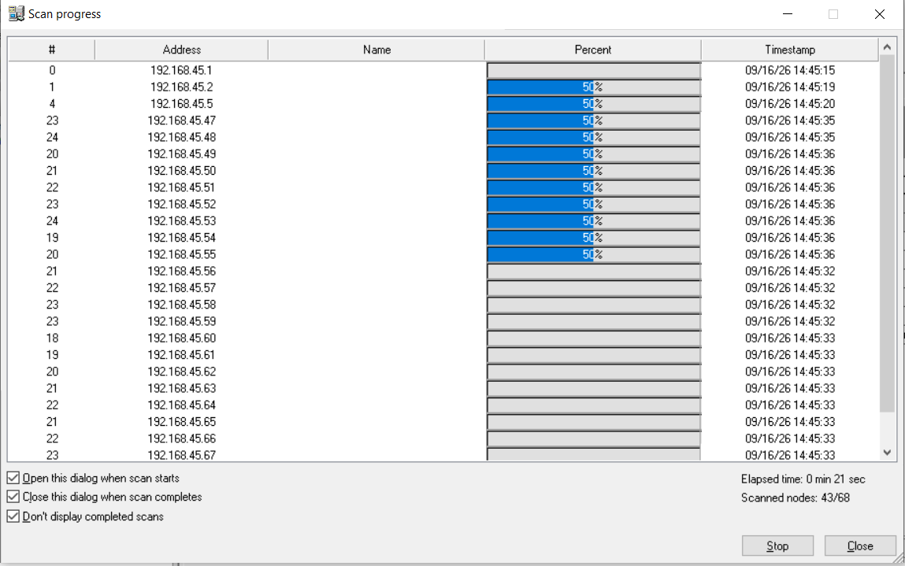
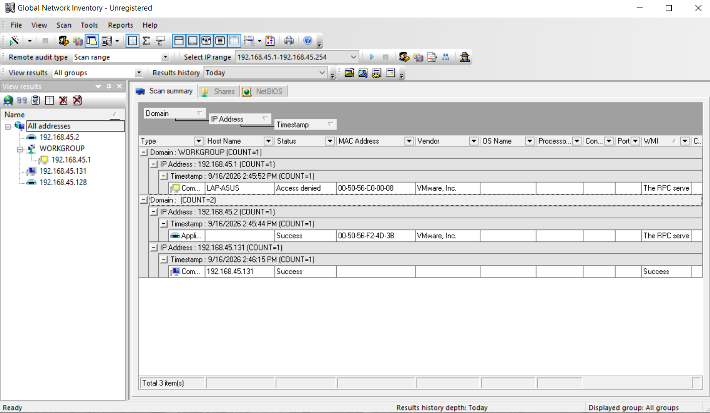

# Lab 1: NetBIOS Enumeration using Global Network Inventory

## 1. Laboratory Overview & Objectives

The objective of this lab is to demonstrate how to use **Global Network Inventory (GNI)** to perform agent-free network reconnaissance, extracting critical system details such as operating systems, BIOS info, NetBIOS names, user groups, services, and installed software across a target IP range.

* **Target System / Environment:** Windows Server / Windows 8/10/11 Target Range
* **Primary Tools:** Global Network Inventory (GNI)

---

## 2. Step-by-Step Task Execution & Evidence

### Task 1: Launch Global Network Inventory

1. Opened **Global Network Inventory** from the desktop shortcut or application directory with administrative privileges to configure a fresh network scan workspace.
2. Initialized a new scan wizard or configuration profile to target specific network ranges.

📸 **Verification Screenshot 1: Launching Global Network Inventory**

### Task 2: Configure Network Scan Range and Credentials

1. Entered the target IP address range or subnet (e.g., `192.168.45.1/24`) to scope the network discovery.
2. Provided required administrative credentials or NetBIOS/WMI access settings to authenticate and query remote systems during the agent-free inventory process.

📸 **Verification Screenshot 2: Configuring Scan Range and Credentials**

### Task 3: Execute Agent-Free Network Scan

1. Initiated the scan process and monitored live progress as GNI probed target nodes over ports like NetBIOS (137/138/139), SMB (445), and WMI.
2. Observed the extraction of active host status, response times, and initial device identification.

📸 **Verification Screenshot 3: Executing Network Scan**

### Task 4: Review and Export Inventory Data

1. Navigated through the detailed node reports to examine gathered data including NetBIOS names, workgroup/domain membership, operating system versions, running services, and installed software inventory.
2. Exported the final audit report or inventory logs for reconnaissance reporting and vulnerability correlation.

📸 **Verification Screenshot 4: Final Inventory Results and NetBIOS Data**

---

## 3. Lab Questions & Technical Analysis

**Question 1: Why is agent-free enumeration using tools like Global Network Inventory valuable during early reconnaissance phases?**

* **Answer:** Agent-free enumeration allows security testers and administrators to quickly gather detailed asset information—such as operating system versions, installed software, NetBIOS profiles, and active user accounts—across an entire subnet without needing prior software installation on target endpoints, saving time and minimizing detection footprints.

**Question 2: What underlying protocols and ports do inventory tools commonly leverage to extract system and NetBIOS information from Windows hosts?**

* **Answer:** Tools like Global Network Inventory typically rely on NetBIOS over TCP/IP (UDP ports 137/138, TCP port 139), Server Message Block (SMB over TCP port 445), and Windows Management Instrumentation (WMI/RPC) to query system configurations, user groups, and hardware specifications.

---

## 4. Laboratory Reflection

This lab provided practical experience in performing agent-free network discovery and system enumeration using Global Network Inventory. By configuring target IP ranges, supplying authentication parameters, executing network scans, and extracting detailed NetBIOS, OS, and software inventories, we gained a deeper understanding of how internal network layouts and host profiles are mapped during security assessments and infrastructure audits.