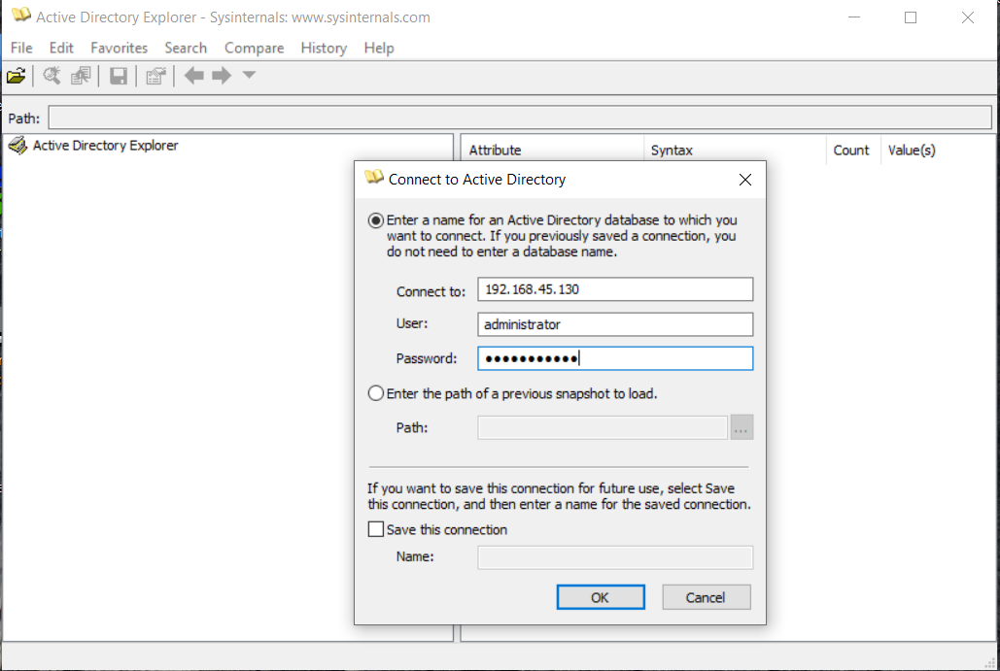
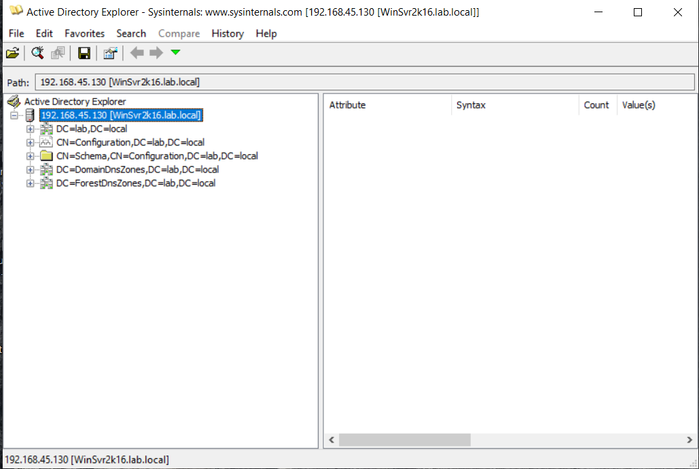
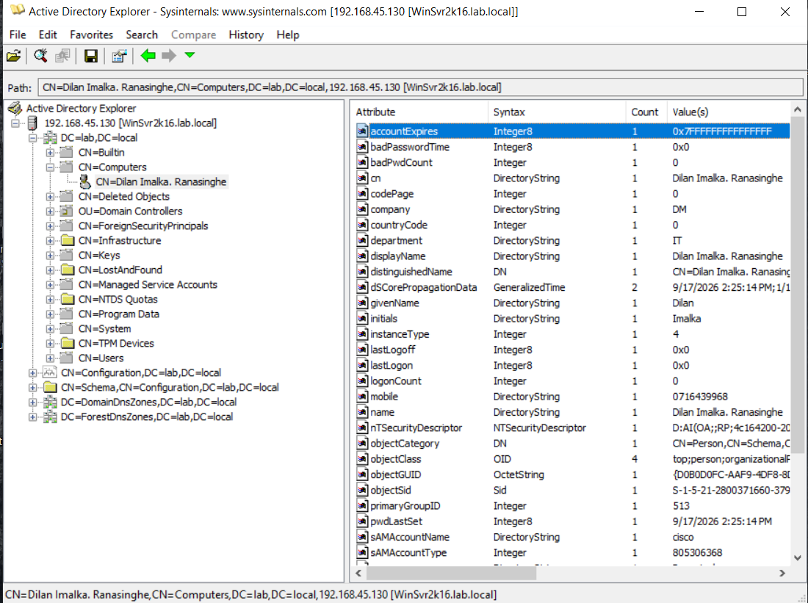

# Lab 10: LDAP Enumeration using Active Directory Explorer (ADExplorer)

## 1. Laboratory Overview & Objectives

The objective of this lab is to utilize **Active Directory Explorer (ADExplorer)** from a Windows environment to connect to a target domain controller/LDAP server, browse the hierarchical Directory Information Tree (DIT), and inspect organizational units (OUs), users, computers, groups, and security descriptors to identify potential security misconfigurations or privilege pathways.

* **Target System / Environment:** Windows Domain Controller / Target LDAP Server (`192.168.45.130`)
* **Primary Tools:** Active Directory Explorer (ADExplorer) on Windows

---

## 2. Step-by-Step Task Execution & Evidence

### Task 1: Launch and Connect to the Active Directory Domain

1. Launched **ADExplorer** on the Windows system and opened the connection configuration window.
2. Entered the target domain controller IP address (`192.168.45.130`) and valid credentials (or default lab credentials) to establish an LDAP session.

📸 **Verification Screenshot 1: ADExplorer Connection Dialog**

### Task 2: Browse the Hierarchical Directory Information Tree (DIT)

1. Explored the root domain node in the left-hand navigation panel to map out the directory structure.
2. Inspected key built-in containers and Organizational Units (OUs), such as Users, Computers, and Builtin groups.

📸 **Verification Screenshot 2: Directory Tree Navigation**

### Task 3: Examine Object Attributes and Security Descriptors

1. Clicked on specific user and group objects to review their properties, attributes (such as `sAMAccountName`, `memberOf`, and descriptions), and access control lists (ACLs).
2. Analyzed the returned attributes for misconfigurations or unintended permission grants.

📸 **Verification Screenshot 3: Object Attribute Inspection**

---

## 3. Lab Questions & Technical Analysis

**Question 1: What is the primary purpose of LDAP enumeration in a penetration test or security assessment?**

* **Answer:** LDAP enumeration allows an assessor to map the domain structure, discover valid user accounts, identify privileged groups, and uncover structural misconfigurations or weak access controls without needing high-level administrative credentials initially.

**Question 2: How does ADExplorer simplify the analysis of Active Directory compared to standard command-line tools?**

* **Answer:** ADExplorer provides a graphical, read-only interface that mimics an LDAP browser and snapshot utility, allowing security professionals to easily search objects, view nested group memberships, and inspect security descriptors in an organized hierarchical tree view.

---

## 4. Laboratory Reflection

This lab demonstrated how directory services can be queried and analyzed using Active Directory Explorer. By connecting to the target domain, navigating the DIT hierarchy, and examining object attributes, we successfully gathered intelligence on domain users, groups, and permissions crucial for internal security reviews.