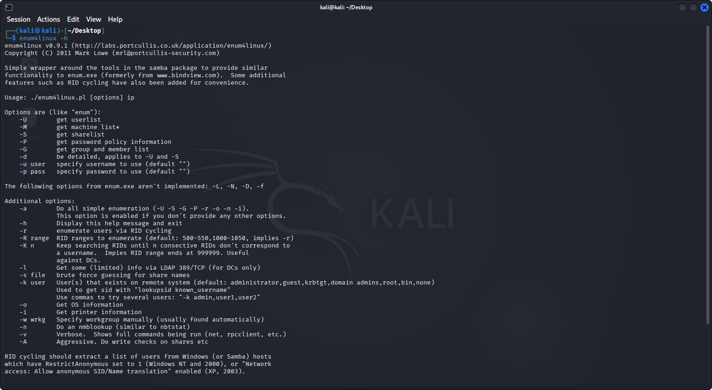
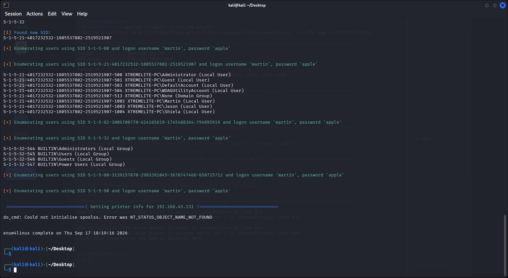
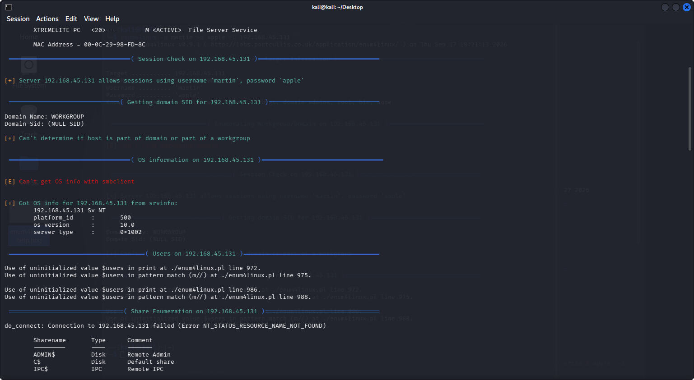
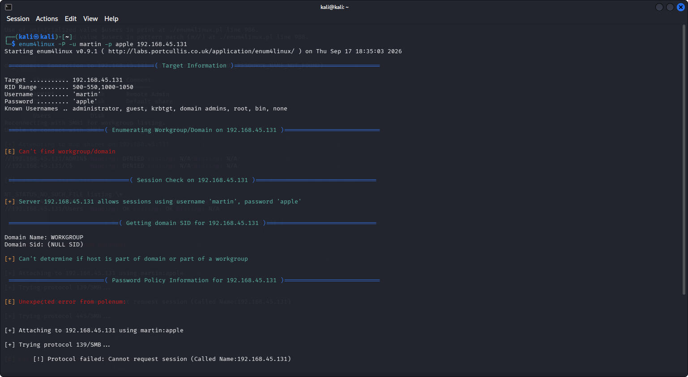
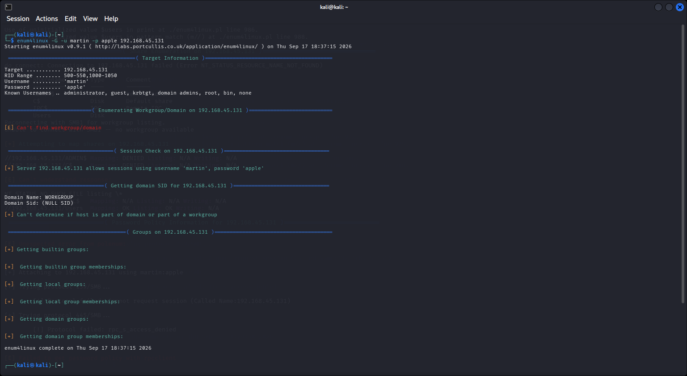
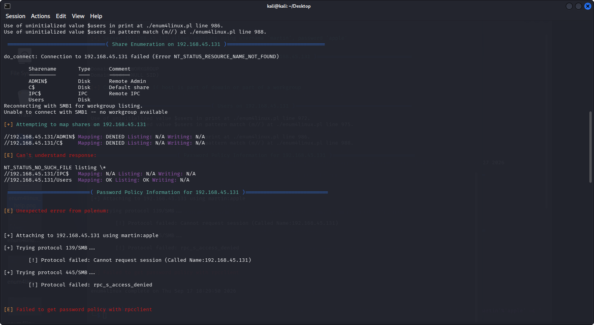

# Lab 11: Enumerating Information from Windows and Samba Host using Enum4linux

## 1. Laboratory Overview & Objectives

The objective of this lab is to utilize **Enum4linux** from a Kali Linux environment to perform comprehensive automated enumeration against a target Windows or Samba host, including extracting user accounts, share mappings, password complexity policies, and operating system details.

* **Target System / Environment:** Windows / Samba Target Host (`192.168.45.131`)
* **Primary Tools:** Enum4linux (Kali Linux)

---

## 2. Step-by-Step Task Execution & Evidence

### Task 1: Test for User Info

1. Started the Kali Linux machine and opened a Terminal window.
2. Executed `enum4linux -h` to review available tool options and help commands.
3. Modern versions of Kali Linux sometimes trigger Perl uninitialized value errors with older scripts like enum4linux during RID cycling. To ensure the user list prints correctly, try running a broader scan or include the -v (verbose) flag, or use the all-inclusive switch:

   `enum4linux -a -u martin -p apple 192.168.45.131`

📸 **Verification Screenshot 1: Enum4linux Help Options**


3. Executed user enumeration against the target host:
   ```bash
   enum4linux -U -p apple -U 192.168.45.131

   ```
4. Observed the tool connecting, enumerating workgroups/domains, and listing out user accounts along with their respective RIDs.

📸 **Verification Screenshot 2: User Enumeration Output**


### Task 2: Test for OS Info

1. Executed the command to pull OS details from the target machine:
   ```bash
   enum4linux -o -p apple -U 192.168.45.131
   ```
2. Reviewed the extracted operating system version, service pack, and system date/time information.

📸 **Verification Screenshot 3: OS Information Output**


### Task 3: Test for Password Policy Info

1. Executed the command to extract password policy settings from the target system:
   ```bash
   enum4linux -P -p apple -U 192.168.45.131
   ```
2. Analyzed the output for minimum password length, password age settings, lockout threshold, and complexity requirements.

📸 **Verification Screenshot 4: Password Policy Output**


### Task 4: Test for Group Info & Shares

1. Enumerate local and domain groups using the group option flag:
   ```bash
   enum4linux -G -p apple -U 192.168.45.131
   ```

📸 **Verification Screenshot 5: Group Information Output**


2. Perform share enumeration to discover exposed network shares and IPC mappings:
   ```bash
   enum4linux -S -p apple -U 192.168.45.131
   ```

📸 **Verification Screenshot 6: Share Enumeration Output**


---

## 3. Lab Questions & Technical Analysis

**Question 1: What is the primary purpose of using Enum4linux during a penetration test or security assessment?**

* **Answer:** Enum4linux automates multiple underlying information-gathering utilities (such as smbclient, rpcclient, net, and nmblookup) into a single tool, rapidly extracting high-value data like user lists, share permissions, group memberships, and password policies.

**Question 2: Why is evaluating password policies and user lists critical during the enumeration phase?**

* **Answer:** Identifying weak password policies (such as lack of complexity requirements or high account lockout thresholds) alongside valid user accounts helps determine the feasibility of launching successful password brute-forcing or credential-stuffing attacks.

---

## 4. Laboratory Reflection

This lab demonstrated how automated enumeration scripts like Enum4linux simplify the reconnaissance phase against Windows and Samba hosts. By leveraging built-in RPC and SMB querying techniques, we successfully identified active user lists, exposed shares, operating system versions, and security policies critical for mapping network attack surfaces.
