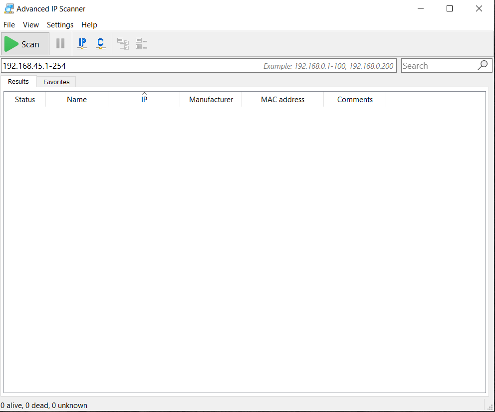
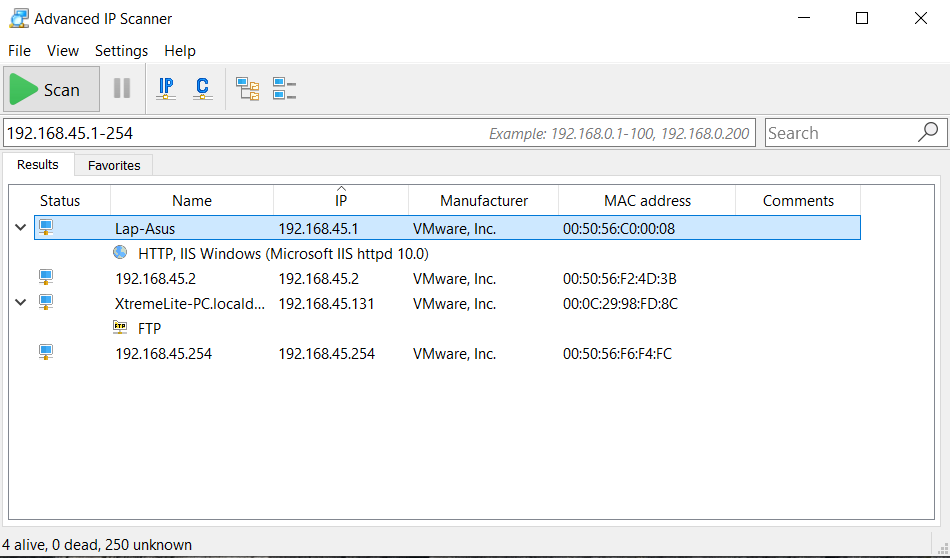
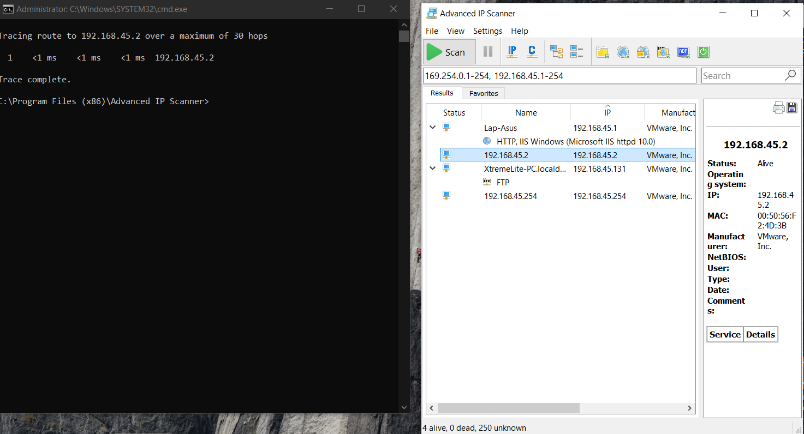

# Lab 2: Enumerating Network Resources using Advanced IP Scanner

## 1. Laboratory Overview & Objectives

The objective of this lab is to demonstrate how to use **Advanced IP Scanner** to perform rapid multi-threaded subnet scans, discover live hosts, inspect shared network resources, and execute remote management or shutdown options during security assessments.

* **Target System / Environment:** Windows Server / Windows 8/10/11 Target Subnet
* **Primary Tools:** Advanced IP Scanner

---

## 2. Step-by-Step Task Execution & Evidence

### Task 1: Launch Advanced IP Scanner and Configure Scan Range

1. Opened **Advanced IP Scanner** from the desktop or application directory with administrative privileges.
2. Verified or entered the target IP address range or subnet mask (e.g., `192.168.45.1-254`) into the search bar to scope the network discovery.

📸 **Verification Screenshot 1: Launching Advanced IP Scanner**

### Task 2: Execute Multi-Threaded Subnet Sweep

1. Clicked the **Scan** button to initiate the fast multi-threaded discovery sweep across the specified IP range.
2. Observed real-time host discovery, resolving IP addresses, MAC addresses, and manufacturer vendor tags.

📸 **Verification Screenshot 2: Executing Subnet Scan**

### Task 3: Inspect Shared Folders and Network Resources

1. Expanded individual discovered host nodes in the results interface to inspect exposed HTTP, FTP, RDP ports, and shared folders.
2. Verified accessible network shares and resource paths for reconnaissance analysis.

📸 **Verification Screenshot 3: Inspecting Shared Resources**

### Task 4: Execute Remote Options and Management Commands

1. Right-clicked on active target hosts to explore built-in remote management tools such as ping, tracert, SSH, FTP, or remote shutdown commands.
2. Reviewed the remote administration options available for post-discovery interaction.

📸 **Verification Screenshot 4: Remote Management and Options**

---

## 3. Lab Questions & Technical Analysis

**Question 1: What makes multi-threaded port and IP scanners like Advanced IP Scanner effective for preliminary network reconnaissance?**

* **Answer:** Multi-threaded scanners can simultaneously query hundreds of IP addresses and ports within seconds, allowing security professionals and testers to rapidly map live hosts, identify active services, and discover unauthorized devices across large subnets with minimal delay.

**Question 2: Why is identifying exposed shared folders during an IP scan important for evaluating internal network security?**

* **Answer:** Exposed shares often contain sensitive files, misconfigured permissions, or writeable directories. Discovering these shares helps security testers identify potential entry points for lateral movement or data leakage before malicious actors exploit them.

---

## 4. Laboratory Reflection

This lab provided practical experience in performing rapid host discovery and resource enumeration using Advanced IP Scanner. By configuring target IP ranges, executing multi-threaded scans, inspecting shared folders, and evaluating remote management commands, we gained a clear understanding of how network perimeters and local resources are quickly profiled during the initial stages of a security assessment.