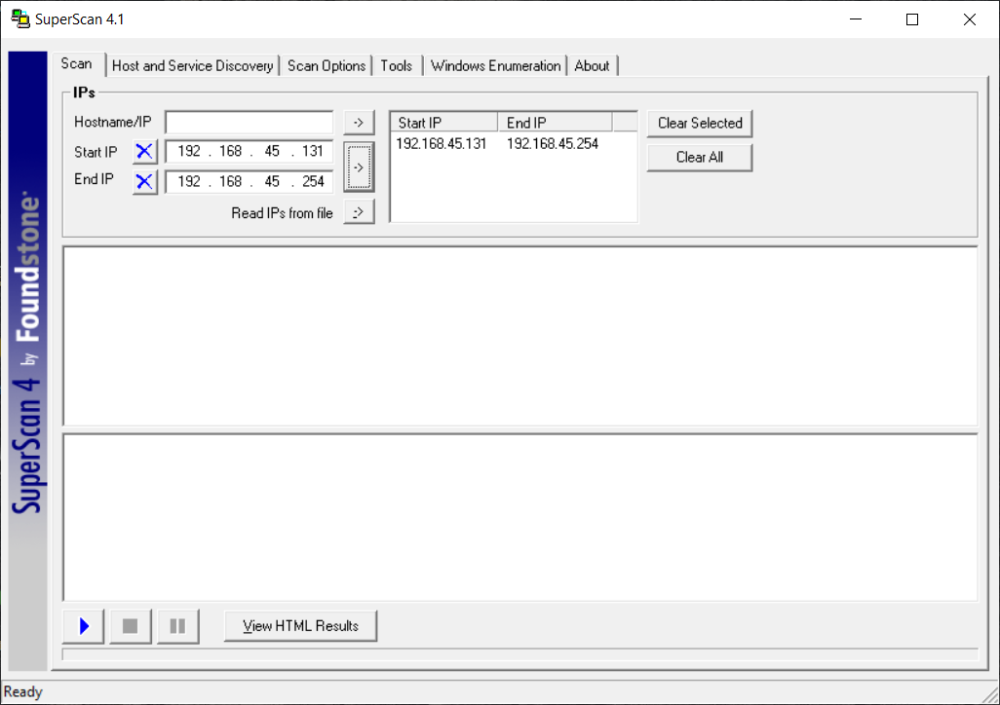
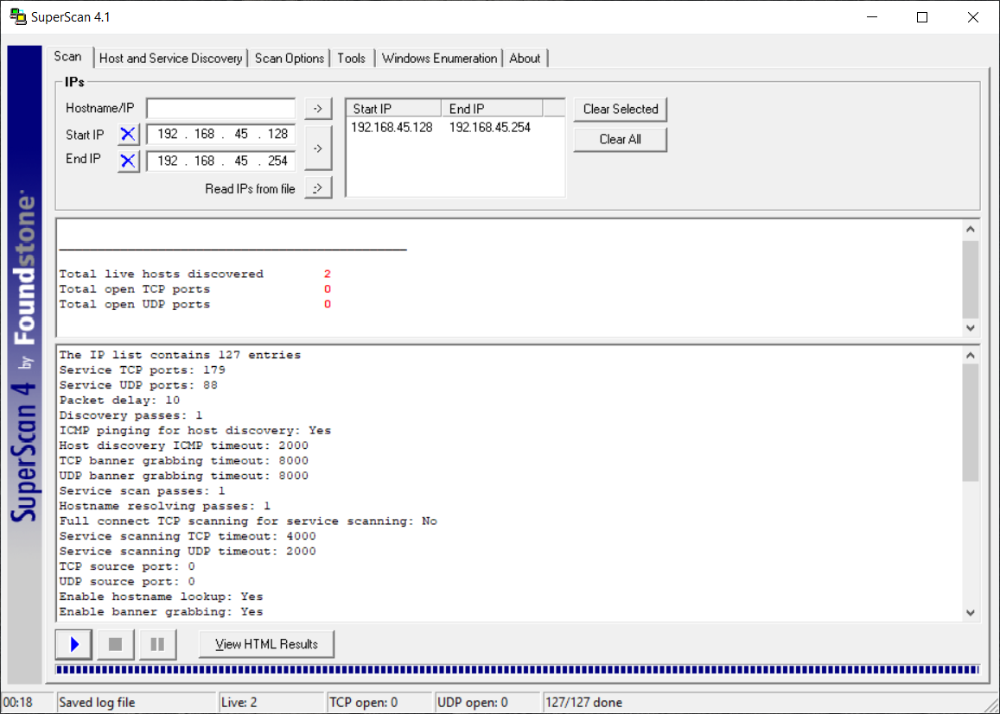
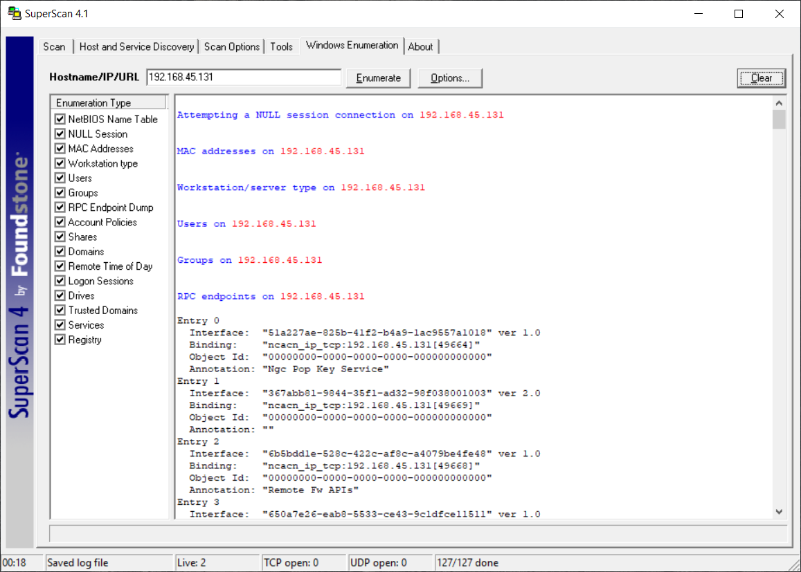

# Lab 3: Performing Network Enumeration using SuperScan

## 1. Laboratory Overview & Objectives

The objective of this lab is to use **SuperScan 4.1** from a Windows host to perform network reconnaissance, execute TCP/UDP port scans, and conduct Windows host enumeration including NetBIOS name tables and null sessions.

* **Target System / Environment:** Windows Host / Target Environment (`192.168.45.131`)
* **Primary Tools:** SuperScan 4.1

---

## 2. Step-by-Step Task Execution & Evidence

### Task 1: Configure Host and Port Lists for Target Reconnaissance

1. Launched **SuperScan 4.1** within the lab environment.
2. Configured the target IP address range (`192.168.45.131` to `192.168.45.254`) and selected appropriate port lists to scope the reconnaissance sweep.

📸 **Verification Screenshot 1: Configuring Host and Port Lists**

### Task 2: Execute Port Scans and Ping Sweeps

1. Executed ping sweeps and TCP/UDP port scans to verify active services and identify listening ports on the target host.
2. Monitored scan output to confirm responsive target systems and active network ports.

📸 **Verification Screenshot 2: Executing Port Scans and Ping Sweeps**

### Task 3: Perform NetBIOS Enumeration and Query Null Sessions

1. Switched to the **Windows Enumeration** tab in SuperScan and targeted the Windows host (`192.168.45.131`).
2. Performed NetBIOS enumeration and leveraged null session capabilities to extract MAC addresses, workstation types, RPC endpoints, user accounts, and shared resources.

📸 **Verification Screenshot 3: NetBIOS Enumeration and Shares**

---

## 3. Lab Questions & Technical Analysis

**Question 1: Why is NetBIOS enumeration and null session querying valuable during network reconnaissance?**

* **Answer:** NetBIOS enumeration and null sessions allow security testers to extract valuable domain details, user accounts, shared resources, and account policies without requiring valid user credentials, exposing common misconfigurations that could be exploited.

**Question 2: What is the purpose of combining ping sweeps with TCP/UDP port scans in SuperScan?**

* **Answer:** Ping sweeps quickly identify which IP addresses are active across a network, while subsequent port scans determine which specific services and application ports are running on those active hosts, providing a clear target profile.

---

## 4. Laboratory Reflection

This lab provided practical experience in performing Windows host enumeration using SuperScan 4.1. By configuring target host and port lists, executing ping sweeps and port scans, and performing Windows enumeration with null session queries, we successfully extracted target details, RPC endpoints, and system parameters from the environment.