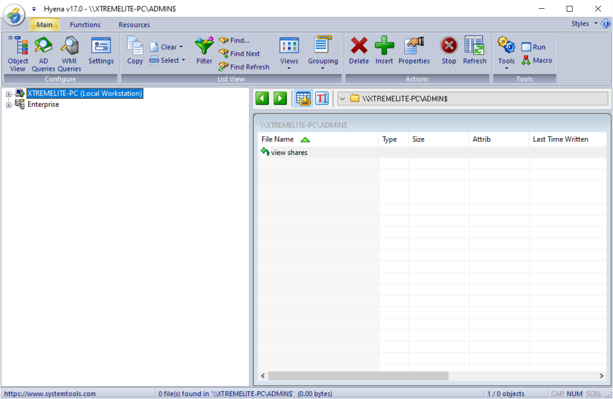
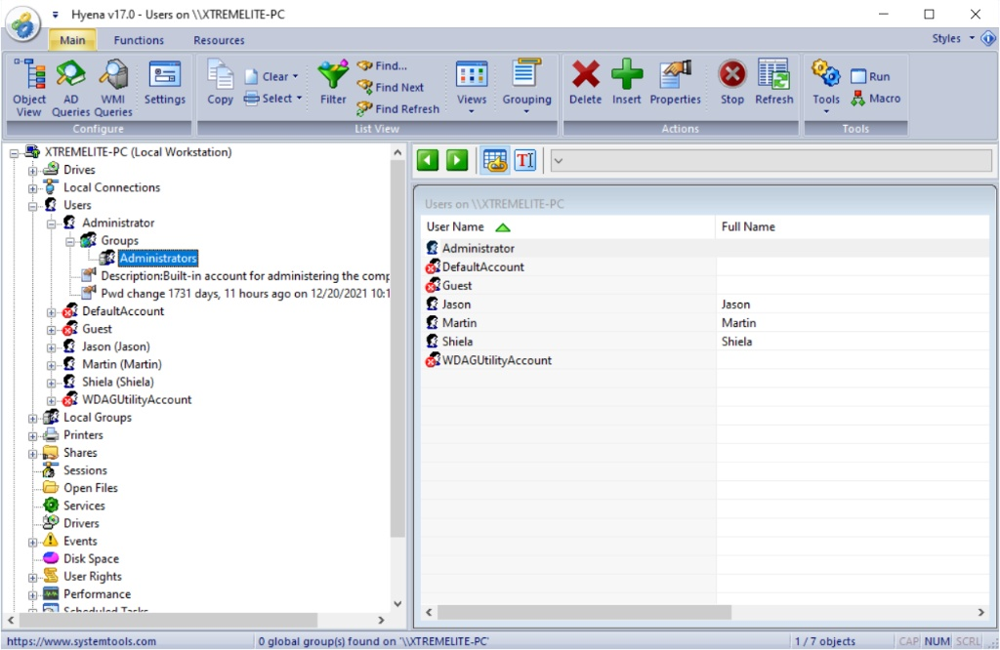
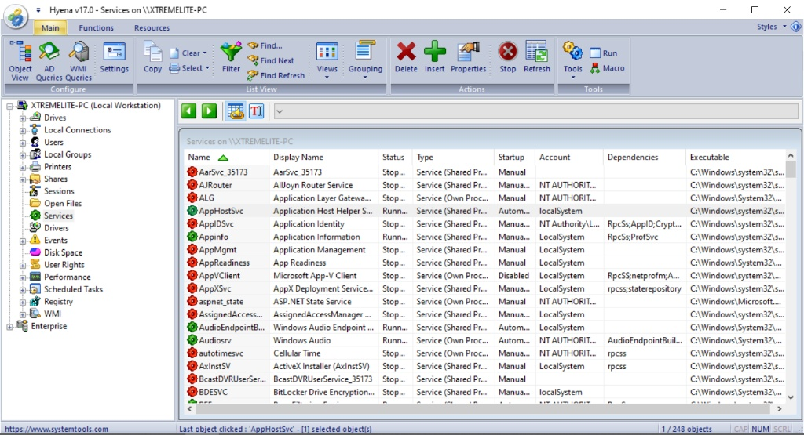

# Lab 4: Enumerating Resources in a Local Machine using Hyena

## 1. Laboratory Overview & Objectives

The objective of this lab is to use **Hyena** to perform explorer-style deep management and enumeration of local system resources, including user accounts, groups, running services, user rights, and scheduled tasks.

* **Target System / Environment:** Windows Local Workstation (`XTREMELITE-PC`)
* **Primary Tools:** Hyena v17.0

---

## 2. Step-by-Step Task Execution & Evidence

### Task 1: Launch Hyena and Connect to Local Workspace

1. Installed and launched **Hyena v17.0** with administrative privileges.
2. Connected to the local machine workspace (`XTREMELITE-PC`) to initialize explorer-style system management.

📸 **Verification Screenshot 1: Connecting to Local Workspace in Hyena**

### Task 2: Navigate System Containers and Inspect User Accounts

1. Expanded the local machine tree container within the Hyena interface.
2. Navigated to the **Users** and **Groups** containers to examine local user accounts, memberships, and account attributes.

📸 **Verification Screenshot 2: User and Group Enumeration**

### Task 3: Audit Running Services and Scheduled Tasks

1. Selected the **Services** container to audit active background services, startup types, and process states.
2. Explored scheduled tasks and user rights assignments to review administrative configurations.

📸 **Verification Screenshot 3: Services and Scheduled Tasks Audit**

---

## 3. Lab Questions & Technical Analysis

**Question 1: Why is an explorer-style administrative tool like Hyena useful during internal system enumeration?**

* **Answer:** Hyena aggregates multiple Windows administration snap-ins (such as user management, service control, shares, and device auditing) into a single, unified graphical interface, allowing security professionals to rapidly review configurations and identify privilege misconfigurations.

**Question 2: What security risks are associated with misconfigured user rights or excessive group memberships discovered during local enumeration?**

* **Answer:** Excessive group memberships or overly permissive user rights can allow low-privileged users to escalate privileges, access unauthorized shares, or manipulate running system services during a security compromise.

---

## 4. Laboratory Reflection

This lab provided practical experience in performing GUI-based local system enumeration and management using Hyena. By establishing a workspace connection, navigating system containers, auditing user accounts and groups, and reviewing running services and scheduled tasks, we gained a comprehensive understanding of how local operating system perimeters are inspected and managed.