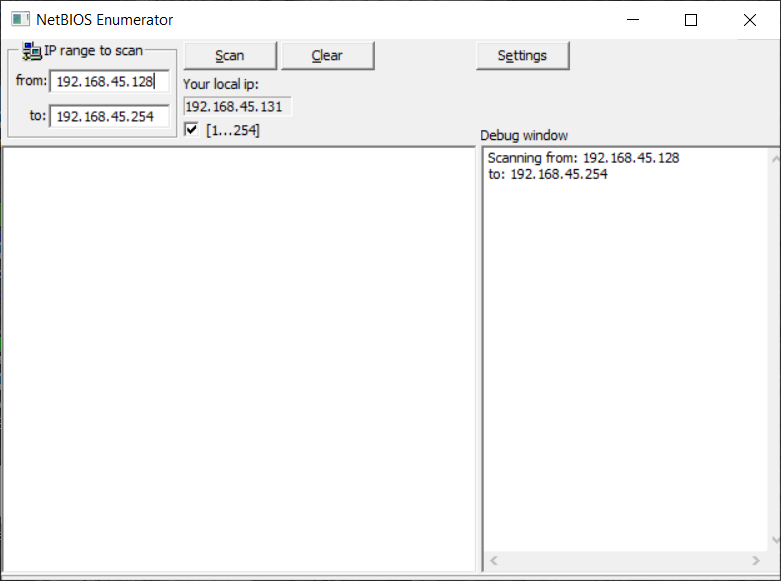
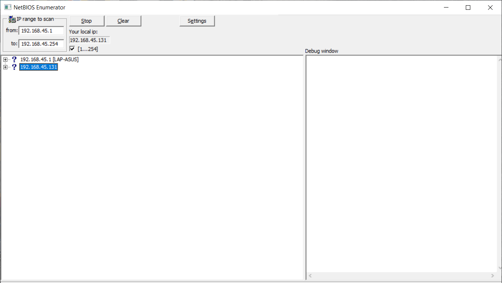
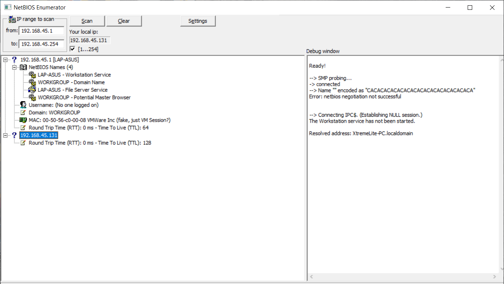

# Lab: Performing Network Enumeration using NetBIOS Enumerator

## 1. Laboratory Overview & Objectives

The objective of this lab is to use **NetBIOS Enumerator** to probe active NetBIOS connections across a target IP range to extract NetBIOS names, workstation types, domain structures, user accounts, and local group memberships.

* **Target System / Environment:** Windows Target Machine (`192.168.45.131`)
* **Primary Tools:** NetBIOS Enumerator

---

## 2. Step-by-Step Task Execution & Evidence

### Task 1: Launch NetBIOS Enumerator and Configure Target IP Range

1. Launched **NetBIOS Enumerator** from the lab tools directory with administrative privileges.
2. Entered the target IP address range (`192.168.45.1` to `192.168.45.254`) into the start and end IP fields to define the reconnaissance scope.

📸 **Verification Screenshot 1: Configuring Target IP Range**

### Task 2: Execute NetBIOS Enumeration Sweep

1. Clicked the **Scan** button to initiate the enumeration sweep targeting NetBIOS session and name service ports across the specified IP range.
2. Monitored real-time query progress, status updates, and debug logs within the application window.

📸 **Verification Screenshot 2: Executing NetBIOS Enumeration Scan**

### Task 3: Extract and Analyze Resolved NetBIOS Names and Workstation Details

1. Reviewed the populated results tree and debug output to extract resolved NetBIOS names (`XtremeLite-PC.localdomain`), workstation types, and session connection attempts.
2. Analyzed the gathered reconnaissance data for potential administrative configurations.

📸 **Verification Screenshot 3: Analyzing Enumerated NetBIOS Results**

---

## 3. Lab Questions & Technical Analysis

**Question 1: Why is NetBIOS enumeration valuable during the preliminary reconnaissance phase of a security assessment?**

* **Answer:** NetBIOS enumeration allows testers to rapidly identify active Windows systems, computer names, workgroups, and shared user accounts on a network without triggering complex authentication mechanisms, exposing potential entry points for lateral movement.

**Question 2: What kind of sensitive security parameters can be uncovered through NetBIOS name service and session queries?**

* **Answer:** Queries can reveal domain memberships, local user accounts, group structures, and account policies, which provide critical intelligence for password auditing and access control evaluations.

---

## 4. Laboratory Reflection

This lab provided practical experience in performing NetBIOS reconnaissance using NetBIOS Enumerator. By configuring target IP ranges, executing enumeration sweeps, and extracting NetBIOS name tables, user accounts, and workstation attributes, we gained a clear understanding of how internal Windows network perimeters are profiled.