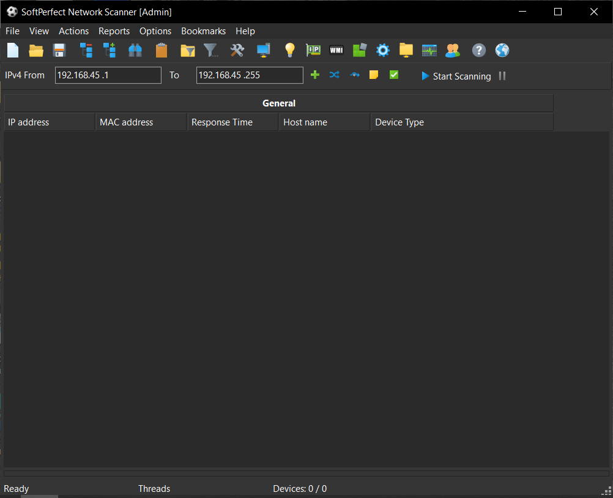
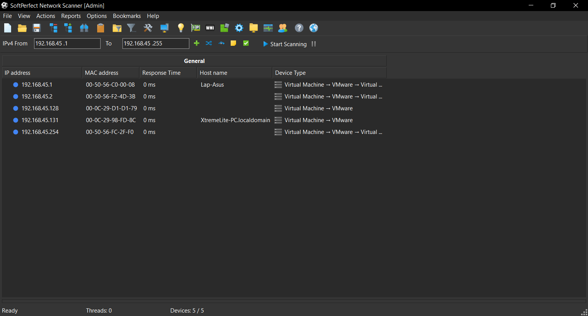
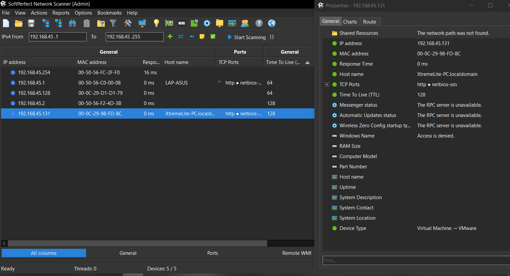

# Lab 6: Enumerating a Network using SoftPerfect Network Scanner

## 1. Laboratory Overview & Objectives

The objective of this lab is to use **SoftPerfect Network Scanner** for multi-threaded host discovery, resolving MAC addresses and vendors, auditing hidden or writable shares, and checking open network ports.

* **Target System / Environment:** Local and External Network Range (`192.168.45.1` to `192.168.45.254`)
* **Primary Tools:** SoftPerfect Network Scanner

---

## 2. Step-by-Step Task Execution & Evidence

### Task 1: Launch SoftPerfect Network Scanner and Configure IP Range

1. Installed and launched **SoftPerfect Network Scanner** with administrative privileges.
2. Configured the target IP address range (e.g., `192.168.45.1` to `192.168.45.254`) and adjusted multi-threaded ping settings.

📸 **Verification Screenshot 1: Configuring IP Range and Settings**

### Task 2: Execute Multi-Threaded Host Discovery and MAC Resolution

1. Initiated the scan to perform multi-threaded host discovery across the subnet.
2. Captured active live hosts, MAC address vendors, operating system fingerprints, and computer names.

📸 **Verification Screenshot 2: Executing Host Discovery and MAC Resolution**

### Task 3: Audit Shared Resources and Open Ports

1. Filtered and reviewed scan results for shared folders, administrative shares, writable directories, and open listening ports.
2. Analyzed discovered shares for potential security misconfigurations or unauthorized access risks.

📸 **Verification Screenshot 3: Auditing Shared Resources and Open Ports**

---

## 3. Lab Questions & Technical Analysis

**Question 1: What are the advantages of using a multi-threaded scanner like SoftPerfect Network Scanner over traditional single-threaded ping sweeps?**

* **Answer:** Multi-threaded scanners execute hundreds of concurrent requests simultaneously, drastically reducing the time required to map large network subnets, discover live hosts, and query exposed services.

**Question 2: Why is identifying hidden or writable shared folders critical during network reconnaissance?**

* **Answer:** Hidden or writable shares often contain sensitive corporate data, configuration files, or scripts that can be leveraged by attackers for lateral movement, credential harvesting, or privilege escalation.

---

## 4. Laboratory Reflection

This lab provided practical experience in performing high-speed network reconnaissance using SoftPerfect Network Scanner. By configuring target IP ranges, executing multi-threaded host discoveries, resolving MAC addresses, and auditing shared resources, we gained valuable insight into how active perimeters and exposed storage assets are evaluated.