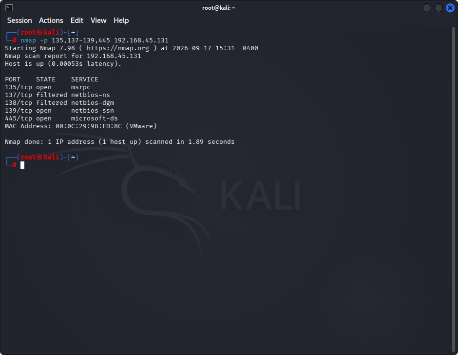
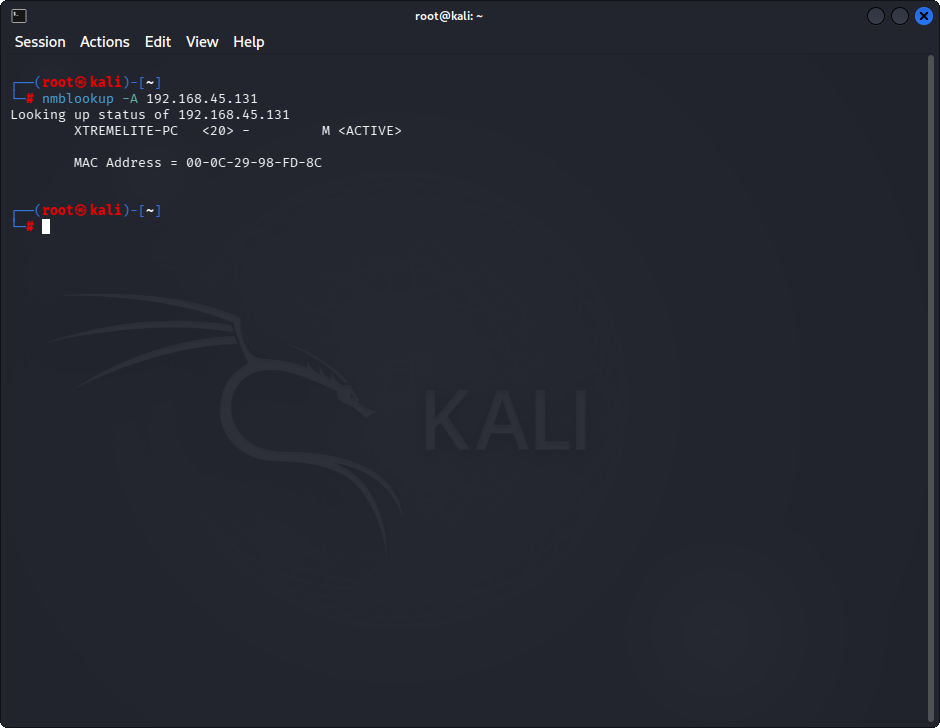
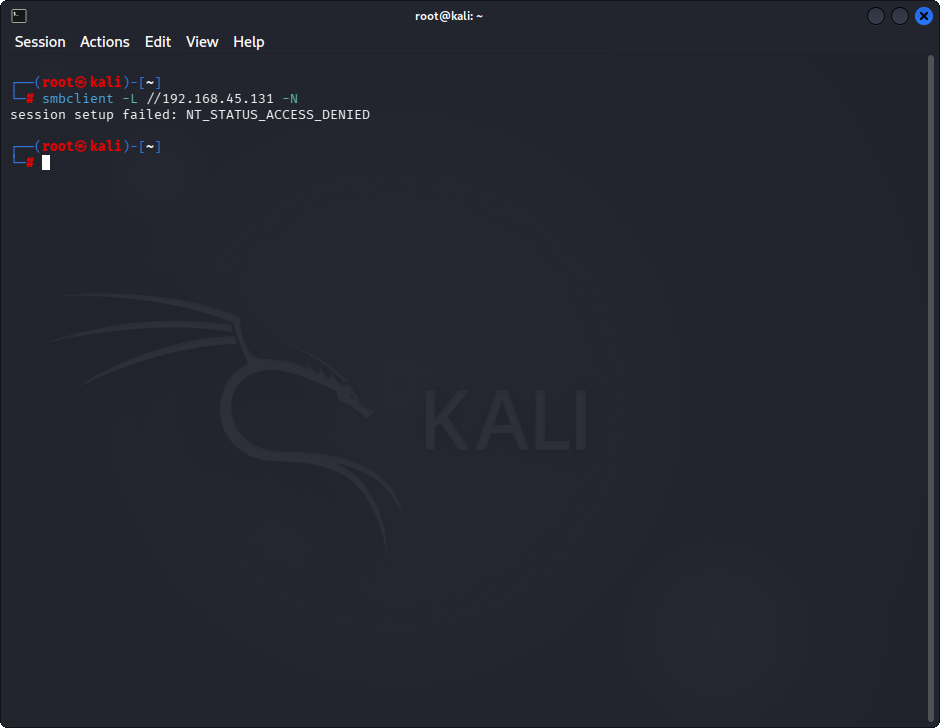

# Lab 7: Enumerating a Target Network using Nmap and Net Use

## 1. Laboratory Overview & Objectives

The objective of this lab is to utilize **Nmap** and network auditing commands from a Kali Linux environment to identify open NetBIOS and SMB ports (135, 137-139, 445), query remote NetBIOS name tables, and test null session connectivity against target systems.

* **Target System / Environment:** Windows Target Machine (`192.168.45.131`)
* **Primary Tools:** Nmap, nmblookup, smbclient (Kali Linux equivalents for Windows `nbtstat` and `net use`)

---

## 2. Step-by-Step Task Execution & Evidence

### Task 1: Run Nmap Port Scan Targeting NetBIOS and SMB Services

1. Opened the Kali Linux terminal and launched an Nmap scan targeting ports 135, 137, 138, 139, and 445 on the target machine.
2. Verified open ports and active listening services associated with Windows networking.

📸 **Verification Screenshot 1: Nmap Port Scan Output**

### Task 2: Query Remote NetBIOS Name Tables

1. Executed a NetBIOS name query using `nmblookup` from Kali Linux against the target IP (`192.168.45.131`).
2. Extracted registered NetBIOS names (`XTREMELITE-PC`) and MAC address records.

📸 **Verification Screenshot 2: NetBIOS Name Table Query**

### Task 3: Test Unauthenticated Null Session Access and SMB Shares

1. Used `smbclient` on Kali Linux to test null session connectivity (`-N`) to the target IPC$ share.
2. Verified access control behavior and noted the access denial response (`NT_STATUS_ACCESS_DENIED`).

📸 **Verification Screenshot 3: SMB Null Session and Share Enumeration**

---

## 3. Lab Questions & Technical Analysis

**Question 1: Why are ports 139 and 445 critical targets during internal network reconnaissance?**

* **Answer:** Ports 139 (NetBIOS Session Service) and 445 (Microsoft-DS SMB) provide direct pathways to file and printer sharing services, which frequently expose configuration flaws, user enumeration vectors, or vulnerabilities suitable for remote execution.

**Question 2: What security risks are introduced when a Windows host permits unauthenticated null session connections to IPC$?**

* **Answer:** Allowing null sessions permits anonymous users to enumerate domain accounts, shared folders, user SIDs, and password policies, providing attackers with vital intelligence required for targeted password attacks.

---

## 4. Laboratory Reflection

This lab demonstrated how to perform NetBIOS and SMB enumeration from a Kali Linux environment. By combining Nmap port scanning, NetBIOS name queries, and null session share testing, we gained a comprehensive understanding of how Windows network services expose internal metadata and attack surfaces.