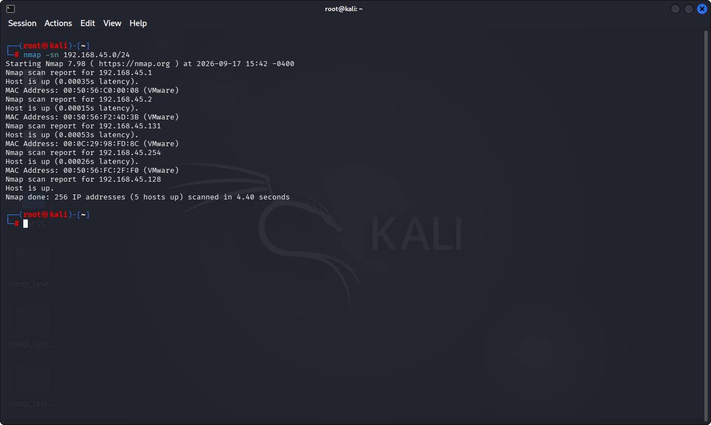
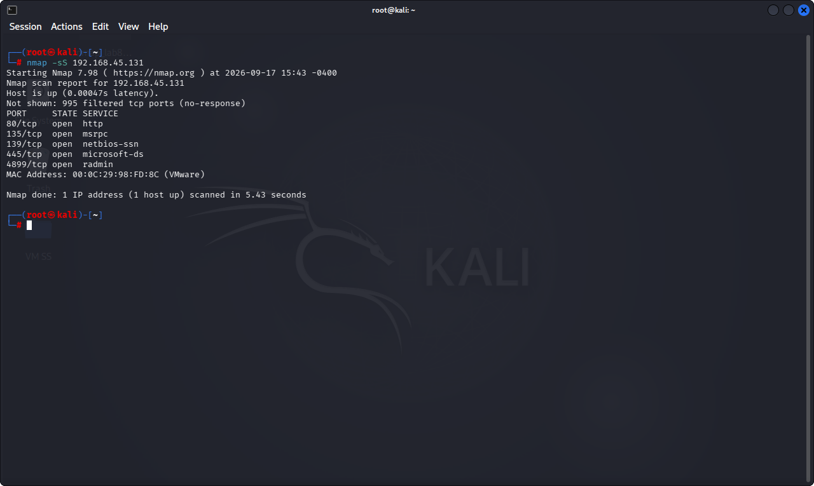
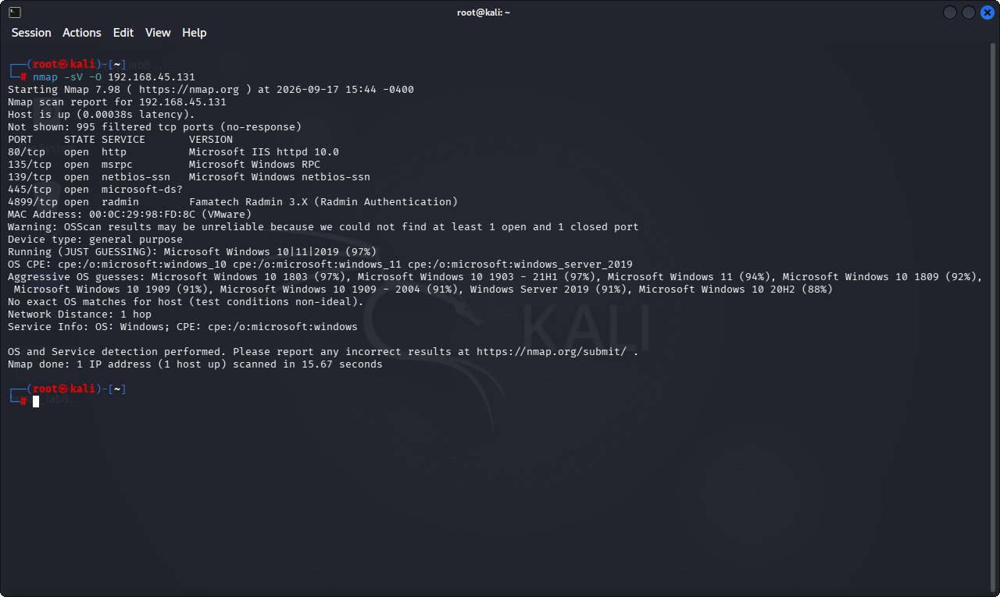

# Lab 8: Enumerating Services on a Target Machine

## 1. Laboratory Overview & Objectives

The objective of this lab is to utilize **Nmap** from a Kali Linux environment to perform host discovery ping sweeps, stealthy SYN scans, and comprehensive service version and OS detection against target machines.

* **Target System / Environment:** Windows Target Machine (`192.168.45.131`)
* **Primary Tools:** Nmap (Kali Linux)

---

## 2. Step-by-Step Task Execution & Evidence

### Task 1: Execute Host Discovery Ping Sweep Across the Subnet

1. Opened the Kali Linux terminal and performed an Nmap ping sweep (`nmap -sn 192.168.45.0/24`) to identify active hosts on the subnet.
2. Verified live target systems responding to ICMP/TCP ping probes.

📸 **Verification Screenshot 1: Ping Sweep Host Discovery**

### Task 2: Perform a Stealth SYN Scan (`-sS`)

1. Executed a stealth TCP SYN scan against the target machine (`nmap -sS 192.168.45.131`) without establishing a full three-way handshake.
2. Cataloged open listening ports while minimizing detection risk.

📸 **Verification Screenshot 2: Stealth SYN Scan Output**

### Task 3: Execute Service Version Detection and OS Fingerprinting (`-sV -O`)

1. Ran an intensive Nmap scan combining service version detection and operating system fingerprinting (`nmap -sV -O 192.168.45.131`).
2. Extracted exact software builds, service banners, and OS version details.

📸 **Verification Screenshot 3: Service Version and OS Fingerprinting**

---

## 3. Lab Questions & Technical Analysis

**Question 1: What is the primary operational advantage of using a TCP SYN scan (`-sS`) over a standard TCP Connect scan (`-sT`)?**

* **Answer:** A SYN scan is stealthier because it never completes the three-way handshake (sending only a SYN packet and responding with an RST upon receiving a SYN-ACK), which often avoids being logged by basic application-layer audit trails or simple host firewalls.

**Question 2: Why is service version detection (`-sV`) critical before attempting exploitation against a target host?**

* **Answer:** Exact version numbers allow security testers to identify specific software patches, known CVE vulnerabilities, and reliable exploit code tailored precisely to that build, rather than guessing blindly.

---

## 4. Laboratory Reflection

This lab reinforced advanced Nmap scanning techniques for deep network reconnaissance. By conducting ping sweeps, stealth SYN audits, and version/OS fingerprinting, we gained critical insight into mapping an active target's attack surface efficiently from Kali Linux.