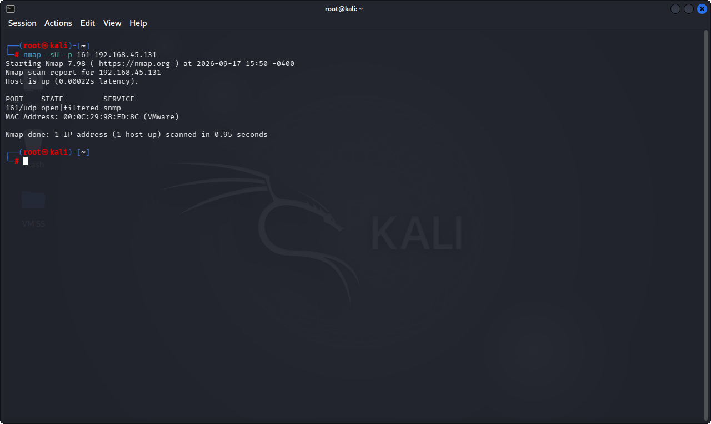
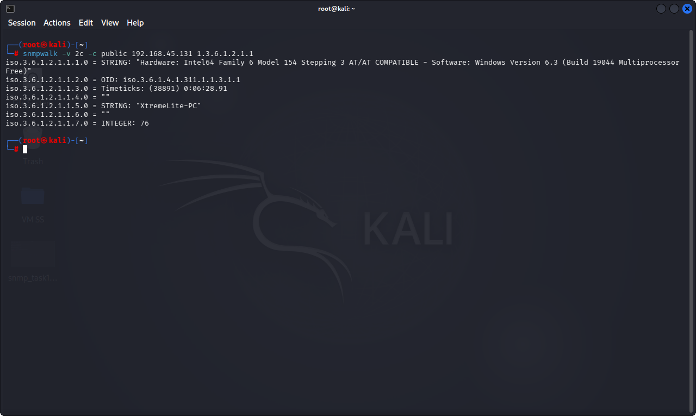
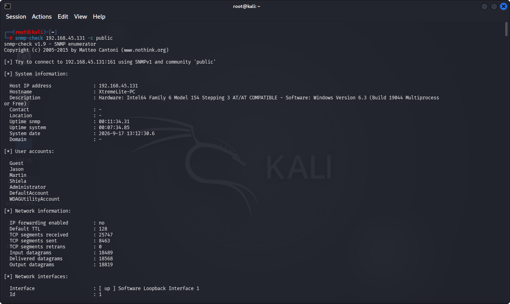

# Lab 9: SNMP Enumeration using snmpwalk / snmp_enum

## 1. Laboratory Overview & Objectives

The objective of this lab is to utilize **SNMP enumeration tools** (such as `snmpwalk` and `snmp-check`) from a Kali Linux environment to query Simple Network Management Protocol agents, identify open UDP port 161, test default community strings (`public`, `private`), and extract system configurations, routing tables, and running services.

* **Target System / Environment:** Windows Target Machine (`192.168.45.131`)
* **Primary Tools:** Nmap (UDP scan), snmpwalk, snmp-check (Kali Linux)

---

## 2. Step-by-Step Task Execution & Evidence

### Task 1: Scan for Open UDP Port 161 (SNMP)

1. Opened the Kali Linux terminal and executed an Nmap UDP port scan targeting port 161 (`nmap -sU -p 161 192.168.45.131`).
2. Verified that the SNMP service port was open or open|filtered.

📸 **Verification Screenshot 1: UDP Port 161 Scan Output**

### Task 2: Test Default Community Strings & Query System Information

1. Executed an initial community string check and system walk using `snmpwalk` with the default community string `public` (`snmpwalk -v 2c -c public 192.168.45.131 system`).Using the community string public, we queried the standard system MIB tree (1.3.6.1.2.1.1) to pull system-level identification data from the target machine.
`snmpwalk -v 2c -c public 192.168.45.131 1.3.6.1.2.1.1`

2. Extracted basic system description, uptime, and contact details.

📸 **Verification Screenshot 2: SNMP System Walk Output**

### Task 3: Comprehensive Enumeration of Running Services and Software Inventory

1. Executed a deeper automated enumeration tool (`snmp-check` or `snmpwalk` with broader MIB trees) against the target to extract running software, storage details, and user lists. COMMAND: `snmp-check 192.168.45.131 -c public`

2. Cataloged the structural output returned by the SNMP agent.

📸 **Verification Screenshot 3: Full SNMP Enumeration Output**

---

## 3. Lab Questions & Technical Analysis

**Question 1: Why are default SNMP community strings like `public` and `private` considered a significant security risk?**

* **Answer:** Default community strings act effectively as unencrypted passwords. If left unchanged, anyone on the network can query sensitive device configurations, routing tables, and user accounts, or modify system settings if a read/write community string is exposed.

**Question 2: What is the operational difference between querying a service over TCP versus UDP port 161 (SNMP)?**

* **Answer:** SNMP operates natively over UDP (User Datagram Protocol), which is connectionless. Scanning and interacting with UDP ports requires handling packet loss and stateless responses differently compared to connection-oriented TCP protocols like HTTP or SSH.

---

## 4. Laboratory Reflection

This lab demonstrated the risks associated with misconfigured SNMP services. By leveraging Nmap UDP scans and Kali Linux SNMP utilities, we successfully discovered active management daemons, tested default community strings, and extracted comprehensive inventory details from the target machine.